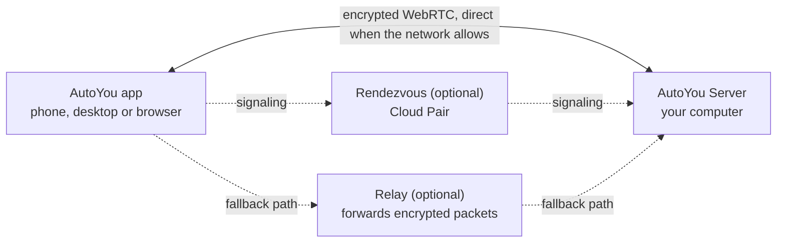
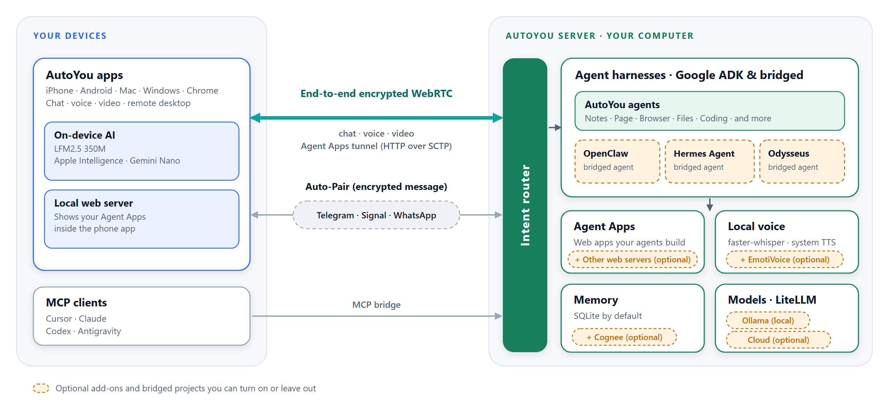

<p align="center">
  
</p>

<h1 align="center">AutoYou Server</h1>

<p align="center"><strong>You are not the product. You are the owner.</strong><br>A self-hosted AI server for the computer you already own.<br>Use it locally or on your Home Wi-Fi, or access from anywhere securely via Internet.<br>Only you and your trusted contacts can access your AutoYou Server. AutoYou is entirely P2P.<br>Build your own App Store, runs serverless Web Applications just like ANY cloud SaaS applications without Usage limits or API costs.<br>Build and host your own games and share them with your friends using Game Mode.<br>Unlimited AI chat, voice calls with AI, Lobby chat, Peer voice & video calls across all devices, video-conference meetings and remote-desktop control - everything on-device with no telemetry/diagnostics/usage metrics captured by default.<br> Works without VPN, Supports Tailscale VPN providers, build your own support, deploy on your own Cloud.</p>

<p align="center">
  <a href="https://github.com/autoyou-ai/AutoYou-Server/actions/workflows/public-checks.yml"></a>
  <a href="https://github.com/autoyou-ai/AutoYou-Server/actions/workflows/codeql.yml"></a>
  
  <a href="servers/README.md"></a>
  <a href="LICENSE"></a>
</p>

<p align="center">
  <a href="#quick-start">Quick start</a> ·
  <a href="#how-autoyou-works">How it works</a> ·
  <a href="#capabilities">Capabilities</a> ·
  <a href="#client-apps">Apps</a> ·
  <a href="#architecture">Architecture</a> ·
  <a href="#documentation">Docs</a> ·
  <a href="#contributing">Contributing</a> ·
  <a href="#license">License</a> ·
  <a href="SECURITY.md">Security</a>
</p>

AutoYou Server runs on your own Windows, macOS, or Linux machine. It hosts your
AI models and agents, speech, voice and video, notes and memory, and a local
web console, and it lets your phone, other computers, and browsers reach it
over encrypted peer-to-peer connections. Conversations, files, and agent
activity are stored on that machine, not in a hosted AutoYou service.

AutoYou client apps are distributed separately. Server-backed features need a
server that you run or compile.

## Quick start

You need Git and Python 3.10 or newer. Dependencies can require a newer Python
or a particular platform; see the [dependency profiles](requirements/README.md).

**1. Get the server**

```bash
git clone https://github.com/autoyou-ai/AutoYou-Server.git
cd AutoYou-Server
```

**2. Run the launcher**

Windows:

```powershell
$ .\run_autoyou.bat --profile base
(OR)
$ .\run_autoyou.bat --profile full --host 0.0.0.0
```

macOS or Linux:

```bash
$ ./run_autoyou.sh --profile base
(OR)
$ .\run_autoyou.bat --profile full --host 0.0.0.0
```

The launcher bootstraps a Python environment, installs dependencies from
package indexes, and may download models and native tools. Read the scripts
first and run them in an environment you can safely modify.

**3. Open the console**

Go to **http://127.0.0.1:8001/**, choose a unique server password, and follow
the setup to pick your AI, enable the tools you want, and pair a device.

For unattended first setup, provide `AUTOYOU_SERVER_PASSWORD` through your
environment or a secret manager. Keep real passwords out of shared commands,
issues, and screenshots.

<details>
<summary><strong>Choose a profile</strong></summary>

Profiles select which dependency sets are installed. They are cumulative, and
the launcher uses `recommended` when `--profile` is omitted.

| Profile | Adds |
| --- | --- |
| `base` | Core server, local administration, device connections, and cloud-provider integrations |
| `local` | Local-model helpers and on-device intent routing |
| `recommended` | Messaging and Bluetooth integration dependencies |
| `full` | Speech, browser, and desktop-automation dependencies |

The root launchers also request the internet (browser) component, including
for `base`. Profiles choose dependencies only; integrations still need
configuration, and optional features may download models or native tools and
require provider accounts. See [requirements/README.md](requirements/README.md)
for platform limits and the current dependency review.

</details>

<p align="center">
  
</p>

## How AutoYou works

AutoYou is built around one idea: **the server is your own computer, and
devices talk to it directly.** The sections below explain what that means for
connectivity, for the services involved, for inspectability, and for security,
including where the guarantees stop.

### Peer to peer, without port forwarding

Apps and the server connect with WebRTC. The two sides exchange a short pairing
handshake, then open an encrypted link (DTLS, with SRTP for media) that carries
chat, voice, video, screen sharing, and proxied web traffic. Most home and
mobile networks can form that link without opening router ports. When a
network is too strict, the connection falls back to a relay that forwards the
same encrypted packets.



You choose how a device finds your computer:

| Method | How it connects | Typical use |
| --- | --- | --- |
| **Local Pair** | Directly over your LAN. Your own server answers the signaling. | Same Wi-Fi or office network |
| **Bluetooth Pair** | Connection details are handed over Bluetooth Low Energy. | First-time setup of a nearby phone |
| **One-time code** | A short-lived code generated in the admin console. | Guest devices and untrusted networks |
| **Auto Pair** | An encrypted pairing message is carried through a Telegram, Signal, or WhatsApp workflow that you set up. | Pairing from afar without a cloud account |
| **Cloud Pair** | An optional AutoYou Cloud rendezvous helps a device find your computer across NAT and firewalls, with relay fallback. | Away from home or behind strict networks |

Peer Link is separate from pairing: it connects one AutoYou app to another app,
and the receiving app approves each link. See
[docs/technical/pairing-protocols.md](docs/technical/pairing-protocols.md).

Pairing messages (offer, answer, and ICE candidates) are encrypted under a key
from a password-authenticated key exchange: a CPace-family construction over
ristretto255 using libsodium. A relay or messaging bridge that carries them
cannot read them, and a captured transcript cannot be used to test password
guesses offline. The module documents where it differs from the registered
ciphersuite: [shared/pairing_cpace.py](shared/pairing_cpace.py).

### Serverless, stated precisely

"Serverless" here means that no AutoYou-operated application server is needed
to run your assistant or to hold your data. You operate one server, your own.
The server is designed to run on a local network without an AutoYou Cloud
connection ([details](docs/architecture/cloud-and-remote.mdx)). Everything else
in this table is either a default you can change or an optional helper, and each
has its own trust boundary:

| Component | Runs on | What it can see |
| --- | --- | --- |
| AutoYou Server: agents, models, storage, admin console | Your computer | Your data. It is an endpoint. |
| Apps and browser clients | Your devices | Whatever you share with them |
| STUN servers for address discovery (on by default, can be disabled) | Google's public STUN servers unless you change them | The public IP address and port that a WebRTC connection appears from |
| Cloud Pair rendezvous (optional) | AutoYou Cloud | Account email, device ID, short-lived pairing details, and network metadata |
| Relay fallback (optional) | AutoYou Cloud | Encrypted packets and network metadata |
| Push wake-ups for sleeping phone apps (optional) | Apple and Google push services | That a wake-up was requested |
| Software update checks (on by default, active once an account is linked) | AutoYou Cloud update feed | An update request authenticated with the account link. Turn off with `software_update.enabled` or `AUTOYOU_SOFTWARE_UPDATES_ENABLED=0`. |
| Cloud model providers (optional) | The provider you pick | The prompts you send to that provider |
| Telegram, Signal, WhatsApp bridges (optional) | Those services | Messages routed through them, under their terms |
| Public tunnel for Website Apps (optional) | Tunnel host | Traffic to the public URL. This is not peer-to-peer. |

The [connection-helper documentation](docs/technical/webrtc.md) states that
AutoYou Cloud does not decrypt message content, voice audio, files, or browsing
content. Peers and connection services can still learn network addresses and
timing, because WebRTC does not hide your public IP from the other side.

**Public STUN is on by default.** Unless you configure otherwise, the server
advertises Google's public STUN servers so WebRTC can discover its public
address, and this applies to Local Pair too. To keep that lookup off the
internet, set `AUTOYOU_DISABLE_PUBLIC_STUN=1` before starting the server, or
point it at your own STUN and TURN host with `AUTOYOU_LOCAL_STUNTURN_HOST`
(plus `AUTOYOU_LOCAL_TURN_USERNAME` and `AUTOYOU_LOCAL_TURN_PASSWORD` for TURN).
Without any STUN or TURN server, connections across NAT may fail.

### Transparent by construction

- **Readable source.** The code that handles your data is in this repository.
  You can read it, build it, and run it. The license is
  [source-available](LICENSE), not OSI-approved open source.
- **Notices and dependencies.** [THIRD-PARTY-NOTICES.md](THIRD-PARTY-NOTICES.md) and the
  [dependency review](requirements/README.md) record what the project includes.
  The review includes a reproducible advisory check:
  `python scripts/audit_dependency_advisories.py --all-manifests`.
- **Automated checks.** Pull requests run the public checks, CodeQL analysis,
  and dependency advisory scans in GitHub Actions.
- **Visible state.** The admin console's live view shows connected devices,
  running tasks, and enabled integrations, so you can see what the server is
  doing and who is connected.
- **Stated limits.** The [security policy](SECURITY.md) and the dependency
  review say what they do not cover. Published source and inventories support
  inspection; they do not certify an installation as secure.

### Secure, with the boundaries spelled out

| Layer | What AutoYou does |
| --- | --- |
| Network exposure | Binds to `127.0.0.1` by default. Listening on your LAN is an explicit setting. |
| Access | The admin console sits behind a server password. Security modes `normal`, `secure`, and `secure_professional` tighten pairing and sessions; Secure Professional requires authenticator-app (TOTP) codes. |
| Pairing | Password-authenticated key exchange (above), one-time codes, and per-link approval for Peer Link. |
| Transport | WebRTC DTLS and SRTP between the two endpoints, including when a relay forwards the packets. |
| Data at rest | Credentials are kept in an encrypted key store. Secure Professional mode also encrypts the server's SQLite and JSON stores, with the key held in the operating system's credential store. |
| Dependencies | Manifests with a lock file, advisory checks, and pinned CI actions. See the dependency review for exactly what is and is not enforced. |

Encryption protects the connection. It does not protect everything around it:

- **Endpoints.** Malware on the server computer or on a paired device has the
  access that endpoint has.
- **Agents.** Agents run with the server's permissions. Browser automation,
  file access, desktop control, and command execution are powerful; enable only
  what you need and review what agents do.
- **Third parties.** Cloud model providers, messaging bridges, and public
  tunnels have their own data flows and terms. Review each before enabling it.
- **Operations.** Running a server makes you responsible for updates, backups,
  and credentials.

Report suspected vulnerabilities privately through [SECURITY.md](SECURITY.md).

## Capabilities

| Area | What is included |
| --- | --- |
| Local AI | Ollama helpers, local GGUF and Hugging Face models, and optional cloud providers through LiteLLM |
| Agents | Native agents on Google ADK, bridged harnesses for OpenClaw, Hermes Agent, and Odysseus, and a visual [Agent Builder](docs/admin-ui/agent-workbench-ui.mdx) |
| Intent routing | An on-device classifier that routes requests to the right agent or tool locally ([details](docs/local-intent-routing.md)) |
| Voice and video | WebRTC media engine, faster-whisper speech recognition, system text-to-speech, and call presence |
| Browser and desktop | Playwright browser automation, file tools, and remote desktop viewing and control |
| Model Context Protocol | An MCP bridge that lets Cursor, Claude, Codex, and Antigravity use server agents ([guide](docs/guides/mcp-integration.mdx)) |
| Messaging | Owner-controlled Telegram, Signal, and WhatsApp connectors |
| Website Apps | Share a local web app with paired devices over the peer link |
| Memory | SQLite-backed memory, with Cognee as an optional add-on |
| Admin console | A local web UI for setup, monitoring, agent configuration, and security settings |

Features depend on the selected profile, hardware, permissions, and configured
integrations.

## Client apps

AutoYou Server runs on your computer. The apps reach it from other places, and
the phone apps also carry a small local AI for when no computer is available.

| Platform | Get it |
| --- | --- |
| iPhone and iPad | [App Store](https://apps.apple.com/us/app/autoyou/id6760363728) |
| Android | [Google Play](https://play.google.com/store/apps/details?id=com.autoyou.app) |
| Windows | [Microsoft Store](https://apps.microsoft.com/detail/9mw8l2wfw7wv?hl=en-US&gl=US) |
| macOS and Linux | [Downloads](https://www.autoyou.me/downloads/) |
| Browser | Chrome extension and web client, listed on the [ecosystem page](https://www.autoyou.me/ecosystem/) |

| Pairing modes | Chat with your own AI | Nearby Lobbies | Local AI on the phone |
| --- | --- | --- | --- |
|  |  |  |  |

- **Local AI without a computer.** *Local* chat runs on the phone with LFM 2.5
  350M, Gemini Nano, or Apple Intelligence, depending on the device.
- **Lobbies.** Host or join nearby rooms over Wi-Fi and Bluetooth, with chat
  and audio or video for up to six guests and the host.
- **Peer Link.** Connect one app to another. The receiving app approves each
  link, and optional AI replies answer using only what you told it.
- **Remote desktop.** View and control your computer's screen with touch and
  hardware modifier keys.

The [ecosystem overview](https://www.autoyou.me/ecosystem/) covers every client.

## Admin console

<p align="center">
  
</p>

The local console brings setup, models, agents, connections, and security
controls together. These screenshots use example account and network values;
statuses reflect the captured setup. Select a preview to open the full image.

| Server overview | Devices and activity | Access and security |
| --- | --- | --- |
| [](docs/images/admin/overview.png) | [](docs/images/admin/live-view.png) | [](docs/images/admin/security.png) |

## Architecture

<picture>
  <source media="(prefers-color-scheme: dark)" srcset="docs/images/architecture-dark.png">
  
</picture>

- **Pair.** Auto Pair exchanges an encrypted pairing message through a Telegram,
  Signal, or WhatsApp workflow you set up, or pairing happens over your local
  network.
- **Connect.** Apps reach the server over an encrypted WebRTC link for chat,
  voice, and video. MCP clients connect through the MCP bridge. Agent Apps use
  the same link as HTTP over the SCTP data channel.
- **Think.** The intent router connects agent harnesses: Google ADK runs the
  native agents, and OpenClaw, Hermes Agent, and Odysseus are bridged. LiteLLM
  sends model calls to Ollama on your machine or to optional cloud providers.
- **Listen, speak, remember.** faster-whisper transcribes, system voices speak
  (EmotiVoice is optional), and memory lives in SQLite (Cognee is optional).

Dashed boxes in the diagram are optional add-ons or bridged projects. The
diagram is generated by
[scripts/build_architecture_diagram.py](scripts/build_architecture_diagram.py).

## Other ways to run

<details>
<summary><strong>Docker</strong></summary>

Provide `AUTOYOU_SERVER_PASSWORD` securely, then run:

```bash
docker compose up --build
```

The Compose file binds published ports to host loopback and keeps configuration
in a named volume. Check how your Docker version publishes ports before relying
on loopback isolation.

To disable build-time and runtime Tunnelmole downloads, set both
`AUTOYOU_SKIP_TUNNELMOLE_DOWNLOAD=1` and `AUTOYOU_NO_DOWNLOAD_TUNNELMOLE=1`
before building and starting. Features that need it then require a separately
supplied binary.

</details>

<details>
<summary><strong>Compile an unofficial local build</strong></summary>

From the repository root:

```powershell
# Windows
.\servers\windows\build-all.ps1 -Configuration Debug
```

```bash
# macOS
./servers/macos/build-all.sh --no-sign --dev

# Linux / WSL
./servers/wsl/build-backend.sh --unofficial
```

These routes do not require an AutoYou account or official release approval.
They may install or reconcile dependencies. Review the license and notices when
prompted. For unattended acknowledgement after review, pass `-AcceptTerms` on
Windows or `--accept-terms` on macOS and Linux.

Prerequisites, output locations, and known limitations:
[Windows](servers/windows/README.md) ·
[macOS](servers/macos/README.md) ·
[Linux / WSL](servers/wsl/README.md).

</details>

## Documentation

| Topic | Where |
| --- | --- |
| Setup and first pairing | [docs/quickstart.mdx](docs/quickstart.mdx) |
| Architecture, pairing, WebRTC, remote access | [docs/architecture/](docs/architecture/) |
| Security and privacy | [docs/security/](docs/security/) |
| HTTP and WebSocket API, with a [route catalog](docs/api-reference/route-catalog.mdx) generated from the source | [docs/api-reference/](docs/api-reference/) |
| Admin console | [docs/admin-ui/](docs/admin-ui/) |
| Guides: custom agents, API routers, MCP, deployment | [docs/guides/](docs/guides/) |
| Built-in agents, generated from the source | [docs/agents/](docs/agents/) and [autoyou_agents/README.md](autoyou_agents/README.md) |
| Dependencies and advisory review | [requirements/README.md](requirements/README.md) |
| Glossary | [docs/glossary.md](docs/glossary.md) |

## Contributing

Start with the [built-in agents](autoyou_agents/README.md), the
[Agent Builder](docs/admin-ui/agent-workbench-ui.mdx), or the
[custom agent tutorial](docs/guides/custom-agent-tutorial.mdx).

- **Build** an agent, extension, integration, or web interface.
- **Improve** setup, accessibility, platform support, documentation, or a
  reproducible bug.
- **Share** a demo, a guide, or a clearly labeled unofficial build that follows
  the license.

Read [CONTRIBUTING.md](CONTRIBUTING.md) and the
[Code of Conduct](CODE_OF_CONDUCT.md) before submitting work. Independent
original code can use your chosen license, including MIT or Apache-2.0.
Changes to existing AutoYou code keep its applicable license.

## License

AutoYou Server is source-available under the [server license](LICENSE). It is
not currently an OSI-approved open-source project, and the definitions in
`LICENSE` control.

| Material or use | Terms |
| --- | --- |
| Individual use, local builds, and free sharing | Permitted under the server license and its conditions |
| Modifications to AutoYou code | Retain the applicable AutoYou license |
| Independent original, separable code | Your chosen license, including MIT or Apache-2.0 |
| Institutional use or commercial exploitation | Separate [Enterprise agreement](https://www.autoyou.me/enterprise/) |

Preserve notices, identify unofficial builds, and meet the obligations of
included components. See [THIRD-PARTY-NOTICES.md](THIRD-PARTY-NOTICES.md) and
the [trademark policy](docs/legal/trademark-policy.md).

OpenStorey allocates at least 15% of qualifying net receipts to the contributor
pool, awarded under the [pool's review and eligibility rules](docs/contributors/contributor-pool.md).
The [funding roadmap](https://www.autoyou.me/donate/) includes a $5M server
open-source milestone; a milestone does not itself change the license of a copy
you have. Details: [docs/legal/open-source-commitment.md](docs/legal/open-source-commitment.md).

## Support and security

- **Questions and setup help:** [SUPPORT.md](SUPPORT.md) and the
  [community](https://www.autoyou.me/community/).
- **Bugs and focused proposals:** [open an issue](https://github.com/autoyou-ai/AutoYou-Server/issues).
- **Vulnerabilities:** report privately as described in [SECURITY.md](SECURITY.md).
  Do not use public issues for undisclosed vulnerabilities.

Agents run with the server's permissions, so review their actions, enable only
what you need, and keep backups.

Copyright &copy; 2026 OpenStorey LLC and contributors.
