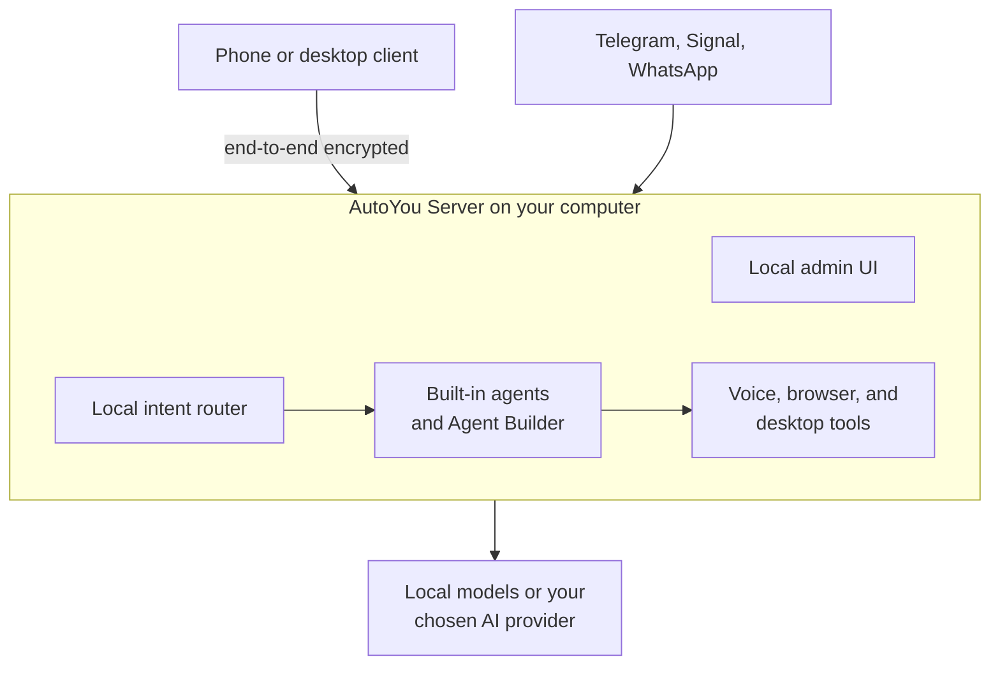

# AutoYou Server

[](https://github.com/autoyou-ai/AutoYou-Server/actions/workflows/public-checks.yml)
[](https://www.python.org/)
[](LICENSE)
<!-- Add the GitHub stars badge once the repository has stars worth showing:
[](https://github.com/autoyou-ai/AutoYou-Server)
-->

**AutoYou is a one-of-a-kind, serverless, peer-to-peer inference and web server**
that does real-time, unlimited human and AI chat, voice, and video calls, and
gives you your own agentic app store offering remote desktop control, notes, a
page feed, reminders, and much more. Everything runs merely on your laptop or
mini PC at home, without modifying your network one bit, while maintaining utmost
security.

**You are not the product.** With AutoYou you are the owner of your ecosystem,
which you can share with your friends and family, or keep for yourself.

AutoYou Server runs on Windows, macOS, and Linux. Conversations, files, and
settings are stored on your machine, and you choose the AI: local models or the
provider you configure.

[Quick start](#quick-start) · [Guides](guides/README.md) · [Ecosystem](https://www.autoyou.me/ecosystem/) · [Community](https://www.autoyou.me/community/) · [Support](https://www.autoyou.me/support/) · [Contributing](CONTRIBUTING.md) · [License](#license-and-use)

## Highlights

- **Talk to it.** Voice and video call support over WebRTC, plus chat, from your phone or another computer.
- **Let it act.** Built-in agents, browser tools, and an interactive Agent Builder for your own agents.
- **Reach it anywhere.** Pair devices with QR or OTP pairing, and connect through Telegram, Signal, or WhatsApp.
- **Stay in control.** A local admin UI, owner-controlled pairing, a server password before anything is enabled, and end-to-end encrypted peer traffic.
- **Route locally.** Fast on-device intent routing, with no cloud round trip.

## How it works

Your devices connect to the server on your computer over the local network, Cloud
Pair, or a public link you explicitly enable. Peer traffic for data and voice is
end-to-end encrypted between your own devices, and connection helpers only
forward already-encrypted packets.



## What is in this repository

This repository contains the server runtime, local administration interface,
optional integrations, tests, and packaging tooling needed to run and evaluate
the server: the standalone backend, HTTP and WebSocket endpoints, messaging
connectors (Telegram, Signal, WhatsApp), built-in AI agents, peer linking, local
intent routing, and the local admin web interface. Client applications and
hosted account services are distributed separately; see the
[AutoYou ecosystem](https://www.autoyou.me/ecosystem/).

## License, Open Source Commitment and Contributor Rewards

AutoYou Server is currently source-available under the [AutoYou Source-Available Personal-Use License](LICENSE) while the initial community foundation is established.

**We are committed to making this Open Sourced soon!** As outlined in our [Community Milestone Roadmap](https://www.autoyou.me/donate/), once our initial community target ($5M) is reached, AutoYou Server will be officially released under an OSI-approved open-source license (such as Apache 2.0 or MIT).

**Contribute and Earn Monetary Rewards:** We actively invite developers from all backgrounds to contribute to AutoYou Server! OpenStorey commits to allocate at least 15% of all sponsorship, donation, and community funding directly to approved contributors. By building agent modules, fixing bugs, creating client connectors, or optimizing inference routines, you can earn monetary payouts and bounties from our community-funded [Contributor Pool](docs/contributors/contributor-pool.md). 

See [CONTRIBUTING.md](CONTRIBUTING.md) to claim an issue and start building today! Read our [Open-Source Commitment](docs/legal/open-source-commitment.md) for full details on contributor allocation and transparency.

## Quick start

You need Python 3.10 or newer. Optional features may also require their own
dependencies, such as a local model runtime, Node.js, or Docker.

From the repository root, start the full trial profile. It includes the
voice/video and browser-backed internet dependencies that make the server's
capability surface representative:

Windows:

```powershell
.\run_autoyou.bat --profile full
```

macOS or Linux:

```bash
./run_autoyou.sh --profile full
```

The bootstrapper creates the local environment and installs the selected
profile. The full profile installs the speech and browser stacks, so its first
install is the largest. Pick a smaller profile to start faster:

| Profile | What it installs |
| --- | --- |
| `base` | Admin UI, cloud AI path, secure device connection, and page service |
| `local` | `base` plus offline intent routing, Ollama helpers, and Hugging Face model-library integration |
| `recommended` | `local` plus Telegram, Signal, and WhatsApp transport support and Bluetooth Pair |
| `full` | `recommended` plus realtime speech (STT/TTS) and model downloads, a browser-backed internet agent, and desktop automation helpers |

After startup, open `http://127.0.0.1:8001/`. On a new installation, choose a
unique server password before enabling integrations or pairing devices. For an
unattended first start, set `AUTOYOU_SERVER_PASSWORD` in the environment before
launching the server.

## What the full profile enables

| Capability | Included path |
| --- | --- |
| Local AI | Ollama helpers and model-library integration |
| Local Intent Router | Fast on-device classification and local intent routing without cloud round-trips |
| Agent Builder & Chat | Interactive Agent Builder website and server-owned Chat & History workspace |
| Voice and video | Speech recognition, TTS, media replies, and WebRTC call support |
| Browser internet | Browser-backed internet tools through Playwright |
| Messaging | Telegram, Signal, and WhatsApp integrations |
| MCP Bridge | Authenticated same-machine and tokenized MCP route bridge |
| Peer Link & Rendezvous | Direct peer invite, authenticated peer-link negotiation, room bridge, and call listener federation |
| Room Bridge & Calls | Multi-party presence, room call sessions, and shared media notes |
| Private access | Local Admin UI, owner-controlled pairing, and protected configuration |

The source tree contains the optional voice, video, and browser helpers even
when a smaller profile is installed. Profiles control dependency installation
and startup readiness; integrations still remain disabled until you enable and
configure them in the Admin UI.

## Inside the local admin UI

These captures show the running Server admin interface. Account, Server ID,
and local network values were replaced with synthetic examples for the images;
service status reflects the captured setup. Select an image to see the full page.

| Overview | Live View | Security |
| --- | --- | --- |
| [](docs/images/admin/overview.png) | [](docs/images/admin/live-view.png) | [](docs/images/admin/security.png) |

## Docker

The Compose setup binds published ports to host loopback and requires
`AUTOYOU_SERVER_PASSWORD` to be set before it starts. Choose a strong, unique
password. It persists configuration in a named Docker volume and does not
mount your checkout into the container. On Docker Engine versions before 28,
localhost-published ports may still be reachable from the same LAN segment;
see [Docker's port-publishing guidance](https://docs.docker.com/engine/network/port-publishing/).

Windows PowerShell:

```powershell
$env:AUTOYOU_SERVER_PASSWORD = "choose-a-strong-unique-password"
docker compose up --build
```

macOS or Linux:

```bash
export AUTOYOU_SERVER_PASSWORD='choose-a-strong-unique-password'
docker compose up --build
```

The Docker build attempts to pre-cache the upstream Tunnelmole binary, and the
server can download it at runtime if absent. Set both
`AUTOYOU_SKIP_TUNNELMOLE_DOWNLOAD=1` and `AUTOYOU_NO_DOWNLOAD_TUNNELMOLE=1`
before `docker compose up --build` to disable those downloads. Pairing through
Tunnelmole then requires a binary you provide separately.

To configure donation links for a source run, copy
`config/donations.example.json` to `config/donations.json` and edit the local
copy. The local file is ignored; packaged builds include the disabled example.

## Development and verification

Read [CONTRIBUTING.md](CONTRIBUTING.md) before making changes. Tests must use
an isolated runtime root so they never touch a live AutoYou configuration:

```powershell
python -m pytest tests/server/build -q
python scripts/export_public_autoyou_server.py --check
```

The full contributor check list, including test dependencies and the server
legal gate, is in [CONTRIBUTING.md](CONTRIBUTING.md).

## Packaging and official builds

The [server packaging workflows](servers/README.md) support local development
and platform-specific compilation across Windows, macOS, and WSL (Linux).
Official release workflows are standardized on the version declared in [VERSION](VERSION)
(currently `81.0.0`) and are strictly authorization-gated via SignToROSS/OpenSign
at `https://sign.autoyou.me/` with OAuth build gating. Build authorization is
granted when the authorized user OAuth account alone signs it. Do not remove, bypass,
or weaken those controls, and do not present an unofficial build as an official
AutoYou release.

### Personal source and private builds

These commands do not require an AutoYou account, email, OAuth, or a request to
AutoYou's build-authorization service. They build or run an unofficial private
copy under the Personal Use terms in [LICENSE](LICENSE). Dependency setup may
download packages from their respective upstream registries.

Run directly from source:

```bash
./run_autoyou.sh --profile full
```

On Windows:

```powershell
.\run_autoyou.bat --profile full
```

Private compiled builds from the command line:

```bash
# macOS: unsigned development build
./servers/macos/build-all.sh --no-sign --dev

# Linux/WSL: local backend build, without release gates
./servers/wsl/build-backend.sh --unofficial
```

```powershell
# Windows: Debug build, without release authorization gates
.\servers\windows\build-all.ps1 -Configuration Debug
```

The first private build displays the current `LICENSE` and
`THIRD-PARTY-NOTICES.md` and asks you to type `I AGREE`. The anonymous receipt
is stored on the device and invalidated when either notice changes. For an
explicit noninteractive build, add `--accept-terms` (PowerShell:
`-AcceptTerms`). This records only the local acknowledgment; it does not change
the license or grant redistribution or commercial rights.

Official release, signing, notarization, MSIX, and archive workflows must pass
`scripts/check_official_build_authorization.py --required` with a signed
authorization payload matching the artifact profile.

## Maintainer architecture

`server.py` composes the app, `routers/` owns HTTP/WebSocket route registration,
`core_server/` owns state, security, service lifecycle, HTTP helpers, and WebRTC
engine internals, and `shared/` provides runtime encryption, peer linking, and
intent routing.

The optional [AutoYou Agents](https://github.com/autoyou-ai/AutoYou_agents)
checkout can sit beside this repository. Source runs discover its optional
agents and ignored `private/` overlay; server packages continue to include
only the built-in agents in this repository.

## Community, support, and sponsorship

- **Community:** join the conversation at [www.autoyou.me/community](https://www.autoyou.me/community/).
- **Support:** get help at [www.autoyou.me/support](https://www.autoyou.me/support/). GitHub issues are for reproducible defects and proposals.
- **Ecosystem:** see the apps and components around the server at [www.autoyou.me/ecosystem](https://www.autoyou.me/ecosystem/).
- **Sponsor:** support AutoYou at [www.autoyou.me/donate](https://www.autoyou.me/donate/). At least 15% of the money we receive is allocated to approved contributors, and accepted contributors can share in the [Contributor Pool](docs/contributors/contributor-pool.md).
- **Website:** [www.autoyou.me](https://www.autoyou.me/).

## Documentation

- [Setup and pairing guides](guides/README.md)
- [Local Intent Routing](docs/local-intent-routing.md)
- [Built-in agents](autoyou_agents/README.md)
- [Contributing](CONTRIBUTING.md)
- [Contributor and AI maintainer guidance](docs/contributors/README.md)
- [Server validation skill](.agents/skills/autoyou-server-validate/SKILL.md)
- [Security policy](SECURITY.md)
- [Security guidance](docs/security/encryption.md)
- [Publication boundary](docs/legal/source-publication-manifest.md)
- [Open-Source Commitment](docs/legal/open-source-commitment.md)
- [Third-party notices](THIRD-PARTY-NOTICES.md)

<!-- Add the star history chart once the repository has stars worth charting:
<details>
<summary>Star history</summary>

[](https://star-history.com/#autoyou-ai/AutoYou-Server&Date)

</details>
-->
