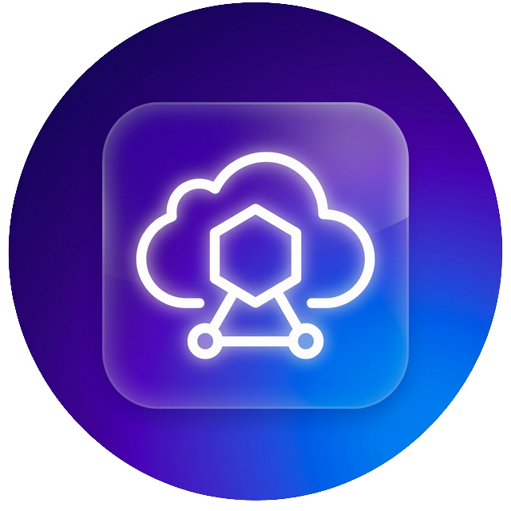
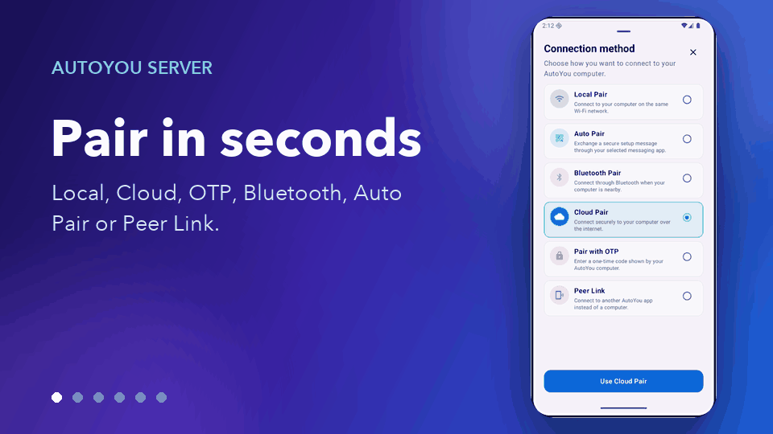
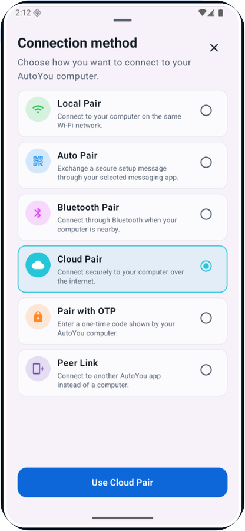
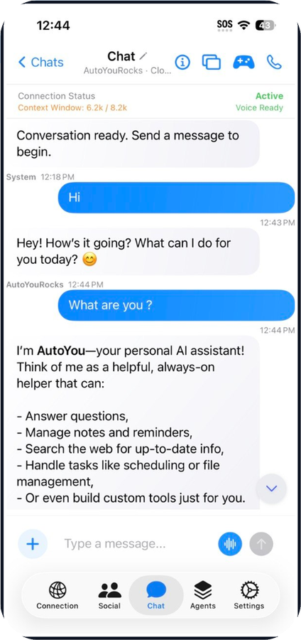
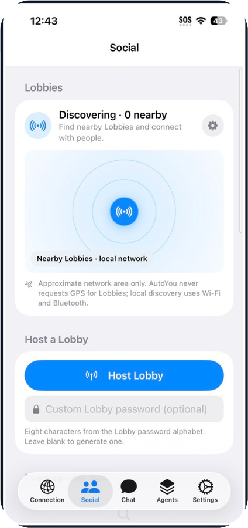
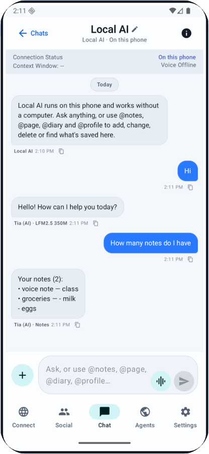
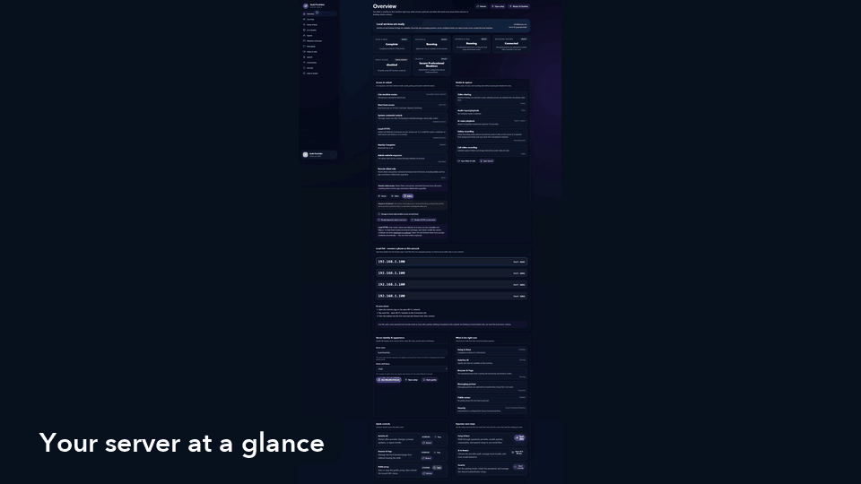
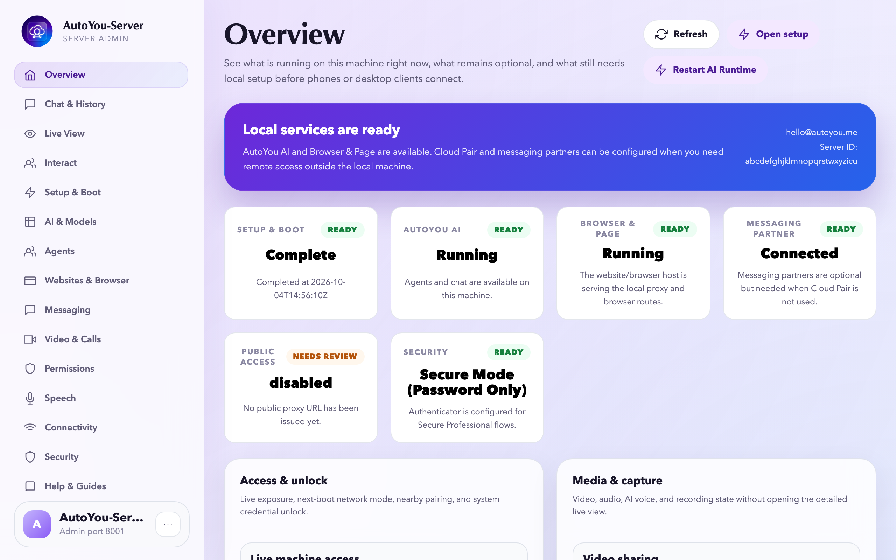
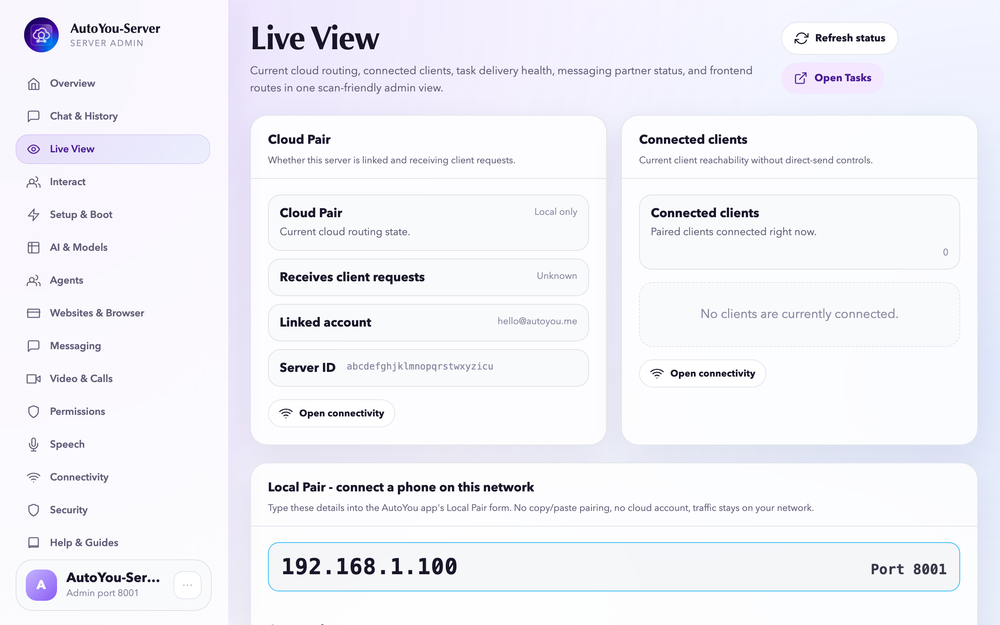
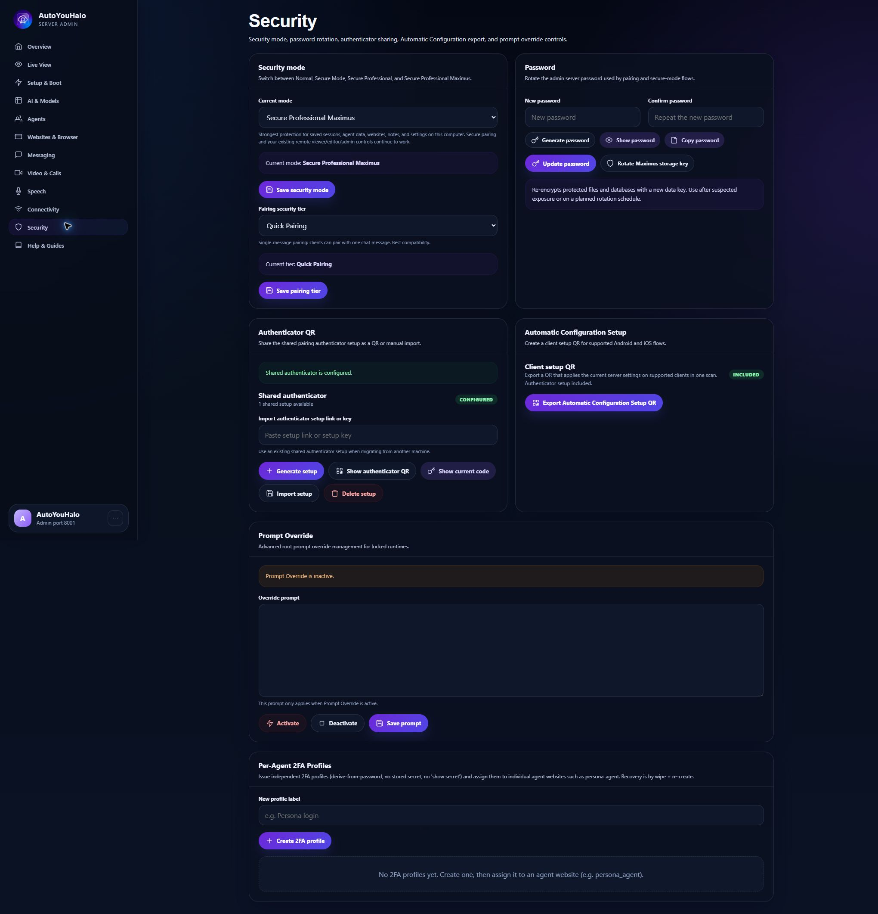

<p align="center">
  
</p>

<h1 align="center">AutoYou Server</h1>
<p align="center"><strong>Turn your computer or home lab into your personal, private AI server.</strong></p>
<p align="center">Local models · Real-time voice & video · Autonomous web agents · End-to-end encrypted</p>

<p align="center">
  <a href="https://github.com/autoyou-ai/AutoYou-Server/actions/workflows/public-checks.yml"></a>
  
  <a href="servers/README.md"></a>
  
  <a href="LICENSE"></a>
  <a href="https://www.autoyou.me/community/"></a>
</p>

<p align="center">
  <a href="#quick-start">Quick start</a> ·
  <a href="#highlights">Highlights</a> ·
  <a href="#what-the-full-profile-enables">Capabilities</a> ·
  <a href="#see-it">Admin UI</a> ·
  <a href="docs/admin-ui/agent-workbench-ui.mdx">Agent Builder</a> ·
  <a href="guides/README.md">Docs</a> ·
  <a href="CONTRIBUTING.md">Contribute</a> ·
  <a href="LICENSE">License</a>
</p>

<p align="center">
  
</p>

<p align="center">
  <a href="https://apps.apple.com/us/app/autoyou/id6760363728"></a>
  <a href="https://play.google.com/store/apps/details?id=com.autoyou.app"></a>
  <a href="https://apps.microsoft.com/detail/9mw8l2wfw7wv?hl=en-US&gl=US"></a>
  <a href="https://www.autoyou.me/downloads/"></a>
  <a href="https://www.autoyou.me/ecosystem/"></a>
</p>

---

### **You are not the product.**
Most AI assistants live in someone else's cloud, train on your private conversations, and bill you every month.

**AutoYou Server** turns the machine you already own — your laptop, desktop, or home mini PC — into a self-hosted AI operating center. Run local models with Ollama, talk to your computer with real-time speech over WebRTC, let agents browse the web and organize your notes, and connect your phone via end-to-end encrypted peer channels.

No network port-forwarding gymnastics. No forced cloud telemetry. Your data stays on your machine.

---

## Highlights

- 🎙️ **Talk to it in real time:** Low-latency voice and video calls powered by WebRTC, on-device speech recognition (Whisper), and neural text-to-speech.
- 🤖 **Let agents take action:** Built-in agents equipped with Playwright browser automation, file explorers, and a visual in-browser [Agent Builder](docs/admin-ui/agent-workbench-ui.mdx).
- ⚡ **Local intent routing:** Instant on-device classification routes queries to the right agent or tool without wasting cloud API tokens or waiting for round-trips.
- 🔌 **Universal MCP & messaging bridges:** Native Model Context Protocol (MCP) server bridge to connect standard developer tools, plus optional bridges for Telegram, Signal, and WhatsApp.
- 📱 **Seamless device pairing:** Pair phones, tablets, or secondary laptops using simple QR or OTP pairing over encrypted WebRTC DataChannels (libsodium).
- 🔒 **Private & sovereign:** Binds to secure loopback defaults out of the box. Single-user password gate, encrypted key store, and total ownership.

## What the full profile enables

| Capability | What's included |
| :--- | :--- |
| **Local AI & Inference** | Integrated Ollama helpers, local GGUF/Hugging Face model support, and cloud provider fallbacks. |
| **Local Intent Router** | High-speed, on-device classifier routing commands locally without external network calls. |
| **Real-time Voice & Video** | Full WebRTC media engine, fast STT (Whisper), neural TTS, and room call presence. |
| **Browser & Web Agents** | Headless browser execution via Playwright for autonomous research and web automation. |
| **Model Context Protocol** | Built-in MCP bridge allowing Claude, Cursor, and IDE tools to tap directly into server agents. |
| **Messaging Connectors** | Owner-controlled Telegram, Signal, and WhatsApp companion services. |
| **P2P Encrypted Peer Link** | Libsodium-encrypted data channels for remote pairing without exposing open router ports. |
| **Admin Console & Workbench** | Single-page local UI for real-time monitoring, agent configuration, and live camera/audio feeds. |

Features depend on the selected profile, hardware, permissions, and configured
integrations. AutoYou client apps are distributed separately; server-backed
features need a server you run or compile.

## The apps

AutoYou Server runs on your computer. The apps reach it from anywhere, and the
phone apps also carry a local AI of their own for when no computer is around.

| Pair any way you like | Chat with your own AI | Nearby Lobbies | Local AI on the phone |
| --- | --- | --- | --- |
|  |  |  |  |

- **Local AI, no computer needed.** Tap *Local* in Chat for an assistant that runs on the phone
  (LFM 2.5 350M, Gemini Nano or Apple Intelligence), and ask it to keep Notes, Page items, a Diary and a Profile.
- **Lobbies.** Host or join nearby rooms over Wi-Fi and Bluetooth, without GPS, with chat plus audio and video
  for up to 6 guests and the host.
- **Peer Link.** Connect one AutoYou app to another; the receiving app approves each link, and optional AI replies
  answer for you using only what you told it.
- **Remote desktop.** View and control your computer's screen with touch and hardware modifier keys.

Explore the whole AutoYou ecosystem at [autoyou.me/ecosystem](https://www.autoyou.me/ecosystem/).

## See it

<p align="center">
  
</p>

The local admin interface brings setup, models, agents, connections, and
security controls together. These repository screenshots use example account
and network values; statuses show the captured setup. Select a preview to
open the full image.

| Your server at a glance | Devices and activity | Access and security |
| --- | --- | --- |
| [](docs/images/admin/overview.png) | [](docs/images/admin/live-view.png) | [](docs/images/admin/security.png) |

## Quick start

### 1. Get the server

```bash
git clone https://github.com/autoyou-ai/AutoYou-Server.git
cd AutoYou-Server
```

The bootstrap checks for Python 3.10 or newer. Dependencies can require a
newer version or a particular platform; see [dependency profiles](requirements/README.md).

### 2. Start with the essentials

**Windows**

```powershell
.\run_autoyou.bat --profile base
```

**macOS or Linux**

```bash
./run_autoyou.sh --profile base
```

The bootstrap prepares a Python environment and downloads dependencies.
Review the scripts first and use an environment you can safely modify.

### 3. Make it yours

Open **http://127.0.0.1:8001/**, choose a unique server password, and follow
setup to select your AI, enable the tools you want, and pair a device.

For unattended first setup, supply `AUTOYOU_SERVER_PASSWORD` through your
environment or secret manager. Keep real passwords out of shared commands,
issues, and screenshots.

<details>
<summary><strong>Choose a larger profile</strong></summary>

| Profile | Adds |
| --- | --- |
| `base` | Core server, local administration, device connections, and provider integrations |
| `local` | Local-model helpers and on-device intent routing |
| `recommended` | Messaging and Bluetooth integration dependencies |
| `full` | Speech, browser, and desktop automation dependencies |

Replace `base` in the launch command with your chosen profile. The root
launchers also request the internet component, including for `base`.
Profiles select dependencies; integrations still need configuration. Optional
features may download models or native tools and require provider accounts.

See [requirements/README.md](requirements/README.md) for platform limits and
the current dependency review.

</details>

## How it fits together

<picture>
  <source media="(prefers-color-scheme: dark)" srcset="docs/images/architecture-dark.png">
  
</picture>

- **Pair and connect.** Auto-Pair exchanges an encrypted pairing message between your device and your
  server through a Telegram, Signal or WhatsApp workflow you configure. After pairing, your devices talk
  to the server over end-to-end encrypted WebRTC for chat, voice and video.
- **Agent Apps reach your phone.** Agent websites and web apps are tunneled as encrypted HTTP over the
  WebRTC SCTP data channel to a small local web server on the phone, which serves them the way the
  server would.
- **One harness, many agents.** A Google ADK harness runs the built-in AutoYou agents and bridges
  OpenClaw and Hermes Agent. Model calls go through LiteLLM to Ollama on your machine, or to cloud
  providers only if you add them.
- **Local voice and memory.** Speech-to-text uses faster-whisper. Text-to-speech uses system voices, or
  EmotiVoice if you install it. Memory is SQLite by default, with Cognee as an optional richer backend.
- **Local chat on the phone.** The phone can chat on its own with LFM2.5 350M, Apple Intelligence on
  iPhone, or Gemini Nano on supported Android phones.

Dashed orange boxes are external projects and integrations you can add or leave out. You choose which
models, agents, and connections to enable. WebRTC connections encrypt traffic between their endpoints.
Remote discovery, relays, provider APIs, and messaging bridges have their own data flows and terms.
The diagram source is [docs/images/architecture.mmd](docs/images/architecture.mmd) (Mermaid), with a dark-palette copy next to it.

## Build something yours

Start with the [built-in agents](autoyou_agents/README.md), explore the
[Agent Builder](docs/admin-ui/agent-workbench-ui.mdx), or add your own code.
Give an agent a focused job, connect the tools it needs, and make an interface
you enjoy using.

- **Build:** an original agent, extension, integration, or useful web interface.
- **Improve:** setup, accessibility, platform compatibility, documentation, or a reproducible bug.
- **Share:** a demo, a guide, or a clearly labeled unofficial build that follows the license.

Independent original code can use your chosen license, including MIT or
Apache-2.0. Changes to existing AutoYou code retain its applicable license.
Read [CONTRIBUTING.md](CONTRIBUTING.md) before submitting work to this repository.

## Run it your way

<details>
<summary><strong>Compile an unofficial local build</strong></summary>

From the repository root:

```powershell
# Windows
.\servers\windows\build-all.ps1 -Configuration Debug
```

```bash
# macOS
./servers/macos/build-all.sh --no-sign --dev

# Linux / WSL
./servers/wsl/build-backend.sh --unofficial
```

These routes do not require an AutoYou account or official release approval.
They may install or reconcile dependencies. Review the license and notices
when prompted. For unattended acknowledgement after review, use `-AcceptTerms`
on Windows or `--accept-terms` on macOS/Linux.

Platform prerequisites, output locations, and known limitations:
[Windows](servers/windows/README.md) |
[macOS](servers/macos/README.md) |
[Linux / WSL](servers/wsl/README.md).

</details>

<details>
<summary><strong>Run with Docker</strong></summary>

Supply `AUTOYOU_SERVER_PASSWORD` securely, then run:

```bash
docker compose up --build
```

The Compose configuration binds published ports to host loopback and keeps
configuration in a named volume. Check your Docker version's port-publishing
behavior before relying on loopback isolation.

To disable build-time and runtime Tunnelmole downloads, set both
`AUTOYOU_SKIP_TUNNELMOLE_DOWNLOAD=1` and `AUTOYOU_NO_DOWNLOAD_TUNNELMOLE=1`
before building and starting. Features requiring it then need a separately
supplied binary.

</details>

## License and community

**Build it. Modify it. Share it under the [server license](LICENSE).**

| Material or use | Terms |
| --- | --- |
| Individual Use, local builds, and free sharing | Permitted under the server license and its conditions |
| Modifications to AutoYou code | Retain the applicable AutoYou license |
| Independent original, separable code | Your chosen license, including MIT or Apache-2.0 |
| Institutional Use or Commercial Exploitation | Separate [Enterprise agreement](https://www.autoyou.me/enterprise/) |

AutoYou Server is currently source-available. The definitions in LICENSE
control; it is not currently an OSI-approved open-source project. Preserve
notices, identify unofficial builds, and meet included components' obligations.

OpenStorey allocates at least **15% of qualifying net receipts** to the
contributor pool. Awards follow the [pool's review and eligibility rules](docs/contributors/contributor-pool.md).
Participation does not require a paid plan. The [funding roadmap](https://www.autoyou.me/donate/)
includes a $5M server open-source milestone; current rights come from the
license supplied with the source.

## Star history

[](https://star-history.com/#autoyou-ai/AutoYou-Server&Date)

## Help make AutoYou useful to more people

**Build something useful. Show what it does. Help someone else get started.**

- [Join the community](https://www.autoyou.me/community/) and share what you are building.
- [Open an issue](https://github.com/autoyou-ai/AutoYou-Server/issues) with a reproducible bug or a focused idea.
- [Contribute](CONTRIBUTING.md) code, documentation, or platform feedback.
- Star the repository if you want to follow its progress and help others discover it.

For setup help, use [SUPPORT.md](SUPPORT.md). Report suspected vulnerabilities
privately through [SECURITY.md](SECURITY.md). Agents run with the server's
permissions, so review actions, enable only what you need, and keep backups.
See [dependency guidance](requirements/README.md) and
[third-party notices](THIRD-PARTY-NOTICES.md) for component details.
