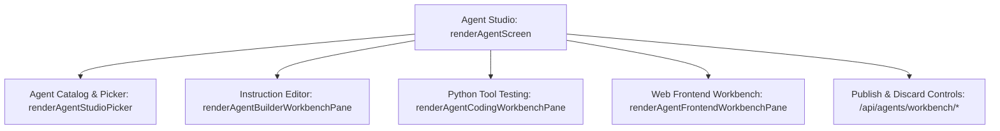

# Agent Workbench & Studio

The **Agent Screen** (`renderAgentScreen()` in `assets/admin-ui.js`) is an integrated visual IDE embedded directly within AutoYou Server. It enables developers to inspect, modify, test, scaffold, and publish AI agents in real time without restarting the server.

---

## Workbench Architecture



---

## 1. Agent Catalog & Studio Picker (`renderAgentStudioPicker()`)

Lists all installed agents discovered across the immutable built-in catalog (`autoyou_agents/`) and the mutable dynamic directory (`get_dynamic_agents_root()`):
- **Agent Cards**: Displays agent title, operational domain, description, and status tags (`BUILTIN`, `DRAFT`, `PUBLISHED`, `FRONTEND_ENABLED`).
- **Owner Card**: Displays author attribution, version, and license terms.
- **Filtering**: Filters by domain (System, Tooling, Media, Intelligence, Automation, Utility).

---

## 2. Prompt & Instruction Editor (`renderAgentBuilderWorkbenchPane()`)

Allows editing the prompt instructions that govern agent decision-making:
- **Section-Based Editing**: Prompts are partitioned into modular sections:
  - `identity`: Core role and behavioral persona.
  - `tools`: Detailed usage rules for bound Python tools.
  - `constraints`: Negative constraints and safety guidelines.
  - `formatting`: Output templates and JSON schemas.
- **Placeholder Inspection**: Inspects runtime injected values like `{current_date}`, `{user_device}`, `{platform_os}`, and `{owner_name}`.
- **Reversion History**: `POST /api/agent-instructions/revert` restores original package defaults if a prompt change produces undesirable behavior.

---

## 3. Tool Execution & Dry-Run Testing (`renderAgentCodingWorkbenchPane()`)

Developers can test Python tool execution before publishing changes to production:

```http
POST /api/agents/workbench/weather_agent/test HTTP/1.1
Host: 127.0.0.1:8001
Content-Type: application/json
Authorization: Bearer <ADMIN_SESSION_TOKEN>

{
  "tool_name": "fetch_forecast",
  "arguments": {
    "location": "San Francisco, CA",
    "days": 3
  }
}
```

The response includes:
- Return value or JSON payload.
- Execution duration in milliseconds.
- Standard output (`stdout`) and error tracebacks (`stderr`).
- Memory and privilege boundary check results.

---

## 4. Frontend Scaffolding & Live Preview (`renderAgentFrontendWorkbenchPane()`)

If an agent requires an interactive web UI, the workbench automates frontend generation:

1. **Scaffold Frontend**: Clicking **"Scaffold UI"** dispatches:
   ```http
   POST /api/agents/workbench/{agent_name}/frontend/scaffold HTTP/1.1
   Host: 127.0.0.1:8001
   ```
   Generates a starter `index.html`, `app.js`, and `styles.css` under the agent's `website/frontend/` directory.
2. **Live IFrame Preview**: Embeds a live sandboxed `<iframe>` pointing to `http://127.0.0.1:8067/agent/{agent_name}/`.
3. **Manifest Editor**: Modifies `manifest.json` attributes (route mode, proxy port, permissions, icon).

---

## 5. Draft Lifecycle & Hot-Publishing

To guarantee stability, modifications are staged as isolated drafts:
- **Clone Agent**: `POST /api/agents/workbench/{name}/clone` creates an independent copy under a new name.
- **Publish Draft**: `POST /api/agents/workbench/{name}/publish` commits the draft into the dynamic agent registry. The orchestrator reloads the agent worker dynamically without dropping client connections.
- **Discard Draft**: `POST /api/agents/workbench/{name}/discard` reverts all staged changes cleanly.
