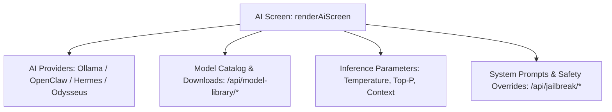

# AI Models & Speech Settings

AutoYou Server features unified administrative interfaces for configuring local and cloud intelligence engines, speech recognition models, and voice cloning pipelines:
- **AI Screen** (`renderAiScreen()`): LLM provider status, model downloads, inference parameters, and prompt policies.
- **Speech Screen** (`renderSpeechScreen()`): Speech-to-text (STT) models, text-to-speech (TTS) engines, and voice cloning.

---

## AI Screen: LLM Orchestration (`renderAiScreen()`)

### 1. Model Providers Status (`renderAiProviderSettingsBody()`)
Inspects active local inference backends:
- **Ollama**: Connects to `http://127.0.0.1:11434`. Queries `GET /api/ai/ollama/status` to list loaded models (e.g. `llama3:8b`, `qwen2.5-coder`, `mistral`).
- **OpenClaw Bridge**: Native bridge connecting to the OpenClaw orchestration engine (`GET /api/ai/openclaw/status`).
- **Hermes**: Autonomous reasoning engine bridge (`GET /api/ai/hermes/status`).
- **Odysseus**: Specialized agent planner bridge (`GET /api/ai/odysseus/status`).

### 2. Model Library Catalog & Download Manager (`renderAiCatalogMarkup()`)
Operators can browse, download, and delete GGUF and Ollama model weights directly from the Admin UI:
- **Catalog Browsing**: `GET /api/model-library/catalog` retrieves recommended open models categorized by memory footprint (3B, 8B, 14B, 70B).
- **Download Jobs**: Initiating a download calls `POST /api/model-library/download`.
- **Progress Tracking**: Real-time progress bar polling `GET /api/model-library/downloads/{job_id}` displays download speed and estimated time remaining.
- **Model Selection**: `POST /api/model-library/select` designates the default model for root agent dispatch.

### 3. Model Behavior & Hyperparameters (`renderModelBehaviorBody()`)
Fine-tune inference generation settings:
- **Temperature** ($0.0 - 2.0$): Balances determinism vs creativity.
- **Top-P (Nucleus Sampling)** ($0.0 - 1.0$).
- **Context Length**: Configures the token context limit ($4,096 - 128,000$ tokens).
- **Penalties**: Frequency and presence repetition penalty adjustments.

### 4. System Prompts & Red-Team Mode
- **System Instructions**: Customizes the base persona prompt applied across agents.
- **Jailbreak Safety Override**: For authorized developers and security researchers, `POST /api/jailbreak/activate` permits testing unconstrained model behaviors with explicit safety disclaimers.

---

## Speech Screen: Voice & STT Engine (`renderSpeechScreen()`)

### 1. Speech Recognition / STT (`renderSpeechRecognitionBody()`)
AutoYou Server utilizes local Whisper models for converting user speech into text:
- **Engine Backends**:
  - `faster-whisper`: CTranslate2-accelerated inference running on CPU or CUDA.
  - `RealtimeSTT`: Ultra-low-latency streaming voice activity detection (VAD).
- **Model Sizes**: `tiny.en`, `base.en`, `small`, `medium`, `large-v3`.
- **Management API**:
  - `GET /api/speech-models/status`: Lists currently installed speech models.
  - `POST /api/speech-models/download`: Triggers background download of model weights.

### 2. Text-to-Speech / TTS (`renderSpeechProviderSettingsBody()`)
Configure how AutoYou agents speak back to the user:
- **EmotiVoice**: Fast, expressive multi-voice local neural synthesis.
- **Kokoro**: Ultra-compact 82M parameter high-quality TTS.
- **ElevenLabs**: Cloud integration for studio-grade voice synthesis via API key.
- **Azure Cognitive Services**: Enterprise multilingual cloud TTS fallback.

### 3. Voice Training & Cloning (`loadChatTrainingLibrary()`)
Operators can clone their own voice or custom agent voices:
- Records audio clips directly from the browser or uploads WAV files to `POST /api/chat/voice-training`.
- Extracts voice speaker embeddings and stores them in `uploads/voice_profiles/`.
- Previews synthesized speech using the generated voice profile in real time.
