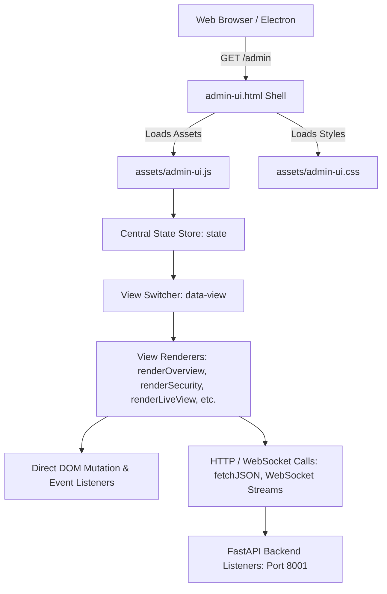
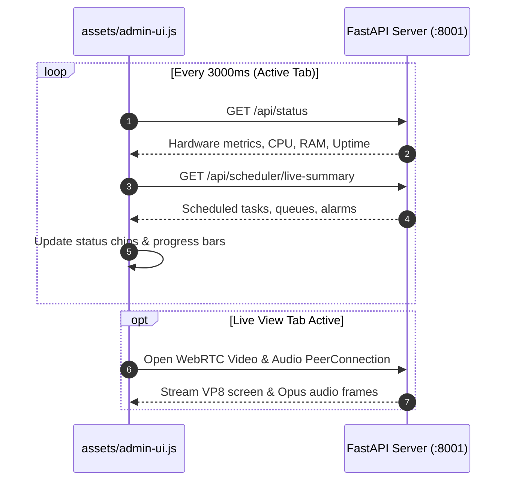

# Admin UI Architecture

The AutoYou Server administrative console is a high-performance, single-page application (SPA) delivered as a static asset bundle:
- **`assets/admin-ui.js`**: Core client application logic (10,000+ lines of vanilla JavaScript).
- **`assets/admin-ui.css`**: Responsive, dark-themed presentation stylesheet.
- **`assets/admin-ui.html`**: Root HTML shell served at `GET /admin`.



---

## Zero-Dependency Philosophy

The Admin Console is deliberately written in pure, standard **Vanilla JavaScript (ES2022+)** without external framework dependencies (React, Vue, or Angular) or build-step compilers:
- **Instant Loading**: Zero bundle compilation overhead; loads in under 30 milliseconds.
- **Minimal Memory Overhead**: Eliminates virtual DOM layers, running comfortably in low-memory environments, headless servers, and embedded WebViews.
- **Long-Term Maintainability**: Direct standard Web APIs (DOM, Fetch, WebSockets, Canvas) ensure the interface remains stable and immune to frontend framework churn.

---

## State Management & Reactive Render Cycle

`admin-ui.js` maintains a centralized reactive state object:

```javascript
const state = {
  currentView: 'overview',
  theme: 'dark',
  bootstrap: null,           // System capabilities & platform info
  status: null,              // Hardware metrics, memory, CPU
  connection: null,          // Active WebRTC connections & pairing
  activeSessionId: null,     // Active chat/interact conversation
  agentSecurityProfiles: [], // Security access policies
  totpState: { active: false, setupUri: null },
  isRefreshing: false
};
```

### The Rendering Pipeline

When navigating between views or when remote telemetry updates arrive, `renderApp()` executes:

1. **View Dispatch**: Inspects `state.currentView` and selects the corresponding view function:
   - `overview` $\rightarrow$ `renderOverview()`
   - `security` $\rightarrow$ `renderSecurityScreen()`
   - `live-view` $\rightarrow$ `renderLiveViewScreen()`
   - `interact` $\rightarrow$ `renderInteractScreen()`
   - `ai` $\rightarrow$ `renderAiScreen()`
   - `speech` $\rightarrow$ `renderSpeechScreen()`
   - `messaging` $\rightarrow$ `renderMessagingScreen()`
   - `agents` $\rightarrow$ `renderAgentScreen()`
   - `setup` $\rightarrow$ `renderSetupScreen()`
2. **DOM Patching**: Constructs clean HTML markup and injects it into container elements (`#main-content`).
3. **Event Binding**: Recursively attaches event handlers (`onclick`, `onchange`, `onsubmit`) to buttons, inputs, and tabs.

---

## Polling, Synchronization & Real-Time Streams

To maintain current operational awareness without overwhelming the server, `admin-ui.js` coordinates background synchronization:



- **Visibility-Aware Throttling**: When the browser tab is hidden or minimized, polling intervals dynamically back off from 3 seconds to 15 seconds to conserve CPU cycles.
- **Exponential Backoff on Errors**: If network errors or server restarts occur, reconnect attempts automatically back off to prevent request storms.

---

## Security & Sensitive Token Sanitization

`admin-ui.js` includes defensive security controls:
- **Automatic Scrubbing**: Any sensitive secrets (TOTP master keys, private tokens) rendered in confirmation modals are automatically scrubbed from memory after user dismissal.
- **CSRF & Origin Verification**: All mutating requests (`POST`, `PUT`, `DELETE`) pass operator session cookies or explicit Bearer tokens.
- **Safe HTML Injection**: Text input strings from external messaging bridges (Telegram, WhatsApp, Signal) are sanitized using HTML entity escaping before injection into the DOM, preventing Cross-Site Scripting (XSS).
