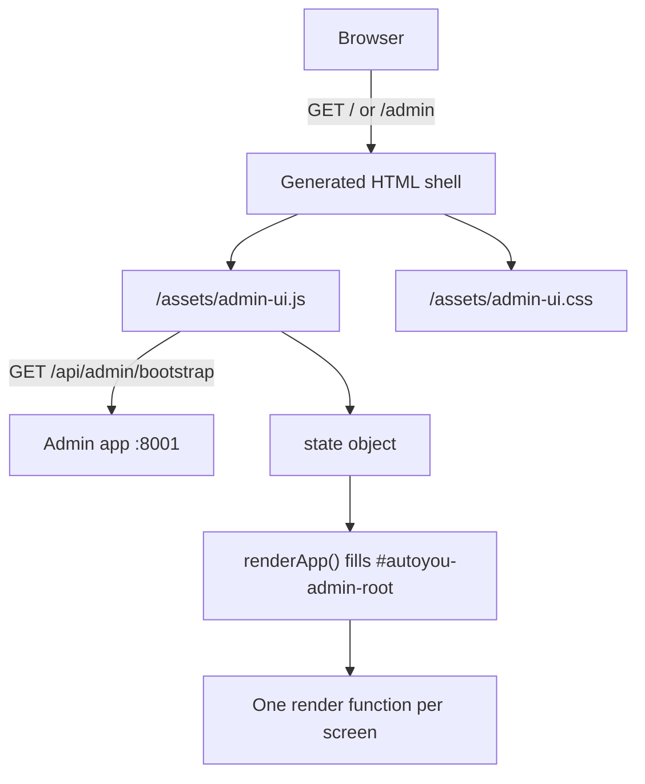

# Admin UI Architecture

The admin console is a single-page application written in plain JavaScript, with no framework and no build step. The server delivers it as a small HTML shell plus two static assets:

- **`assets/admin-ui.js`**: the application (over 11,000 lines).
- **`assets/admin-ui.css`**: the stylesheet, with a light and a dark theme.
- **The shell**: a short HTML document that the server generates in Python (`shared/admin_modern_ui.py`). It loads the stylesheet and script and contains an empty `#autoyou-admin-root` element. The console is served at `GET /` and `GET /admin`.

While the server is locked or you are not signed in, the shell redirects to `/login`. The access model is described in [Security & Authentication](/architecture/security-and-auth).

---

## Screens

The sidebar (the `NAV` list in `admin-ui.js`) has these screens. `state.screen` holds the current screen's id.

| Id | Label |
| :--- | :--- |
| `overview` | Overview |
| `chat` | Chat & History |
| `live` | Live View |
| `interact` | Interact |
| `setup` | Setup & Boot |
| `ai` | AI & Models |
| `agents` | Agents |
| `page` | Websites & Browser |
| `messaging` | Messaging |
| `video` | Video & Calls |
| `permissions` | Permissions |
| `speech` | Speech |
| `connectivity` | Connectivity |
| `security` | Security |
| `guides` | Help & Guides |

Each screen has a render function, for example `renderAiScreen()`, `renderSpeechScreen()`, `renderSecurityScreen()`, and `renderAgentScreen()`.

---

## State and rendering

A single `state` object holds the console's state: the current `screen`, the server's `bootstrap` payload, unsaved `forms`, a `notice` and a `modal`, and per-screen sections such as `aiLibrary`, `speechLibrary`, `setup`, `interact`, and `localPair`.

`renderApp()` rebuilds the shell from `state`: the sidebar and the current screen's markup go into `#autoyou-admin-root` as one HTML string. To avoid disturbing someone who is typing, a passive refresh is deferred while a form control has focus, and the active control and its selection are captured and restored around each render.

User actions are dispatched by an action name carried on the clicked control, and mutations go through small helpers that send JSON to the admin app's routes (`requestJson()` for reads, `postJson()` for writes).

---

## Data refresh

`refreshBootstrap()` calls `GET /api/admin/bootstrap`, applies the payload to `state`, and re-renders. Depending on the screen, it also loads extra data for the Live View, Messaging, Video, and Connectivity screens, the local pair details for Overview and Live View, and media devices for Video.

The console does not poll on one global timer. Features that need live data start their own timers while they are active: download jobs for models and speech models, the pairing dialogs, Telegram sender approvals, the Interact screen, and the authenticator code display.

---

## Safety in the browser

- **Escaping.** Dynamic text, including text that arrives from messaging bridges, is HTML-escaped before it is inserted into the page.
- **Cross-site requests.** State-changing requests must carry a matching `Origin` or `Referer`, which the server enforces.
- **Token generation.** The MCP token is generated in the browser with `crypto.getRandomValues`, and only on `localhost` or over HTTPS.
