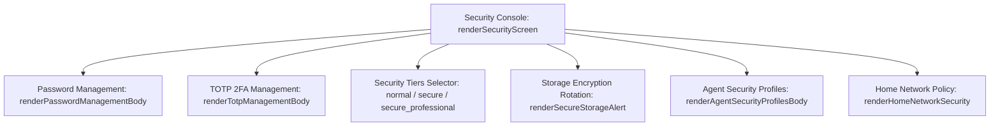

# Security Console

The **Security Console** (`renderSecurityScreen()` in `assets/admin-ui.js`) provides comprehensive administrative controls over authentication, cryptographic secrets, access tiers, and agent execution boundaries.

---

## Security Console Capabilities



---

## Password Management & Generation

Implemented via `renderPasswordManagementBody()`:
- **Master Password Update**: Updates the master password protecting the local server. Submitting the form calls `POST /api/admin/password`.
- **Built-in Password Generator**: `renderPasswordGeneratorTools()` generates high-entropy random passphrases (alphanumeric, symbols, or diceware word combinations) directly within the browser without external network requests.
- **Verification Strength Meter**: Real-time evaluation of password entropy and minimum length compliance.

---

## TOTP 2FA Enrollment & Recovery

The TOTP subsystem (`renderTotpManagementBody()`) manages two-factor authentication tokens:

### 1. New Authenticator Enrollment
1. Clicking **"Set up Authenticator"** calls `POST /admin/security/totp/generate`.
2. The UI renders the `showTotpSecretModal()` containing:
   - Visual QR code generated via local HTML5 Canvas rendering.
   - Plaintext Base32 secret key for manual entry.
3. The operator enters a 6-digit confirmation code, calling `POST /api/native/security/totp/confirm`.
4. Upon confirmation, the TOTP badge updates to **ACTIVE**.

### 2. Manual Secret Import & Key Deletion
- **Import**: Operators migrating from another machine can import an existing Base32 seed using `POST /admin/security/totp/import`.
- **Emergency Delete**: Operators can remove TOTP protection via `POST /admin/security/totp/delete` (requires local physical loopback access).

---

## Security Tier Selector

The console allows toggling the global security policy:

```javascript
// admin-ui.js security tier selection handler
async function updateSecurityTier(selectedTier) {
  const res = await fetchJSON('/api/admin/security/tier', {
    method: 'POST',
    body: JSON.stringify({ tier: selectedTier })
  });
  if (res.ok) {
    showNotice(`Security tier updated to ${selectedTier}`, 'success');
    renderApp();
  }
}
```

- When moving to **`secure_professional`**, the interface verifies that TOTP is active before allowing the switch.

---

## Agent Security Profiles & Sandbox Policy

AutoYou Server allows operators to define fine-grained permission profiles for individual AI agents:

```
+-------------------------------------------------------------------------+
| Agent Security Profiles                                                |
+-------------------------------------------------------------------------+
| Profile Name    | Network Access | Filesystem Access | Shell Execution |
| Standard Agent  | Denied         | Sandbox (/tmp)    | Denied          |
| Web Automator   | Outbound Only  | Downloads Only    | Denied          |
| System Admin    | Full LAN       | Workspace Root    | Approved Tools  |
+-------------------------------------------------------------------------+
| Assigned Agents:                                                        |
|  * browser_agent      -> Web Automator  [Reassign] [Wipe State]         |
|  * coding_agent       -> Standard Agent [Reassign] [Wipe State]         |
|  * admin_agent        -> System Admin   [Reassign] [Wipe State]         |
+-------------------------------------------------------------------------+
```

### Profile Operations
- **Assign Profile**: Maps an agent to a security profile via `POST /api/agent-security/profiles/{profile_id}/assign`.
- **Wipe Agent State**: Completely removes cached conversation memory, browser cookies, and local database keys for a compromised agent via `POST /api/agent-security/agents/{agent_name}/wipe`.
- **Verify Integrity**: Audits agent tool decorators against declared security boundaries via `POST /api/agent-security/verify`.

---

## Storage Encryption Key Rotation

When the operator changes the master server password or initiates a security audit, `renderSecureStorageAlert()` provides a one-click re-encryption tool.
- Invokes `POST /api/admin/security/storage/rotate`.
- Re-encrypts `config.keystore.enc` atomically with a fresh salt and nonce.
- Ensures existing sessions remain valid without dropping live WebRTC calls.
