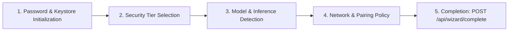
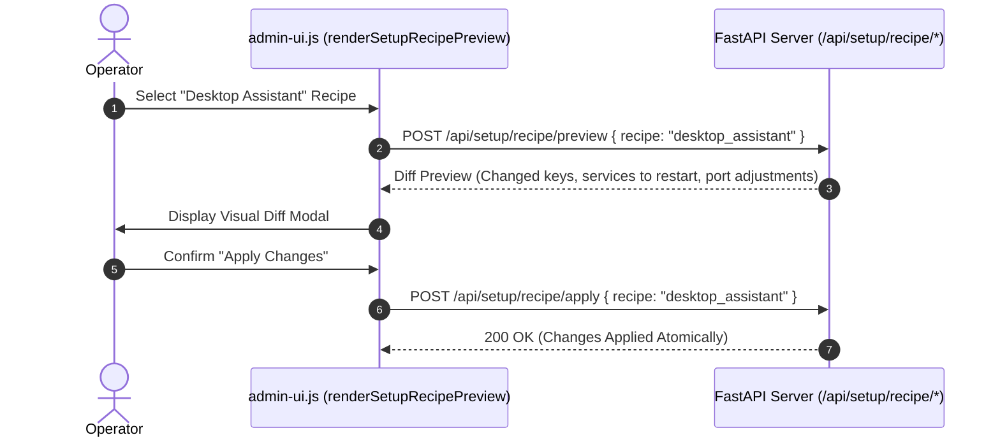

# Setup Wizard & Recipes

The **Setup** screen (`renderSetupScreen()` in `assets/admin-ui.js`) streamlines initial provisioning, automated profile deployment, and software maintenance through structured recipes and wizards.

---

## Onboarding Wizard (`/api/wizard/*`)

When launching AutoYou Server for the first time, the onboarding wizard guides the operator through critical baseline configuration:

- **`GET /api/wizard/status`**: Checks whether the server is in a fresh, unconfigured state.
- **`POST /api/wizard/complete`**: Marks onboarding as finished, sets `wizard_completed: true` in the keystore, and transitions the server into standard operational mode.

---

## Configuration Recipes (`/api/setup/recipe/*`)

Rather than manually toggling dozens of individual settings, AutoYou Server provides pre-engineered **Configuration Recipes**:

| Recipe Name | Focus Area | Applied Configurations |
| :--- | :--- | :--- |
| **Minimal Client** | Lightweight | Binds to loopback only, disables media streaming, pauses background daemons. |
| **Desktop Assistant** | Productivity | Enables screen-listen, Whisper voice capture, system tools, and notes agent. |
| **Creative & Media Hub** | Content | Enables GPU speech models (Kokoro, EmotiVoice), image generation, and audio library. |
| **Enterprise Hardened** | Security | Activates `secure_professional` tier, enforces TOTP 2FA, disables remote reverse proxies. |
| **Full Automation** | Multi-channel | Spins up WhatsApp, Signal, Telegram daemons, browser automation, and MCP servers. |

### Two-Phase Recipe Application

---

## Zero-Touch Pairing Setup (`renderZeroTouchPairingBody()`)

Automates pairing configuration for native desktop clients running on the same host machine (`v2/windows`, `v2/macos`):
- Configures local loopback auto-pairing without passwords.
- Sets ephemeral admin listener ports.
- Exports client configuration seeds into memory-mapped IPC channels.

---

## Software Updates (`renderSoftwareUpdatePanel()`)

Maintains server binaries and model assets safely:
- **`GET /api/software-update/status`**: Checks the upstream repository for new release versions against the local `VERSION` file.
- **`POST /api/software-update/apply`**: Downloads and verifies cryptographically signed update manifests before applying patches to the local install.
