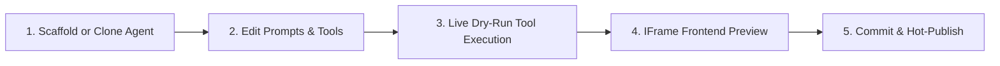

# Agent Workbench Developer Workflow

The **Agent Workbench** bridges source-code development and real-time interactive testing. It allows developers to create, customize, and verify agents without needing to restart the AutoYou Server.

---

## The Interactive Development Loop



---

## 1. Scaffolding a New Agent Project

You can initiate a new agent project via API or through the Admin UI:

```http
POST /api/builder/create HTTP/1.1
Host: 127.0.0.1:8001
Content-Type: application/json
Authorization: Bearer <ADMIN_SESSION_TOKEN>

{
  "name": "crypto_tracker_agent",
  "title": "Crypto Price Tracker",
  "domain": "Finance",
  "description": "Monitors cryptocurrency prices and alert thresholds.",
  "include_frontend": true
}
```

The server automatically scaffolds the project under `get_dynamic_agents_root()/crypto_tracker_agent/`.

---

## 2. Live Instruction Tuning & Section Diffing

Instead of editing monolithic text prompts, the workbench decomposes instructions into structured sections:

```http
POST /api/agent-instructions/sections HTTP/1.1
Host: 127.0.0.1:8001
Content-Type: application/json

{
  "agent": "crypto_tracker_agent",
  "sections": {
    "identity": "You are a crypto analytics agent. Always cite price sources and timestamps.",
    "tools": "Invoke 'get_spot_price' whenever a token ticker is mentioned (e.g. BTC, ETH).",
    "constraints": "Never give financial investment advice. State clearly that prices fluctuate."
  }
}
```

- Changes take effect immediately in the interactive test console.
- If the agent performs poorly, click **Revert** (`POST /api/agent-instructions/revert`) to restore the original prompt.

---

## 3. Interactive Tool Testing

Test individual Python tools directly with custom JSON payloads:

```http
POST /api/agents/workbench/crypto_tracker_agent/test HTTP/1.1
Host: 127.0.0.1:8001
Content-Type: application/json

{
  "tool_name": "get_spot_price",
  "arguments": {
    "ticker": "BTC",
    "fiat": "USD"
  }
}
```

**Response**:
```json
{
  "success": true,
  "output": {
    "ticker": "BTC",
    "price_usd": 68420.50,
    "change_24h": "+3.42%"
  },
  "execution_time_ms": 86.4
}
```

---

## 4. Hot-Publishing & Orchestrator Reload

Once verified, publish the draft:

```http
POST /api/agents/workbench/crypto_tracker_agent/publish HTTP/1.1
Host: 127.0.0.1:8001
```

1. The workbench registers the agent in `agent_install_registry.json`.
2. The orchestrator triggers an in-memory worker process restart (`_reload_agent_runtime()`).
3. The new agent is immediately available across all client interfaces (AutoYou Connect, Web, iOS, Android).
