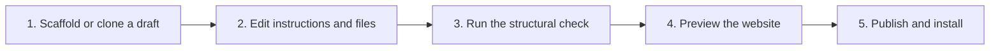

# Agent Workbench Developer Workflow

The **Agent Workbench** (Agent Studio on the Agents screen) lets you create, edit, check, and publish agents from the admin console without editing files by hand. Changes happen in a **workspace draft**; publishing copies the draft into the live agents directory. The routes are listed in [Agents & Agent Builder APIs](/api-reference/agents-and-builder), and the console screen is described in [Agents & Agent Studio](/admin-ui/agent-workbench-ui).

---

## The loop



---

## 1. Scaffold or clone a draft

Create a new draft with `POST /api/builder/create`. The body takes `name`, `description`, `tool_name`, and `tool_description`:

```json
{
  "name": "units_agent",
  "description": "Converts temperatures.",
  "tool_name": "convert_temperature",
  "tool_description": "Convert a temperature between Celsius, Fahrenheit, and Kelvin."
}
```

To change an existing agent instead, clone it into a draft with `POST /api/agents/workbench/{agent_name}/clone`. `GET /api/builder/agents` lists live agents and drafts.

---

## 2. Edit instructions

Save instruction content for a draft with `POST /api/agents/workbench/{agent_name}/instructions` (`description` and `instructions`).

For the main agent, `POST /api/agent-instructions/sections` updates the editable prompt sections and regenerates `AGENT_INSTRUCTION`, and `POST /api/agent-instructions/revert` restores `DEFAULT_INSTRUCTION`. In packaged runtimes these are locked unless Prompt Override is active; see [Security Console](/admin-ui/security-console).

---

## 3. Check the draft

`POST /api/agents/workbench/{agent_name}/test` runs a **structural check** on the draft and returns the result in `draft_test`, plus the refreshed workbench detail. It does not execute the agent's tools. To test tool behavior, write a `pytest` test; see [Self-Improvement Loop & Harness Testing](self-improvement-and-harness-testing.mdx).

---

## 4. Website preview

If the agent has a website, scaffold its frontend with `POST /api/agents/workbench/{agent_name}/frontend/scaffold` and save its manifest with `POST /api/agents/workbench/{agent_name}/frontend/manifest`. The page service serves it at `/agent/{agent_name}/`. See [Agent Web Frontends](agent-web-frontends.mdx).

---

## 5. Publish

`POST /api/agents/workbench/{agent_name}/publish` copies the draft into the live agents directory. Send `{"install_after_publish": true}` to install it in the same step. An agent that is installed becomes available after the AI runtime reloads. `POST /api/agents/workbench/{agent_name}/discard` throws a draft away.
