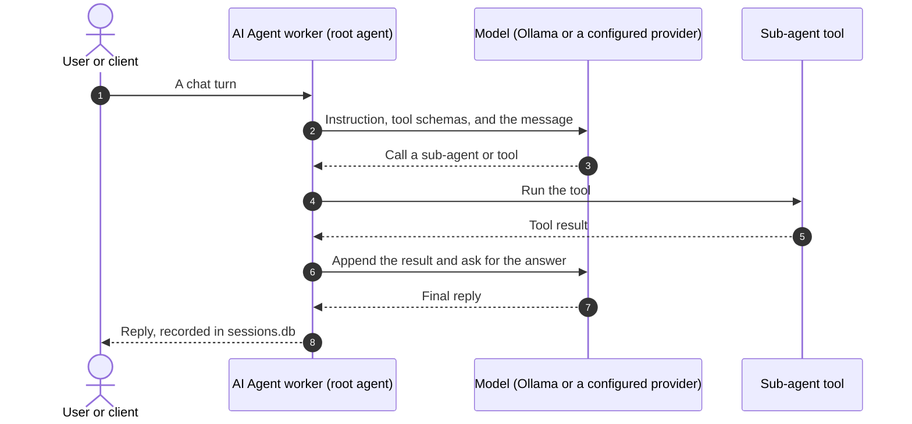

# Agent Framework Architecture

AutoYou's agent runtime is built on the [Google Agent Development Kit (ADK)](https://google.github.io/adk-docs/). A root agent, defined in `autoyou_agents/agent.py`, routes requests to specialized sub-agents. Each sub-agent is a Python package under `autoyou_agents/` that builds an ADK `Agent`. The runtime runs in the AI Agent worker process; see the [AI Agent worker reference](/api-reference/ai-agent-worker).

---

## Agent packages

Every agent lives in its own folder, either under `autoyou_agents/` or, for agents you add, under `autoyou_agents/private/`:

```
autoyou_agents/<name>_agent/
├── __init__.py
├── prompt.py        # AGENT_NAME, AGENT_DESCRIPTION, AGENT_INSTRUCTION, optional routing constants
├── agent.py         # create_<name>_agent(model_config) -> google.adk.agents.Agent
├── <tools>.py       # tool functions
└── website/         # optional web interface
    ├── manifest.json
    ├── frontend/
    └── backend/app.py
```

The server loads `autoyou_agents.<name>_agent.agent` and calls `create_<name>_agent(model_config)`. The factory returns an ADK `Agent` with a name, a model, a description, an instruction, and a list of tools. Tools are plain Python functions whose type annotations and docstrings the ADK turns into a schema for the model.

The contract is described in [Building Custom Agents](building-agents.mdx), and a walkthrough is in the [tutorial](../guides/custom-agent-tutorial.mdx).

---

## Execution loop



The root agent is told about the installed agents only. Agents that are uninstalled or disabled are omitted from its prompt and its routing, and with small models a two-stage routing step first picks a domain and then runs inside it. See [Core Agent Engine](core-agent-engine.mdx).

---

## Websites

An agent can include a website under `website/`. Its `manifest.json` carries `agent_name`, `title`, `description`, `entry_path`, `recommended_port`, `requires_proxy_registration`, and optionally `expose_by_default`, `control_label`, and `control_help`. The [page service](/api-reference/website-gateway) serves it at `/agent/<name>_agent/`. See [Agent Web Frontends](agent-web-frontends.mdx).

---

## Agent categories

The built-in agents are grouped into **9 domains**. The pages below are generated from the source, so they list each agent's real description and tools.

| Category | Agents Included | Reference Documentation |
| :--- | :--- | :--- |
| **System & Administration** | `admin_agent`, `backup_agent`, `hosting_agent`, `win_security_agent`, `mac_security_agent` | [System & Admin Agents](/agents/system-and-admin) |
| **Media & Creative** | `audio_agent`, `media_generation_agent`, `notes_agent`, `page_agent` | [Media & Creative Agents](/agents/media-and-creative) |
| **Intelligence & Models** | `memory_agent`, `persona_agent`, `model_picker_agent`, `openclaw_agent`, `hermes_agent` | [Intelligence & Model Agents](/agents/intelligence-and-models) |
| **Web & Automation** | `browser_agent`, `client_browser_control_agent`, `internet_agent` | [Web & Automation Agents](/agents/web-and-automation) |
| **Coding & Building** | `skills_agent`, `files_agent`, `coding_agent`, `agent_builder_agent`, `website_agent`, `cli_agent`, `claude_cli_agent`, `claude_desktop_agent`, `codex_desktop_agent`, `build_prompt_agent` | [Coding & Building Agents](/agents/coding-and-building) |
| **Communication & Tasks** | `notify_agent`, `tasks_agent` | [Communication & Task Agents](/agents/communication-and-tasks) |
| **AI & Training** | `data_collector_agent`, `fine_tuning_agent`, `voice_training_agent` | [AI & Training Agents](/agents/ai-and-training) |
| **Monetization** | `ads_watching_agent`, `earnings_agent`, `donation_agent` | [Monetization Agents](/agents/monetization) |
| **Utility** | `remote_desktop_agent`, `education_agent`, `game_agent`, `location_agent`, `proxy_agent` | [Utility Agents](/agents/utility) |
