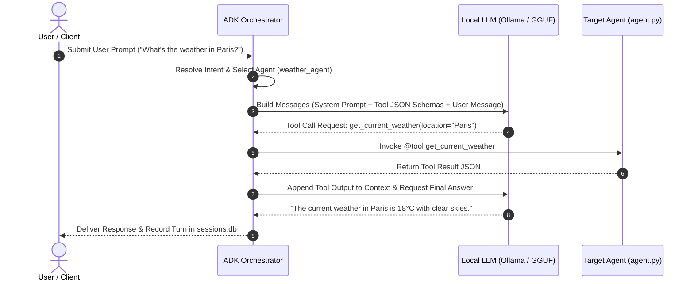

# Agent Framework Architecture

At the heart of AutoYou Server is the **Agent Development Kit (ADK)**, an asynchronous, modular agent framework designed for building, testing, and running multi-modal AI agents directly on local hardware.

---

## Agent Directory Layout

Every agent in AutoYou Server lives in its own self-contained directory under `autoyou_agents/` (for built-in agents) or within the mutable dynamic root (`get_dynamic_agents_root()`):

```
autoyou_agents/my_custom_agent/
├── agent.py                 # Core agent definition, prompt, and Python tools
├── manifest.json            # Agent identity, permissions, and route metadata
├── website/                 # Optional web frontend
│   └── frontend/
│       ├── index.html       # Single-page web app entrypoint
│       ├── app.js           # Client-side JavaScript
│       └── style.css        # Presentation styling
└── README.md                # Documentation and usage notes
```

---

## The `agent.py` Protocol

An agent defines its capabilities in `agent.py` by implementing standard ADK lifecycle hooks and tool decorators:

```python
"""Example agent implementation: my_custom_agent/agent.py"""

from typing import Dict, Any
from autoyou_agents.shared_tools import tool

# 1. Base Identity & Prompt
AGENT_NAME = "weather_agent"
AGENT_TITLE = "Weather Assistant"
AGENT_DESCRIPTION = "Provides weather forecasts and environmental telemetry."

SYSTEM_PROMPT = """
You are a precise meteorological assistant.
When the user asks for weather conditions, invoke the 'get_current_weather' tool.
"""

# 2. Tool Definition with Decorators & Type Hints
@tool
async def get_current_weather(location: str, unit: str = "celsius") -> Dict[str, Any]:
    """
    Fetches real-time weather conditions for a given city or geographic region.

    Args:
        location: City and country or coordinates (e.g. 'San Francisco, CA').
        unit: Temperature scale ('celsius' or 'fahrenheit').
    """
    # Tool business logic here
    return {
        "location": location,
        "temperature": 18,
        "unit": unit,
        "condition": "Clear Sky"
    }

# 3. Factory Function for ADK Orchestration
def create_agent():
    return {
        "name": AGENT_NAME,
        "title": AGENT_TITLE,
        "prompt": SYSTEM_PROMPT,
        "tools": [get_current_weather]
    }
```

---

## Agent Execution Loop

When a user prompt or external messaging turn arrives:



---

## Manifest Configuration (`manifest.json`)

Controls discovery, permissions, and browser proxy routing:

```json
{
  "name": "weather_agent",
  "version": "1.0.0",
  "title": "Weather Assistant",
  "description": "Live weather reporting and forecast assistant.",
  "author": "AutoYou Community",
  "has_frontend": true,
  "route_mode": "path_proxy",
  "proxy_port": 8067,
  "permissions": {
    "network_outbound": true,
    "filesystem_access": "sandbox_only",
    "shell_execution": false
  }
}
```
