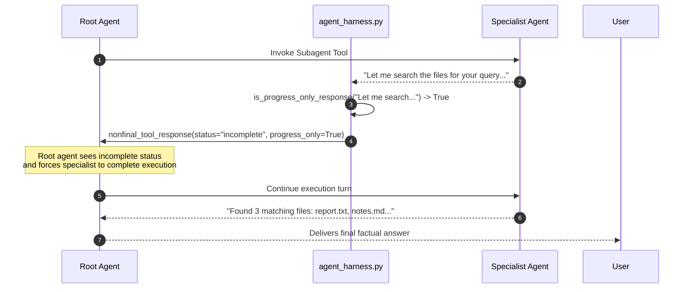
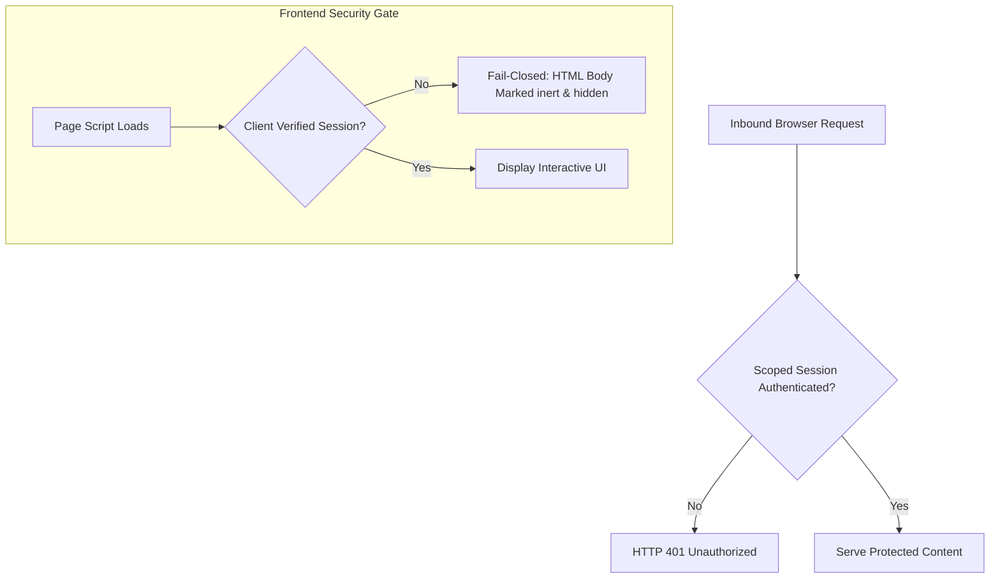

# Core Agent Engine Architecture

The core agent engine located in [`autoyou_agents/`](file:///c:/Users/You/Projects/AutoYou/AutoYou-Server/autoyou_agents) orchestrates all conversational turns, tool dispatches, model adaptations, and dynamic specialist subagents across AutoYou Server.

Rather than relying on high-level generic frameworks that fail on edge devices, AutoYou implements an asynchronous, fault-tolerant runtime designed specifically for local LLMs, edge GPUs, and on-device neural engines.


---

## 1. Package Initialization: `autoyou_agents/__init__.py`

The entrypoint file [`autoyou_agents/__init__.py`](file:///c:/Users/You/Projects/AutoYou/AutoYou-Server/autoyou_agents/__init__.py) enforces a strict **lightweight import contract**.

### Lightweight Import Contract

Importing `autoyou_agents` must **never** eagerly evaluate or instantiate the full root agent graph or load heavyweight neural dependencies. Many server routes, administrative scripts, and background services require only lightweight helper modules (e.g., `autoyou_agents.notes_agent.notes_tool`). Eager initialization would consume gigabytes of VRAM and delay server bootstrap.

### Dynamic Runtime Path Extension

To support standalone Nuitka/PyInstaller compiled binaries, developer checkouts, and custom user-scaffolded dynamic agents, `__init__.py` dynamically extends `__path__`:

```python
def _extend_package_path_for_runtime_agents() -> None:
    """Allow compiled builds to import user-scaffolded autoyou_agents packages."""
    try:
        from shared.platform_runtime import get_dynamic_agents_root, is_compiled

        package_path = globals().get("__path__", None)
        if package_path is None:
            return
        sibling = Path(__file__).resolve().parents[2] / "autoyou_agents"
        if not is_compiled() and (sibling / "__init__.py").is_file():
            sibling_path = str(sibling.resolve())
            if sibling_path not in package_path:
                package_path.append(sibling_path)
            private_root = sibling / "private"
            if private_root.is_dir() and str(private_root.resolve()) not in package_path:
                package_path.append(str(private_root.resolve()))
        dynamic_root = str(get_dynamic_agents_root("AutoYou", anchor=__file__))
        if dynamic_root not in package_path:
            package_path.append(dynamic_root)
    except Exception as exc:
        LOGGER.debug("Could not extend autoyou_agents package path: %s", exc)
```

### Lazy Module Resolution

The root `app` and `root_agent` objects are lazily imported via Python's module-level `__getattr__`:

```python
def __getattr__(name: str) -> Any:
    if name not in {"app", "root_agent"}:
        raise AttributeError(f"module {__name__!r} has no attribute {name!r}")
    if name == "app":
        from autoyou_agents.agent import app as resolved_value
    else:
        from autoyou_agents.agent import root_agent as resolved_value
    return resolved_value
```

---

## 2. Root Orchestrator: `autoyou_agents/agent.py`

[`autoyou_agents/agent.py`](file:///c:/Users/You/Projects/AutoYou/AutoYou-Server/autoyou_agents/agent.py) is the core operational engine of the AutoYou Agent Development Kit (ADK). Spanning nearly 5,000 lines of hardened Python, it resolves several systemic failure modes common in local open-weights LLMs.

### The LiteLLM Monkey-Patch (`_patched_acompletion`)

Standard LiteLLM assumes cloud-grade behavior (unlimited context, strict JSON compliance, structured tool responses). Local models running via Ollama, llama.cpp, or vLLM frequently suffer from KV cache overflows, truncated reasoning blocks, and schema drift. 

`agent.py` intercepts `litellm.acompletion` with `_patched_acompletion`:

```python
async def _patched_acompletion(*args, **kwargs):
    """Fault-tolerant acompletion interceptor with automated recovery."""
    # 1. Clean up input messages and normalize tool definitions
    clean_kwargs = _preprocess_ollama_request(kwargs)
    
    try:
        return await _original_acompletion(*args, **clean_kwargs)
    except Exception as exc:
        # 2. Check for Ollama Context Window / Memory Truncation
        if _is_ollama_context_truncation_error(exc):
            LOGGER.warning("Ollama context truncation detected; re-anchoring conversation...")
            recovered_messages = _reanchor_latest_ollama_user_query(clean_kwargs.get("messages", []))
            clean_kwargs["messages"] = recovered_messages
            _mark_ollama_context_recovery(exc)
            return await _original_acompletion(*args, **clean_kwargs)

        # 3. Check for Truncated Tool Call Arguments
        if _is_ollama_truncated_tool_call_error(exc):
            new_num_predict = _raised_num_predict_for_truncated_tool_call(clean_kwargs)
            if new_num_predict:
                LOGGER.info("Bumping num_predict to %d for truncated tool call", new_num_predict)
                clean_kwargs.setdefault("options", {})["num_predict"] = new_num_predict
                return await _original_acompletion(*args, **clean_kwargs)

        # 4. Fallback: Retry without tools if model collapsed on JSON schema
        if _should_retry_ollama_without_tools(exc, clean_kwargs):
            LOGGER.error("Model collapsed during tool generation; executing fallback text completion")
            clean_kwargs.pop("tools", None)
            return await _original_acompletion(*args, **clean_kwargs)
            
        raise exc
```

### Key Recovery Mechanisms

<CardGroup cols={2}>
  <Card title="Ollama KV Cache Recovery" icon="memory">
    Detects `_OLLAMA_MEMORY_ERROR_FRAGMENT` ("model requires more memory than available"). Automatically compresses older turns and preserves system prompts and the latest user turn.
  </Card>
  <Card title="Tool Call Truncation Repair" icon="wrench">
    Catches premature EOF tokens when small models generate complex JSON arguments. Automatically raises `num_predict` and resubmits the turn.
  </Card>
  <Card title="Dynamic Agent Tool Synthesis" icon="diagram-project">
    Iterates through active agents registered in `agent_install_registry.json` and synthesizes ADK `AgentTool` instances dynamically.
  </Card>
  <Card title="Instruction Synthesis & Filtering" icon="filter">
    Rewrites the system prompt dynamically so that uninstalled or disabled subagents are omitted from the advertised tool catalog.
  </Card>
</CardGroup>

### Two-Stage Routing Protocol

When running ultra-compact models (e.g. 3B parameters), presenting 40+ tool schemas simultaneously causes severe prompt dilution and hallucinated tool calls. `agent.py` implements **Two-Stage Routing**:
1. **Stage 1 (Intent Classification)**: The root agent routes to a high-level specialist domain (e.g., `autoyou_notes_agent` or `autoyou_coding_agent`).
2. **Stage 2 (Domain Execution)**: The target specialist executes within its isolated tool context, returning concrete results to the root.

---

## 3. Harness Progress Filtering: `autoyou_agents/agent_harness.py`

[`autoyou_agents/agent_harness.py`](file:///c:/Users/You/Projects/AutoYou/AutoYou-Server/autoyou_agents/agent_harness.py) decouples provider-specific orchestration quirks from individual agent definitions.

### The Progress-Only Anti-Pattern

Small local models frequently generate conversational conversational chatter when invoking tools, such as:
- *"Let me look that up for you..."*
- *"I am going to check the notes database..."*
- *"Working on it, one moment please..."*

If returned to the root agent without interception, the root agent hallucinates that the task is finished and sends that planning line to the user as the final reply.



### Implementation Details

```python
_FINAL_RESPONSE_HINTS = (
    "added", "completed", "confirmed", "created", "done",
    "error", "failed", "found", "generated", "queued",
    "saved", "scheduled", "sent", "success", "updated",
)

_PROGRESS_ONLY_PATTERNS = (
    re.compile(r"^\s*(?:let me|lemme)\b", re.IGNORECASE),
    re.compile(r"^\s*i(?:'| a)?m\s+(?:going|checking|searching|looking|reading|scanning)\b", re.IGNORECASE),
    re.compile(r"^\s*i\s+(?:will|ll)\s+(?:check|search|look|scan|inspect|read|analy[sz]e)\b", re.IGNORECASE),
    re.compile(r"^\s*(?:one moment|hold on|stand by|working on it)\b", re.IGNORECASE),
)

def is_progress_only_response(value: Any) -> bool:
    """Return True if text is conversational progress chatter, not a user answer."""
    text = normalize_agent_text(value)
    if not text or len(text) > 240:
        return False
    lowered = text.lower()
    # Completion keywords override progress patterns
    if any(hint in lowered for hint in _FINAL_RESPONSE_HINTS):
        return False
    return any(pattern.search(text) for pattern in _PROGRESS_ONLY_PATTERNS)
```

When a progress-only line is detected, `nonfinal_tool_response()` replaces it with a structured payload:

```json
{
  "status": "incomplete",
  "progress_only": true,
  "message": "The specialist tool returned only a progress update, not a completed answer. Do not send that progress line to the user as the final response. Continue the specialist task if possible.",
  "tool_name": "autoyou_notes_agent",
  "progress_text": "Let me search the notes database..."
}
```

---

## 4. On-Device macOS Engine: `autoyou_agents/apple_intelligence.py`

[`autoyou_agents/apple_intelligence.py`](file:///c:/Users/You/Projects/AutoYou/AutoYou-Server/autoyou_agents/apple_intelligence.py) integrates Apple's on-device foundation models via Apple Silicon Neural Engine while allowing AutoYou to retain complete ownership of tool execution.

### Guided Generation Schema Adaptation

Apple's native guided generation runtime accepts only a strict subset of JSON Schema:
- **No `$ref` pointers**: Recursive schemas or definitions must be flattened or converted.
- **Unions (`anyOf`)**: Flattened to single types or serialized to string representations.
- **Strict Typing**: Uppercase type specifiers from Google ADK types are converted to standard JSON Schema lowercase types.

```python
def _schema(value: dict) -> dict:
    """Translate ADK schemas to the subset supported by Apple guided generation."""
    value = dict(value or {"type": "object", "properties": {}})
    if "$ref" in value:
        raise ValueError("Apple Intelligence does not support $ref schemas. Choose another chat mode.")
    
    kind = str(value.get("type", "object")).lower()
    if value.get("anyOf"):
        choices = [v for v in value["anyOf"] if str(v.get("type", "")).lower() != "null"]
        if len(choices) == 1:
            return _schema(choices[0])
        # Arbitrary unions travel as JSON text and are restored before ADK tool validation
        return {"type": "string", "description": "A JSON value matching: " + json.dumps(value)}

    result = {"type": kind}
    for key in ("description", "enum", "required"):
        if key in value:
            result[key] = value[key]
    if kind == "object":
        result["properties"] = {key: _schema(child) for key, child in value.get("properties", {}).items()}
    elif kind == "array":
        result["items"] = _schema(value.get("items", {"type": "string"}))
    return result
```

### Two-Way Data Restoration and Validation

When Apple Intelligence returns arguments for a tool call:
1. `_restore(value, schema)`: Parses stringified JSON values back into structured Python dictionaries and lists.
2. `_validation_schema(value)`: Normalizes Google ADK nullable schema markers.
3. `_validated(value, schema)`: Performs strict JSON schema validation using `jsonschema.validate()`. If Apple Intelligence generates invalid parameters, the call fails gracefully rather than invoking a corrupted tool.

---

## 5. Sanitization & Normalization: `autoyou_agents/litellm_ollama_adapter.py`

[`autoyou_agents/litellm_ollama_adapter.py`](file:///c:/Users/You/Projects/AutoYou/AutoYou-Server/autoyou_agents/litellm_ollama_adapter.py) is a 2,260-line filter pipeline running between LiteLLM and local model runtimes.

### Stripping Reasoning Artifacts

Models with internal chain-of-thought (e.g. DeepSeek-R1, Qwen-2.5-Coder, Ollama thinking models) frequently leak raw scratchpad tokens into output streams:

```python
_REASONING_ANSWER_STOP_MARKERS = (
    "<|channel>", "<channel|>", "[thought]", "thought}",
    "思考过程：", "思考过程:", "思考過程：", "思考過程:",
    "thoughtthought_", "outof_thought", "<|tool_response",
    "[Internal Note:", "[Decision:",
)
```

The adapter scans output streams, detects reasoning boundaries, extracts the visible user response, and strips internal scratchpad commentary before the response reaches the UI.

### Missing Tool Result Recovery

When local models execute multi-turn tool loops, network timeouts or process interruptions can result in missing tool result messages. Many OpenAI-compatible providers throw fatal HTTP 400 errors if an assistant tool call is not immediately followed by a matching tool response ID.

`litellm_ollama_adapter.py` automatically inspects the message history, identifies orphaned `tool_calls`, and injects synthetic error placeholders:

```python
def repair_missing_tool_results(messages: list[dict]) -> list[dict]:
    """Ensure every assistant tool_call has a matching tool response block."""
    repaired = []
    pending_tool_ids = set()
    
    for msg in messages:
        role = msg.get("role")
        if role == "assistant" and "tool_calls" in msg:
            for tc in msg["tool_calls"]:
                pending_tool_ids.add(tc.get("id"))
        elif role == "tool":
            pending_tool_ids.discard(msg.get("tool_call_id"))
        repaired.append(msg)
        
    for missing_id in pending_tool_ids:
        repaired.append({
            "role": "tool",
            "tool_call_id": missing_id,
            "content": json.dumps({"error": _DEFAULT_MISSING_TOOL_RESULT_MESSAGE})
        })
    return repaired
```

---

## 6. Dynamic Provider Routing: `autoyou_agents/model_config.py`

[`autoyou_agents/model_config.py`](file:///c:/Users/You/Projects/AutoYou/AutoYou-Server/autoyou_agents/model_config.py) manages model profiles, memory footprints, and provider routing.

### Supported AI Providers

```python
PROVIDER_OLLAMA   = "ollama"               # Local Ollama daemon (default)
PROVIDER_OPENCLAW = "openclaw"             # Local OpenAI-compatible gateway
PROVIDER_HERMES   = "hermes"               # Hermes Agent gateway
PROVIDER_LITELLM  = "litellm"              # Cloud: Anthropic, OpenAI, Mistral, etc.
PROVIDER_GOOGLE   = "google"               # Google Gemini via AI Studio or Vertex
PROVIDER_APPLE    = "apple_intelligence"  # On-device macOS Foundation Model
```

### Parameter Sizing & Context Windows

The module parses model tags (e.g., `qwen2.5:3b`, `llama3.1:8b`, `deepseek-r1:70b`) to determine parameter size and select the appropriate harness profile:

```python
AGENT_HARNESS_COMPACT = "compact"   # For 3B-8B models: stripped schemas, single-stage tools
AGENT_HARNESS_EXPANDED = "expanded" # For 14B+ models: rich multi-tool capability
```

Context windows (`num_ctx`) are calculated dynamically via `shared.ollama_context_policy.recommend_ollama_num_ctx()` based on available host RAM/VRAM:
- **Compact profile**: Constrains prompt schemas to under 2,048 tokens.
- **Expanded profile**: Scales up to 32,768 or 128,000 tokens for coding and deep research agents.

---

## 7. Modular System Instructions: `autoyou_agents/prompt.py`

[`autoyou_agents/prompt.py`](file:///c:/Users/You/Projects/AutoYou/AutoYou-Server/autoyou_agents/prompt.py) defines the foundational persona, constraints, and instructions for the root agent.

### Composable Prompt Sections

System instructions are structured into independent, composable blocks:
- `INTRODUCTION`: Establishes AutoYou's identity.
- `CORE_BEHAVIOR`: Absolute behavioral rules and anti-hallucination contracts.
- `SUB_AGENTS_SECTION`: Catalog of available domain specialist tools.
- `ROUTING_RULES_SECTION`: Rules governing single-turn specialist routing vs pinned mode.

### Strict Behavioral Rules

The prompt enforces strict software engineering guarantees:
1. **Never Output JSON Wrappers**: Text replies must be plain markdown. Models must not wrap their final reply in `{"role": "assistant", "content": "..."}` or planner objects.
2. **Never Call Self as Tool**: `autoyou_agent` is explicitly forbidden from invoking `autoyou_agent` (which would trigger an infinite recursion loop).
3. **No Specialist Progress Echoing**: Never forward a raw planning line (*"I'll look into it"*) as a final answer.
4. **Live Data Grounding**: External, live, or time-sensitive claims must be verified via `autoyou_internet_agent`. If unavailable, state the limitation rather than guessing.

---

## 8. Server Integration & Security: `autoyou_agents/README.md`

[`autoyou_agents/README.md`](file:///c:/Users/You/Projects/AutoYou/AutoYou-Server/autoyou_agents/README.md) defines the boundary contracts between the agent layer and the rest of AutoYou Server.

### Full-Server Architecture Boundaries

- **Supervision**: The background AI worker process is launched and monitored by `core_server/services.py`.
- **HTTP Endpoints**: Worker chat turns are exposed via `routers/ai_agent.py`.
- **Admin Management**: Agent installs, uninstalls, and security profiles are managed via `routers/agents.py`.
- **Runtime Namespace**: `server.py` provides the shared runtime namespace but does **not** own agent lifecycle logic.

### Two-Part Website Security Contract

Agents providing web frontends must adhere to a strict two-part boundary:



1. **Backend Gate**: Rejects every protected read and write with `401 Unauthorized` until authenticated. Verifies per-agent TOTP profiles first, then falls back to the shared pairing TOTP.
2. **Frontend Gate**: Fails closed before page-specific JavaScript runs. Protected content must be `inert` and hidden. A cosmetic modal over an interactive UI is strictly prohibited.
