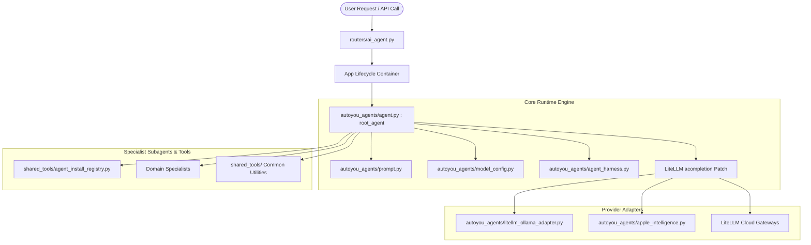
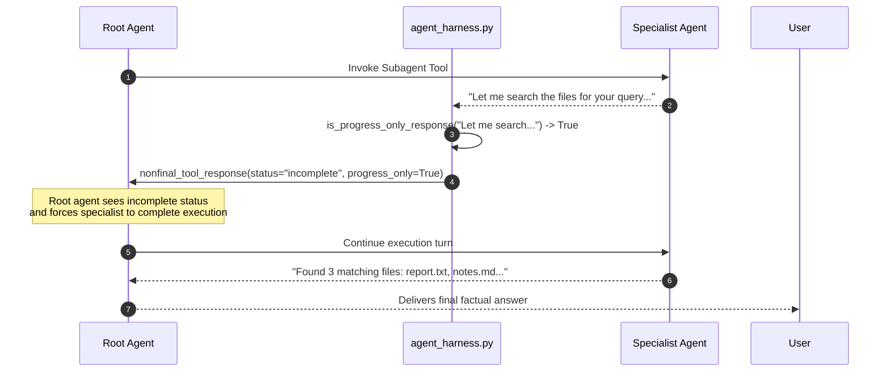
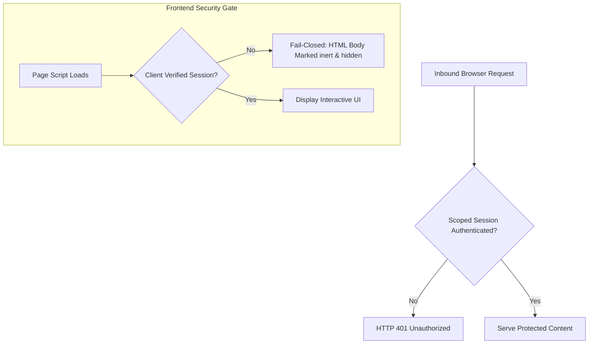

# Core Agent Engine Architecture

The core agent engine located in [`autoyou_agents/`](https://github.com/autoyou-ai/AutoYou-Server/blob/main/autoyou_agents) orchestrates all conversational turns, tool dispatches, model adaptations, and dynamic specialist subagents across AutoYou Server.

Rather than relying on high-level generic frameworks that fail on edge devices, AutoYou implements an asynchronous, fault-tolerant runtime designed specifically for local LLMs, edge GPUs, and on-device neural engines.



---

## 1. Package Initialization: `autoyou_agents/__init__.py`

The entrypoint file [`autoyou_agents/__init__.py`](https://github.com/autoyou-ai/AutoYou-Server/blob/main/autoyou_agents/__init__.py) enforces a strict **lightweight import contract**.

### Lightweight Import Contract

Importing `autoyou_agents` must **never** eagerly evaluate or instantiate the full root agent graph or load heavyweight neural dependencies. Many server routes, administrative scripts, and background services require only lightweight helper modules (e.g., `autoyou_agents.notes_agent.notes_tool`). Eager initialization would consume gigabytes of VRAM and delay server bootstrap.

### Dynamic Runtime Path Extension

To support standalone Nuitka/PyInstaller compiled binaries, developer checkouts, and custom user-scaffolded dynamic agents, `__init__.py` dynamically extends `__path__`:

```python
def _extend_package_path_for_runtime_agents() -> None:
    """Allow compiled builds to import user-scaffolded autoyou_agents packages."""
    try:
        from shared.platform_runtime import get_dynamic_agents_root, is_compiled

        package_path = globals().get("__path__", None)
        if package_path is None:
            return
        sibling = Path(__file__).resolve().parents[2] / "autoyou_agents"
        if not is_compiled() and (sibling / "__init__.py").is_file():
            sibling_path = str(sibling.resolve())
            if sibling_path not in package_path:
                package_path.append(sibling_path)
            private_root = sibling / "private"
            if private_root.is_dir() and str(private_root.resolve()) not in package_path:
                package_path.append(str(private_root.resolve()))
        dynamic_root = str(get_dynamic_agents_root("AutoYou", anchor=__file__))
        if dynamic_root not in package_path:
            package_path.append(dynamic_root)
    except Exception as exc:
        LOGGER.debug("Could not extend autoyou_agents package path: %s", exc)
```

### Lazy Module Resolution

The root `app` and `root_agent` objects are lazily imported via Python's module-level `__getattr__`:

```python
def __getattr__(name: str) -> Any:
    if name not in {"app", "root_agent"}:
        raise AttributeError(f"module {__name__!r} has no attribute {name!r}")
    if name == "app":
        from autoyou_agents.agent import app as resolved_value
    else:
        from autoyou_agents.agent import root_agent as resolved_value
    return resolved_value
```

---

## 2. Root Orchestrator: `autoyou_agents/agent.py`

[`autoyou_agents/agent.py`](https://github.com/autoyou-ai/AutoYou-Server/blob/main/autoyou_agents/agent.py) is the core operational engine of the AutoYou Agent Development Kit (ADK). Over 5,000 lines long, it handles several failure modes that are common with local open-weights models.

### The LiteLLM patch (`_patched_acompletion`)

Local models served through Ollama can run out of memory, lose the user's question when the context is truncated, cut a tool call off in the middle of its JSON, or echo the tool schema back as text. `agent.py` wraps `litellm.acompletion` with `_patched_acompletion`. For Ollama chat models it first flattens message content and prepares the tool definitions, then calls LiteLLM inside a retry loop with these recoveries:

<CardGroup cols={2}>
  <Card title="Memory allocation failure" icon="memory">
    When Ollama reports that its memory layout cannot be allocated, the wrapper halves `num_ctx`, down to a floor of 4,096, and retries.
  </Card>
  <Card title="Cut-off tool call" icon="wrench">
    The wrapper raises `num_predict` once and retries. If the tool call is still cut off, it retries once without the tool payload so the turn can answer from what it already gathered.
  </Card>
  <Card title="Context truncation" icon="scissors">
    When the model can no longer find the user's question, the wrapper moves the latest user turn after the tool results and retries once.
  </Card>
  <Card title="Tool-schema echo" icon="filter">
    If the model collapses into echoing the tool schema, the wrapper retries once without the tools.
  </Card>
</CardGroup>

Responses are normalized after a successful call, for both streaming and non-streaming replies. Other errors are logged with a summary of the recent messages and the advertised tool names, and then raised.

### Specialist tools and instruction filtering

For each installed agent, the root builds an ADK `AgentTool`. The system prompt is rewritten at load time so that agents that are uninstalled or disabled are left out of the catalog the model sees.

### Two-stage routing

Advertising every installed specialist as its own tool puts dozens of function declarations in front of the model, and small local models collapse under that. Under **two-stage routing** the root advertises one dispatcher tool, `route_to_specialist`, and the specialist catalog lives in the dispatcher's description. Each specialist's own tools stay scoped to its child session, so the number of tools the root advertises no longer grows with the number of installed agents. The routing rules in the prompt are rewritten to say "call `route_to_specialist` with `agent` set to ...".

Two-stage routing is always on for Apple Intelligence. Otherwise `AUTOYOU_TWO_STAGE_ROUTER` overrides it (`0`, `false`, `no`, or `off` turns it off), and by default the model policy chooses: small or unrecognized models use the dispatcher, and models that use the expanded harness, below, advertise specialists directly. Gemma 4 e2b and e4b are the exception: they use the expanded harness with the dispatcher.

---

## 3. Harness Progress Filtering: `autoyou_agents/agent_harness.py`

[`autoyou_agents/agent_harness.py`](https://github.com/autoyou-ai/AutoYou-Server/blob/main/autoyou_agents/agent_harness.py) decouples provider-specific orchestration quirks from individual agent definitions.

### The Progress-Only Anti-Pattern

Small local models frequently generate conversational conversational chatter when invoking tools, such as:
- *"Let me look that up for you..."*
- *"I am going to check the notes database..."*
- *"Working on it, one moment please..."*

If returned to the root agent without interception, the root agent hallucinates that the task is finished and sends that planning line to the user as the final reply.



### Implementation Details

```python
_FINAL_RESPONSE_HINTS = (
    "added", "completed", "confirmed", "created", "done",
    "error", "failed", "found", "generated", "queued",
    "saved", "scheduled", "sent", "success", "updated",
)

_PROGRESS_ONLY_PATTERNS = (
    re.compile(r"^\s*(?:let me|lemme)\b", re.IGNORECASE),
    re.compile(r"^\s*i(?:'| a)?m\s+(?:going|checking|searching|looking|reading|scanning)\b", re.IGNORECASE),
    re.compile(r"^\s*i\s+(?:will|ll)\s+(?:check|search|look|scan|inspect|read|analy[sz]e)\b", re.IGNORECASE),
    re.compile(r"^\s*(?:one moment|hold on|stand by|working on it)\b", re.IGNORECASE),
)

def is_progress_only_response(value: Any) -> bool:
    """Return True if text is conversational progress chatter, not a user answer."""
    text = normalize_agent_text(value)
    if not text or len(text) > 240:
        return False
    lowered = text.lower()
    # Completion keywords override progress patterns
    if any(hint in lowered for hint in _FINAL_RESPONSE_HINTS):
        return False
    return any(pattern.search(text) for pattern in _PROGRESS_ONLY_PATTERNS)
```

When a progress-only line is detected, `nonfinal_tool_response()` replaces it with a structured payload:

```json
{
  "status": "incomplete",
  "progress_only": true,
  "message": "The specialist tool returned only a progress update, not a completed answer. Do not send that progress line to the user as the final response. Continue the specialist task if possible.",
  "tool_name": "autoyou_notes_agent",
  "progress_text": "Let me search the notes database..."
}
```

---

## 4. On-Device macOS Engine: `autoyou_agents/apple_intelligence.py`

[`autoyou_agents/apple_intelligence.py`](https://github.com/autoyou-ai/AutoYou-Server/blob/main/autoyou_agents/apple_intelligence.py) integrates Apple's on-device foundation models via Apple Silicon Neural Engine while allowing AutoYou to retain complete ownership of tool execution.

### Guided Generation Schema Adaptation

Apple's native guided generation runtime accepts only a strict subset of JSON Schema:
- **No `$ref` pointers**: Recursive schemas or definitions must be flattened or converted.
- **Unions (`anyOf`)**: Flattened to single types or serialized to string representations.
- **Strict Typing**: Uppercase type specifiers from Google ADK types are converted to standard JSON Schema lowercase types.

```python
def _schema(value: dict) -> dict:
    """Translate ADK schemas to the subset supported by Apple guided generation."""
    value = dict(value or {"type": "object", "properties": {}})
    if "$ref" in value:
        raise ValueError("Apple Intelligence does not support $ref schemas. Choose another chat mode.")
    
    kind = str(value.get("type", "object")).lower()
    if value.get("anyOf"):
        choices = [v for v in value["anyOf"] if str(v.get("type", "")).lower() != "null"]
        if len(choices) == 1:
            return _schema(choices[0])
        # Arbitrary unions travel as JSON text and are restored before ADK tool validation
        return {"type": "string", "description": "A JSON value matching: " + json.dumps(value)}

    result = {"type": kind}
    for key in ("description", "enum", "required"):
        if key in value:
            result[key] = value[key]
    if kind == "object":
        result["properties"] = {key: _schema(child) for key, child in value.get("properties", {}).items()}
    elif kind == "array":
        result["items"] = _schema(value.get("items", {"type": "string"}))
    return result
```

### Two-Way Data Restoration and Validation

When Apple Intelligence returns arguments for a tool call:
1. `_restore(value, schema)`: Parses stringified JSON values back into structured Python dictionaries and lists.
2. `_validation_schema(value)`: Normalizes Google ADK nullable schema markers.
3. `_validated(value, schema)`: Performs strict JSON schema validation using `jsonschema.validate()`. If Apple Intelligence generates invalid parameters, the call fails gracefully rather than invoking a corrupted tool.

---

## 5. Sanitization & Normalization: `autoyou_agents/litellm_ollama_adapter.py`

[`autoyou_agents/litellm_ollama_adapter.py`](https://github.com/autoyou-ai/AutoYou-Server/blob/main/autoyou_agents/litellm_ollama_adapter.py) is a 2,260-line filter pipeline running between LiteLLM and local model runtimes.

### Stripping Reasoning Artifacts

Models with internal chain-of-thought (e.g. DeepSeek-R1, Qwen-2.5-Coder, Ollama thinking models) frequently leak raw scratchpad tokens into output streams:

```python
_REASONING_ANSWER_STOP_MARKERS = (
    "<|channel>", "<channel|>", "[thought]", "thought}",
    "思考过程：", "思考过程:", "思考過程：", "思考過程:",
    "thoughtthought_", "outof_thought", "<|tool_response",
    "[Internal Note:", "[Decision:",
)
```

The adapter scans output streams, detects reasoning boundaries, extracts the visible user response, and strips internal scratchpad commentary before the response reaches the UI.

### Missing tool result repair

Earlier compatibility bugs could leave a persisted session with an assistant tool call that has no matching tool result. Many providers reject that history. `repair_missing_tool_results()` finds those orphaned tool calls and adds a placeholder result for each ("Error: Missing tool result (tool execution may have been interrupted before a response was recorded)."). It uses the `tool_responses` role for Gemma 4 models and `tool` otherwise. Old and new sessions can then continue without repeated warnings.

---

## 6. Dynamic Provider Routing: `autoyou_agents/model_config.py`

[`autoyou_agents/model_config.py`](https://github.com/autoyou-ai/AutoYou-Server/blob/main/autoyou_agents/model_config.py) manages model profiles, memory footprints, and provider routing.

### Supported AI Providers

```python
PROVIDER_OLLAMA   = "ollama"               # Local Ollama daemon (default)
PROVIDER_OPENCLAW = "openclaw"             # Local OpenAI-compatible gateway
PROVIDER_HERMES   = "hermes"               # Hermes Agent gateway
PROVIDER_LITELLM  = "litellm"              # Cloud: Anthropic, OpenAI, Mistral, etc.
PROVIDER_GOOGLE   = "google"               # Google Gemini via AI Studio or Vertex
PROVIDER_APPLE    = "apple_intelligence"  # On-device macOS Foundation Model
```

### Harness profile and context size

`resolve_agent_harness_profile()` chooses between two agent harnesses:

```python
AGENT_HARNESS_COMPACT = "compact"
AGENT_HARNESS_EXPANDED = "expanded"
```

Automatic mode fails closed to **compact** for unknown models. It chooses **expanded** for `gpt-oss`, for Gemma 4, for Ministral 3 models larger than 8B, and for other models with a known size of 20B parameters or more. A tag without a size, or `:latest`, stays compact unless the active Ollama metadata reports a large size for that exact tag. Set `AUTOYOU_AGENT_HARNESS_PROFILE` to `auto`, `compact`, or `expanded` to override the choice.

The context window (`num_ctx`) is recommended by `shared.ollama_context_policy.recommend_ollama_num_ctx()` from the host's available memory.

---

## 7. Modular System Instructions: `autoyou_agents/prompt.py`

[`autoyou_agents/prompt.py`](https://github.com/autoyou-ai/AutoYou-Server/blob/main/autoyou_agents/prompt.py) defines the foundational persona, constraints, and instructions for the root agent.

### Composable Prompt Sections

System instructions are structured into independent, composable blocks:
- `INTRODUCTION`: Establishes AutoYou's identity.
- `CORE_BEHAVIOR`: Absolute behavioral rules and anti-hallucination contracts.
- `SUB_AGENTS_SECTION`: Catalog of available domain specialist tools.
- `ROUTING_RULES_SECTION`: Rules governing single-turn specialist routing vs pinned mode.

### Strict Behavioral Rules

The prompt requests the following engineering behavior. Prompt instructions alone are not enforcement or an execution sandbox:
1. **Never Output JSON Wrappers**: Text replies must be plain markdown. Models must not wrap their final reply in `{"role": "assistant", "content": "..."}` or planner objects.
2. **Never Call Self as Tool**: `autoyou_agent` is explicitly forbidden from invoking `autoyou_agent` (which would trigger an infinite recursion loop).
3. **No Specialist Progress Echoing**: Never forward a raw planning line (*"I'll look into it"*) as a final answer.
4. **Live Data Grounding**: External, live, or time-sensitive claims must be verified via `autoyou_internet_agent`. If unavailable, state the limitation rather than guessing.

---

## 8. Server Integration & Security: `autoyou_agents/README.md`

[`autoyou_agents/README.md`](https://github.com/autoyou-ai/AutoYou-Server/blob/main/autoyou_agents/README.md) defines the boundary contracts between the agent layer and the rest of AutoYou Server.

### Full-Server Architecture Boundaries

- **Supervision**: The background AI worker process is launched and monitored by `core_server/services.py`.
- **HTTP Endpoints**: Worker chat turns are exposed via `routers/ai_agent.py`.
- **Admin Management**: Agent installs, uninstalls, and security profiles are managed via `routers/agents.py`.
- **Runtime Namespace**: `server.py` provides the shared runtime namespace but does **not** own agent lifecycle logic.

### Two-Part Website Security Contract

Agents providing web frontends must adhere to a strict two-part boundary:



1. **Backend Gate**: Rejects every protected read and write with `401 Unauthorized` until authenticated. Verifies per-agent TOTP profiles first, then falls back to the shared pairing TOTP.
2. **Frontend Gate**: Fails closed before page-specific JavaScript runs. Protected content must be `inert` and hidden. A cosmetic modal over an interactive UI is strictly prohibited.
