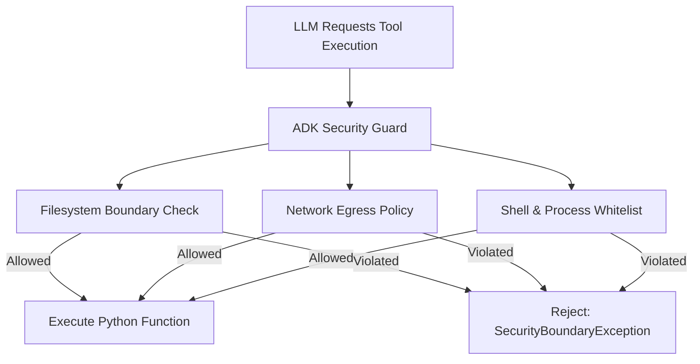

# Agent Security & Permission Boundaries

Because AI agents can execute arbitrary Python tools, access local storage, and query external networks, AutoYou Server enforces strict privilege boundaries to protect operator safety.

---

## Privilege Boundaries & Permission Scopes

Each agent is assigned a security policy managed in `agent_security.db`:

### 1. Filesystem Access Scopes
- **`denied`**: The agent cannot read or write any host files.
- **`sandbox_only`**: Access is restricted strictly to an isolated temporary sandbox directory (`/tmp/autoyou_sandbox_{agent_name}/`).
- **`workspace_root`**: Can read and edit project files within the user's explicitly approved workspace directory.

### 2. Network Egress Policy
- **`denied`**: Network sockets are blocked.
- **`lan_only`**: Can query devices on the local subnet (`192.168.x.x`) but cannot initiate public internet connections.
- **`full_internet`**: Can connect to external APIs and web services.

### 3. Shell & System Process Execution
- **`denied`**: Subprocess creation and shell execution are completely prohibited.
- **`approved_tools_only`**: Can execute only specific, allowlisted commands (e.g. `git status`, `node -v`) through supervised wrappers.

---

## Immutable Bundles vs Dynamic Agents Root Contract

To support signed production packaging (MSIX on Windows, notarized `.app` on macOS), AutoYou Server enforces a strict storage mutability boundary:

| Storage Domain | Location | Mutability | Contents |
| :--- | :--- | :--- | :--- |
| **Built-in Agents** | `autoyou_agents/` | **Read-Only** | Pre-packaged default agents and static frontends shipped with the server. |
| **Dynamic Agents** | `get_dynamic_agents_root()` | **Read/Write** | User-created agents, downloaded community agents, and edited drafts. |
| **Mutable User Data** | `get_user_data_dir()` | **Read/Write** | Agent notes, uploaded audio clips, embeddings, and conversation histories. |

<Important>
Never write temporary files, editable databases, or user state into `autoyou_agents/`. Always resolve mutable paths using `shared.platform_runtime.get_dynamic_agents_root()` or `get_user_data_dir()`.
</Important>

---

## Emergency Agent Wiping & Reset

If an agent behaves unpredictably or handles untrusted content:
1. Navigate to **Security Console** $\rightarrow$ **Agent Security**.
2. Select the agent and click **"Wipe State"**.
3. Dispatches `POST /api/agent-security/agents/{agent_name}/wipe`:
   - Deletes all SQLite memory tables for that agent.
   - Clears cookies and browser local storage for its web frontend.
   - Deletes all files in its sandbox directory.
