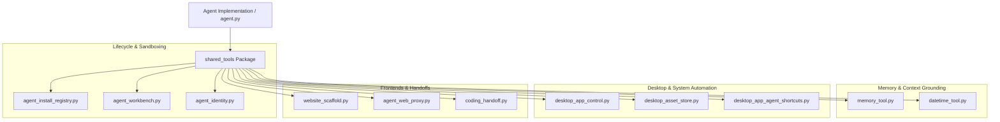
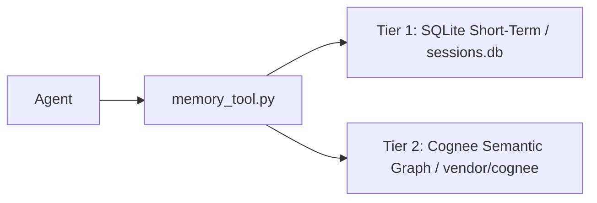
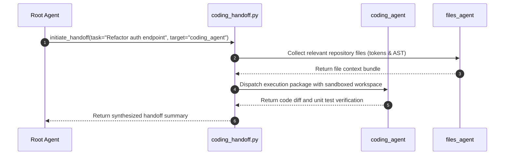
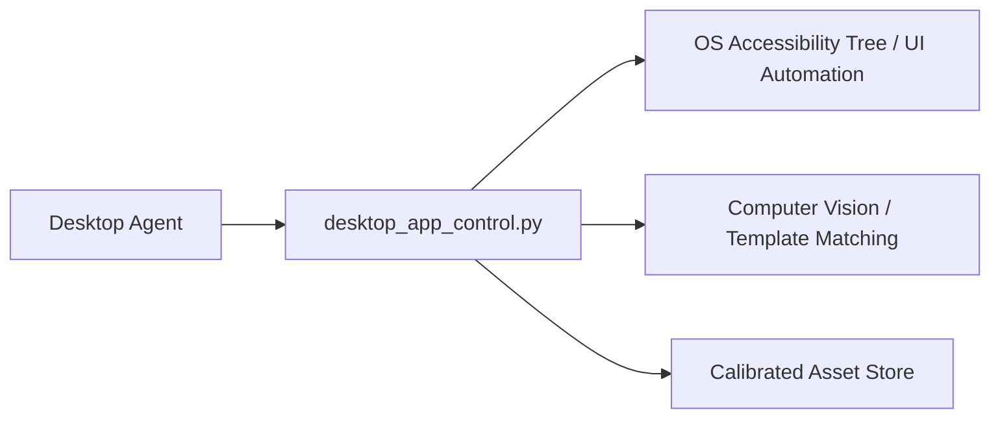

# Shared Tools & Subsystems Architecture

The directory [`autoyou_agents/shared_tools/`](file:///c:/Users/You/Projects/AutoYou/AutoYou-Server/autoyou_agents/shared_tools) provides reusable infrastructure, state registries, sandboxing harnesses, and hardware-control bridges shared across all 40+ built-in and dynamic agents.



---

## 1. Dynamic Agent Registry: `agent_install_registry.py`

[`agent_install_registry.py`](file:///c:/Users/You/Projects/AutoYou/AutoYou-Server/autoyou_agents/shared_tools/agent_install_registry.py) manages the persistent installation state of all subagents in the system.

### Persistent State File: `agent_install_registry.json`

Installation state is stored as secure JSON on disk:
- In production, it resides under the platform configuration directory (`get_config_dir("AutoYou") / "agent_install_registry.json"`).
- In automated test suites, it resolves under `AUTOYOU_TEST_ROOT` to prevent mutating live operator setups.

```python
DEFAULT_AGENT_INSTALL_STATES: Dict[str, bool] = {
    "admin_agent": True,
    "ads_watching_agent": True,
    "agent_builder_agent": False,    # Opt-in: developer scaffolding
    "audio_agent": True,
    "backup_agent": False,          # Opt-in: browser-paired backups
    "browser_agent": False,          # Opt-in: heavy automation bundle
    "client_browser_control_agent": True,
    "coding_agent": False,           # Opt-in: repo-aware coding assistant
    "data_collector_agent": False,   # Opt-in: consented conversation logging
    "internet_agent": True,
    "notes_agent": True,
    "page_agent": True,
    # ... additional agents configured by default policy
}
```

### Registry API Methods

```python
def is_agent_installed(agent_name: str) -> bool:
    """Check if an agent is currently installed and active."""

def install_agent(agent_name: str) -> bool:
    """Mark an agent as installed in the registry and persist to disk."""

def uninstall_agent(agent_name: str) -> bool:
    """Mark an agent as uninstalled, preventing its tools from loading."""

def get_installed_agent_names() -> list[str]:
    """Return all currently active agent names for prompt synthesis."""
```

When an agent is uninstalled:
1. Its entry in `agent_install_registry.json` is updated to `false`.
2. The root agent automatically rewrites its system prompt via `_filter_prompt_section_by_installed_agents()`.
3. The uninstalled agent's `AgentTool` is removed from the advertised tool catalog, eliminating hallucinated routing attempts.

---

## 2. Sandbox Testing: `agent_workbench.py`

[`agent_workbench.py`](file:///c:/Users/You/Projects/AutoYou/AutoYou-Server/autoyou_agents/shared_tools/agent_workbench.py) provides an isolated execution harness for developers and operators to test agents and tool definitions without launching the full web server.

### Features

- **Isolated Execution**: Runs an agent instance with simulated user sessions.
- **Tool Tracing**: Captures all tool inputs, return values, execution timings, and exceptions.
- **Multi-Turn Evaluation**: Simulates multi-turn conversations to verify whether the agent completes goals or gets trapped in progress loops.

### Workbench Test Execution Example

```python
from autoyou_agents.shared_tools.agent_workbench import AgentWorkbench

async def test_custom_agent():
    workbench = AgentWorkbench()
    
    # Load candidate agent definition from a directory
    test_agent = workbench.load_agent_from_path("autoyou_agents/notes_agent")
    
    # Execute a test turn in an isolated sandbox session
    result = await workbench.execute_turn(
        agent=test_agent,
        prompt="Create a note titled 'Deploy checklist' with content 'Run test gate'",
        session_id="workbench-test-session"
    )
    
    assert result.success is True
    assert "Deploy checklist" in result.response_text
    assert len(result.tool_calls) == 1
    assert result.tool_calls[0].tool_name == "create_note"
```

---

## 3. Semantic Memory Interface: `memory_tool.py`

[`memory_tool.py`](file:///c:/Users/You/Projects/AutoYou/AutoYou-Server/autoyou_agents/shared_tools/memory_tool.py) bridges the root agent and specialist agents with persistent memory systems.

### Dual-Tier Memory Backing



1. **Tier 1: Local SQLite (`sessions.db`)**: Stores exact recent chat turns, session metadata, and conversation history. Fast, deterministic, and requires zero external neural models.
2. **Tier 2: Semantic Memory (Cognee)**: Stores vector embeddings and knowledge graph entities for associative recall across sessions (see [Vendor & Memory Subsystems](/agent-framework/vendor-and-memory)).

### Exposed Tool Functions

```python
@tool
async def search_memory(query: str, limit: int = 5) -> dict:
    """
    Search past conversations, user preferences, and saved context.
    
    Args:
        query: Natural language search query or keywords.
        limit: Maximum number of relevant memories to retrieve.
    """

@tool
async def remember_long_term_memory(fact: str, category: str = "general") -> dict:
    """
    Persist an explicit fact or preference into long-term semantic memory.
    
    Args:
        fact: The concrete information to remember across sessions.
        category: Contextual bucket ('user_preference', 'project_detail', etc.).
    """
```

---

## 4. Real-Time Temporal Grounding: `datetime_tool.py`

[`datetime_tool.py`](file:///c:/Users/You/Projects/AutoYou/AutoYou-Server/autoyou_agents/shared_tools/datetime_tool.py) injects real-time temporal grounding into model context.

### The Temporal Hallucination Problem

Local open-weights models have no internal clock and rely on training cutoffs. Without temporal grounding, models make incorrect assumptions about:
- Current day of the week, month, or year.
- Relative temporal offsets (*"tomorrow"*, *"next Tuesday"*, *"3 days ago"*).
- Timezone offsets when scheduling cron jobs or setting reminders via `notify_agent` and `tasks_agent`.

### Implementation

`datetime_tool.py` provides deterministic clock queries:

```python
@tool
def get_current_datetime(timezone_name: str = "UTC") -> dict:
    """
    Returns the exact current date, time, day of the week, and timezone offset.
    
    Args:
        timezone_name: Target IANA timezone identifier (e.g. 'America/New_York').
    """
    now = datetime.now(timezone.utc)
    return {
        "iso": now.isoformat(),
        "date": now.strftime("%Y-%m-%d"),
        "time": now.strftime("%H:%M:%S"),
        "day_of_week": now.strftime("%A"),
        "year": now.year,
        "is_dst": False,
        "timezone": "UTC"
    }
```

---

## 5. Multi-Agent Delegation: `coding_handoff.py`

[`coding_handoff.py`](file:///c:/Users/You/Projects/AutoYou/AutoYou-Server/autoyou_agents/shared_tools/coding_handoff.py) manages structured delegation protocols between orchestrator agents and implementation specialists (`coding_agent`, `files_agent`, `cli_agent`).

### Handoff Protocol Flow



The handoff package encapsulates:
- Task specifications and acceptance criteria.
- Scoped workspace directory paths.
- Execution timeout limits and allowed tool permissions.
- Test outcome assertions.

---

## 6. Desktop UI Automation Suite

The desktop automation suite consists of:
- [`desktop_app_control.py`](file:///c:/Users/You/Projects/AutoYou/AutoYou-Server/autoyou_agents/shared_tools/desktop_app_control.py)
- [`desktop_asset_store.py`](file:///c:/Users/You/Projects/AutoYou/AutoYou-Server/autoyou_agents/shared_tools/desktop_asset_store.py)
- [`desktop_asset_schema.json`](file:///c:/Users/You/Projects/AutoYou/AutoYou-Server/autoyou_agents/shared_tools/desktop_asset_schema.json)
- [`desktop_app_agent_shortcuts.py`](file:///c:/Users/You/Projects/AutoYou/AutoYou-Server/autoyou_agents/shared_tools/desktop_app_agent_shortcuts.py)

### Multi-Modal Desktop Control

This subsystem enables desktop bridge agents (such as `claude_desktop_agent`, `codex_desktop_agent`, and `remote_desktop_agent`) to interact with native desktop interfaces across Windows and macOS.



### Visual Asset Packs (`desktop_asset_store.py`)

Rather than relying purely on brittle screen pixel coordinates:
1. **Visual Anchors**: Visual asset packs store calibrated UI icons, button templates, and anchor coordinates governed by `desktop_asset_schema.json`.
2. **Template Matching**: When the accessibility tree does not expose named elements (common in Electron apps or custom game UIs), OpenCV/numpy template matching locates the target control.
3. **Coordinate Scaling**: DPI-aware coordinate scaling translates Retina / 4K coordinates to native display coordinates before mouse click dispatch.

---

## 7. Web Scaffolding & Security Gate: `website_scaffold.py`

[`website_scaffold.py`](file:///c:/Users/You/Projects/AutoYou/AutoYou-Server/autoyou_agents/shared_tools/website_scaffold.py) generates single-page browser frontends for agents.

### Automatic Injection of the Fail-Closed Security Gate

When an agent front-end is generated or hosted:
1. `website_scaffold.py` injects the mandatory **TOTP Security Gate** into the HTML markup.
2. The `<main>` and `<body>` containers are marked with `inert` and `style="display: none;"` by default.
3. Only upon successful verification of the agent session cookie or pairing token via `/api/admin/verify_admin_totp` does the JavaScript frontend remove the `inert` attribute and render the UI.

```html
<!-- Example of injected security gate in generated frontends -->
<div id="autoyou-auth-gate" class="fixed inset-0 bg-gray-950 flex items-center justify-center z-50">
  <div class="bg-gray-900 border border-gray-800 p-6 rounded-lg max-w-md w-full">
    <h3 class="text-lg font-semibold text-white mb-2">Agent Security Verification</h3>
    <p class="text-sm text-gray-400 mb-4">Enter your AutoYou pairing TOTP to access this agent interface.</p>
    <input id="totp-input" type="text" maxlength="6" class="w-full bg-gray-800 border border-gray-700 px-3 py-2 rounded text-white" />
    <button onclick="verifyAgentAuth()" class="mt-4 w-full bg-blue-600 hover:bg-blue-500 py-2 rounded text-white font-medium">Verify & Unlock</button>
  </div>
</div>
```

---

## 8. Sandboxed Process Environment: `_subprocess_env.py`

[`_subprocess_env.py`](file:///c:/Users/You/Projects/AutoYou/AutoYou-Server/autoyou_agents/shared_tools/_subprocess_env.py) provides safe process launching primitives:
- Strips production secrets, keystore credentials, and master encryption keys from the spawned process environment.
- Enforces execution timeouts to prevent hanging subprocesses from locking up worker threads.
- Redirects stderr and stdout to structured rotating log files for post-mortem analysis by the self-improvement loop.
