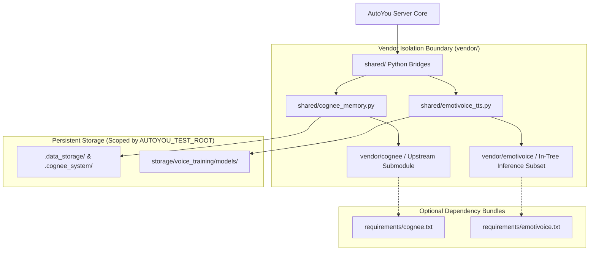
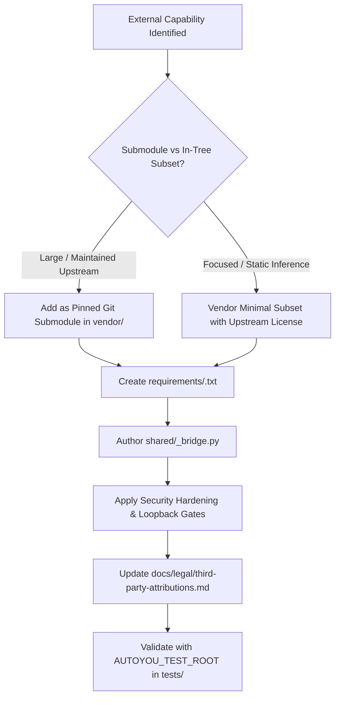

# Vendor Integrations & Memory Subsystems

AutoYou Server maintains a strict architectural separation between core server code and heavy external AI subsystems located in [`AutoYou-Server/vendor/`](https://github.com/autoyou-ai/AutoYou-Server/blob/main/vendor).

Rather than bloating core runtime dependencies with multi-gigabyte vector databases or neural speech packages, external capabilities are decoupled through **vendored dependency boundaries**, pinned commit hashes, and isolated requirements bundles.



---

## 1. The Vendoring Philosophy

AutoYou's vendoring design enforces four core principles:

1. **Hermetic Base Runtime**: A clean installation of AutoYou Server starts and handles all basic chat turns, Admin UI management, and pairing protocols without requiring any vendored packages.
2. **Local-Only & Excluded from Exports**: `vendor/` checkouts are excluded from public source archives and base Docker images (`.dockerignore`). They are pulled on-demand.
3. **Upstream Pinning**: Vendored repositories are strictly pinned to verified, audited commit hashes to prevent upstream breaking changes.
4. **Security Monkey-Patching**: Where upstream libraries contain known vulnerabilities or unhardened serialization patterns (e.g. Python `pickle`), AutoYou injects runtime security monkey-patches at the adapter layer before execution.

---

## 2. Cognee Semantic Memory (`vendor/cognee`)

[`vendor/cognee`](https://github.com/autoyou-ai/AutoYou-Server/blob/main/vendor/cognee) provides AutoYou with a high-dimensional vector memory graph for long-term associative memory across user sessions.

### Upstream Pinning & Setup

As detailed in [`vendor/INSTRUCTIONS.md`](https://github.com/autoyou-ai/AutoYou-Server/blob/main/vendor/INSTRUCTIONS.md), Cognee is pinned to commit `1913271821c84cec1630dd5b15ceb17dee8ace55`:

```powershell
# Clone exact upstream revision
git clone https://github.com/topoteretes/cognee.git vendor/cognee
git -C vendor/cognee checkout 1913271821c84cec1630dd5b15ceb17dee8ace55

# Install isolated dependencies
python -m pip install -r requirements/cognee.txt
```

### Integration Bridge: `shared/cognee_memory.py`

AutoYou interfaces with Cognee via [`shared/cognee_memory.py`](https://github.com/autoyou-ai/AutoYou-Server/blob/main/shared/cognee_memory.py) through the `CogneeMemoryService` class.

#### Loopback Isolation & Network Security
By default, AutoYou refuses connections to remote Cognee instances to prevent sensitive user memories from leaking across untrusted networks:

```python
def _is_loopback_url(url: str) -> bool:
    parsed = urlparse(str(url or "").strip())
    host = (parsed.hostname or "").lower()
    return host in {"localhost", "127.0.0.1", "::1"}

if self.service_url and not _is_loopback_url(self.service_url) and not _env_flag("AUTOYOU_COGNEE_ALLOW_REMOTE", False):
    raise RuntimeError("Refusing non-loopback Cognee service URL")
```

#### User Partitioning via SHA-256 Digests
Memories are isolated per user. Rather than sharing a single global graph, AutoYou creates a distinct dataset for each user ID:

```python
def _dataset_for_user(user_id: str) -> str:
    digest = hashlib.sha256(str(user_id or "").encode("utf-8")).hexdigest()[:24]
    return f"autoyou_user_{digest}"
```

#### Security Monkey-Patch: Neutralizing CVE-2025-69872 (Pickle RCE)
Upstream Cognee's `FSCacheAdapter` historically used standard Python `pickle` for caching session entities, introducing a potential Remote Code Execution (RCE) vulnerability if cache files were tampered with.

`shared/cognee_memory.py` automatically inspects and monkey-patches `FSCacheAdapter` upon import, replacing `pickle` with `diskcache.JSONDisk`:

```python
# Security monkey-patch to FSCacheAdapter to mitigate CVE-2025-69872 (Pickle RCE)
try:
    from cognee.infrastructure.databases.cache.fscache.FsCacheAdapter import FSCacheAdapter
    import diskcache as dc

    if not getattr(FSCacheAdapter, "_autoyou_patched", False):
        def patched_init(self, session_ttl_seconds: int | None = 604800):
            default_key = "sessions_db"
            from cognee.infrastructure.files.storage.get_storage_config import get_storage_config
            storage_config = get_storage_config()
            data_root_directory = storage_config["data_root_directory"]
            self.cache_directory = os.path.join(data_root_directory, ".cognee_fs_cache", default_key)
            os.makedirs(self.cache_directory, exist_ok=True)
            # FORCE JSONDisk instead of standard pickle disk
            self.cache = dc.Cache(directory=self.cache_directory, disk=dc.JSONDisk)
            self.session_ttl_seconds = session_ttl_seconds
            self.cache.expire()
            logger.info("FSCacheAdapter monkey-patched with JSONDisk (CVE-2025-69872 mitigated)")

        FSCacheAdapter.__init__ = patched_init
        FSCacheAdapter._autoyou_patched = True
except Exception as patch_exc:
    logger.warning("FSCacheAdapter security monkey-patch failed: %s", patch_exc)
```

#### Dual-Tier Fallback
If `AUTOYOU_COGNEE_MEMORY_ENABLED=false` or if the Cognee dependency bundle is not installed, `memory_tool.py` automatically falls back to the deterministic local SQLite session store (`sessions.db`).

---

## 3. EmotiVoice Neural Speech (`vendor/emotivoice`)

[`vendor/emotivoice`](https://github.com/autoyou-ai/AutoYou-Server/blob/main/vendor/emotivoice) provides on-device neural Text-to-Speech (TTS) and voice cloning for `voice_training_agent` and `audio_agent`.

### In-Tree Architecture

Unlike Cognee, EmotiVoice is maintained as a focused **in-tree inference subset** licensed under Apache-2.0. It omits heavyweight training pipelines and retains only runtime inference components:
- **JETS**: Joint Energy-based Text-to-Speech acoustic model.
- **HiFiGAN**: High-fidelity neural vocoder converting mel-spectrograms to 16kHz audio waveforms.
- **SimBERT**: Semantic text embedding model used for tone and emotion conditioning.
- **Frontend**: Phoneme dictionary conversion (`g2p_en`, `pypinyin`, `cn2an`).

### Integration Bridge: `shared/emotivoice_tts.py`

The bridge [`shared/emotivoice_tts.py`](https://github.com/autoyou-ai/AutoYou-Server/blob/main/shared/emotivoice_tts.py) wraps EmotiVoice inference with hardware-specific optimizations:

#### Chunking for SimBERT Position Limits
`simbert-base-chinese` supports a maximum of 512 position embeddings. Generating speech for long agent replies without chunking causes a PyTorch tensor mismatch crash. 

The bridge implements a recursive text pack algorithm with a strict token budget:

```python
_CHUNK_TOKEN_BUDGET = 256
_CHUNK_PAUSE_SECONDS = 0.2
_SAMPLE_RATE = 16_000

def split_for_synthesis(
    text: str,
    count_tokens: Callable[[str], int],
    budget: int = _CHUNK_TOKEN_BUDGET,
    level: int = 0,
) -> list[str]:
    """Greedily pack sentences into chunks whose token count stays within budget."""
    # Recursively splits by sentences (.!?), then words, then characters
```
Chunks are synthesized individually and stitched together with a natural 200ms inter-chunk pause.

#### Concurrency & Device Locking
PyTorch model weights cannot safely execute concurrent forward passes across multiple threads on consumer GPUs. The bridge serializes inference via thread locks:

```python
_MODEL_LOCK = threading.Lock()      # Serializes model weight loading
_INFERENCE_LOCK = threading.Lock()  # Serializes GPU/MPS forward passes
```

#### Hardware Acceleration
- **macOS Apple Silicon**: Configures `PYTORCH_ENABLE_MPS_FALLBACK=1` for Apple Neural Engine / Metal Performance Shaders.
- **Windows / Linux**: Leverages CUDA FP16 tensor cores when available, with automatic CPU fallback.

---

## 4. Guide: Pulling & Vendoring External Integrations

When integrating capabilities from other open-source repositories into AutoYou Server, follow this Senior Software Engineer protocol:



### Protocol Checklist

1. **Choose Vendoring Mode**:
   - **Submodule (`vendor/<name>`)**: For large repositories that receive regular upstream patches. Record the pinned commit hash in `vendor/INSTRUCTIONS.md`.
   - **In-Tree Subset**: For stable inference code where only 5-10% of the upstream repository is required (e.g. omitting training harnesses, docs, and benchmarks).

2. **Isolate Requirements**:
   - Never add heavy external dependencies (e.g. `torch`, `qdrant-client`, `diffusers`) to the base `requirements.txt`.
   - Create a dedicated requirement bundle: `requirements/<vendor_name>.txt`.

3. **Implement Adapter Bridge**:
   - Create an adapter under `shared/<vendor_name>_bridge.py`.
   - Wrap imports in `try/except ImportError` blocks with actionable error messages explaining how to install the bundle.
   - Enforce loopback URL restrictions (`127.0.0.1` / `localhost`) unless explicitly opted-in by the operator.

4. **Legal & SBOM Compliance**:
   - Verify that the upstream license is compatible with AutoYou's Source-Available License (e.g., Apache-2.0, MIT, BSD-3-Clause).
   - Add attribution, copyright notices, and license text to:
     - [`docs/legal/third-party-attributions.md`](https://github.com/autoyou-ai/AutoYou-Server/blob/main/docs/legal/third-party-attributions.md)
     - [`docs/legal/optional-integrations.md`](https://github.com/autoyou-ai/AutoYou-Server/blob/main/docs/legal/optional-integrations.md)

5. **Hermetic Test Verification**:
   - Write pytest tests under `tests/server/` or `tests/agents/`.
   - Always verify that test runs honor `AUTOYOU_TEST_ROOT` and do not write models or caches to live directories.
