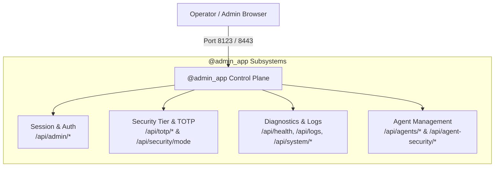

# `@admin_app` Route Catalog (Control Plane & Feature APIs)

`@admin_app` serves the full Admin UI console (`assets/admin-ui.js`), processes elevated administrative commands, orchestrates the agent catalog, and coordinates background messaging integrations.

Unlike `@auth_app`, `@admin_app` requires the server's keystore to be unlocked and enforces administrative authentication (session cookies or Bearer tokens).



---

## 1. Administrative Session & Authentication

These endpoints manage operator sign-in, session tokens, and password updates.

### `POST /api/admin/login`

Authenticates the operator password, establishing an `admin_session` cookie or issuing a Bearer token.

<CodeGroup>
```http Request
POST /api/admin/login HTTP/1.1
Host: 127.0.0.1:8123
Content-Type: application/json

{
  "password": "CorrectHorseBatteryStaple123!"
}
```

```json 200 OK Response
{
  "status": "authenticated",
  "session_token": "admin_sess_9a8b7c6d5e",
  "security_tier": "secure",
  "totp_required": false
}
```
</CodeGroup>

---

### `GET /api/admin/session`

Validates the active session, returning operator identity, permissions, and active security tier.

<CodeGroup>
```http Request
GET /api/admin/session HTTP/1.1
Host: 127.0.0.1:8123
Cookie: admin_session=admin_sess_9a8b7c6d5e
```

```json 200 OK Response
{
  "authenticated": true,
  "user_id": "operator",
  "security_mode": "secure",
  "totp_elevated": true,
  "elevated_expires_in": 1800
}
```
</CodeGroup>

---

### `POST /api/admin/logout`

Invalidates the active administrative session token immediately.

<CodeGroup>
```http Request
POST /api/admin/logout HTTP/1.1
Host: 127.0.0.1:8123
Cookie: admin_session=admin_sess_9a8b7c6d5e
```

```json 200 OK Response
{
  "status": "logged_out"
}
```
</CodeGroup>

---

## 2. Security Tier & TOTP Second-Factor

AutoYou Server implements a tiered security posture. Sensitive operations (such as resetting database stores, re-configuring messaging bridges, or exposing public Cloudflare tunnels) require TOTP elevation.

### `GET /api/totp/status`

Checks whether 2FA TOTP is configured on the host and whether the current session has elevated privileges.

<CodeGroup>
```http Request
GET /api/totp/status HTTP/1.1
Host: 127.0.0.1:8123
Cookie: admin_session=admin_sess_9a8b7c6d5e
```

```json 200 OK Response
{
  "enabled": true,
  "elevated": true,
  "elevation_remaining_seconds": 1640
}
```
</CodeGroup>

---

### `POST /api/totp/verify`

Submits a 6-digit TOTP code to elevate session privileges for sensitive operations.

<CodeGroup>
```http Request
POST /api/totp/verify HTTP/1.1
Host: 127.0.0.1:8123
Content-Type: application/json
Cookie: admin_session=admin_sess_9a8b7c6d5e

{
  "code": "849201"
}
```

```json 200 OK Response
{
  "elevated": true,
  "expires_in": 1800
}
```
</CodeGroup>

---

### `POST /api/security/mode`

Adjusts the active host security profile (`normal`, `secure`, or `secure_professional`).

<CodeGroup>
```http Request
POST /api/security/mode HTTP/1.1
Host: 127.0.0.1:8123
Content-Type: application/json
Cookie: admin_session=admin_sess_9a8b7c6d5e

{
  "mode": "secure_professional"
}
```

```json 200 OK Response
{
  "mode": "secure_professional",
  "active_restrictions": [
    "require_totp_for_all_mutations",
    "disallow_remote_debuggers",
    "enforce_sandbox_filesystem"
  ]
}
```
</CodeGroup>

---

## 3. System Telemetry, Logs & Process Controls

```http
GET  /api/health
GET  /api/diagnostics
GET  /api/logs
POST /api/system/restart
```

### `GET /api/health`

Returns detailed telemetry across all server subsystems:

<CodeGroup>
```json 200 OK Response
{
  "status": "healthy",
  "uptime_seconds": 86400,
  "keystore": {
    "status": "unlocked",
    "path": "config.keystore.enc"
  },
  "processes": {
    "ai_agent_worker": "running",
    "page_service": "running",
    "webrtc_daemon": "idle"
  },
  "system": {
    "cpu_percent": 4.2,
    "memory_used_mb": 620,
    "disk_free_gb": 142.5
  }
}
```
</CodeGroup>

---

### `GET /api/logs`

Retrieves recent server logs with automatic PII and secret redaction.

- **Query Parameters**:
  - `limit`: Number of log entries to retrieve (default: `100`).
  - `level`: Minimum log level (`DEBUG`, `INFO`, `WARNING`, `ERROR`).
  - `filter`: Keyword filter string.

---

## 4. Agent Workbench & Security Management

```http
GET  /api/agents/overview
POST /api/agents/install
POST /api/agents/uninstall
GET  /api/agents/workbench/{agent_name}
POST /api/agents/workbench/{agent_name}/test
POST /api/agents/workbench/{agent_name}/publish
POST /api/agent-security/agents/{agent_name}/wipe
POST /api/agents/ai/restart
```

### `GET /api/agents/overview`

Lists all 40+ built-in and dynamic agents, their installation states, and active web frontends:

<CodeGroup>
```json 200 OK Response
{
  "agents": [
    {
      "name": "notes_agent",
      "title": "Notes Assistant",
      "installed": true,
      "has_frontend": true,
      "route": "/agent/notes_agent/",
      "permissions": ["database_read", "database_write"]
    },
    {
      "name": "coding_agent",
      "title": "Coding Specialist",
      "installed": false,
      "has_frontend": false,
      "permissions": ["filesystem_sandbox", "shell_execution"]
    }
  ]
}
```
</CodeGroup>

---

### `POST /api/agents/ai/restart`

Restarts the dedicated AI Agent worker subprocess or reloads the in-process agent runtime. Useful after installing new skills or updating model configurations.

<CodeGroup>
```http Request
POST /api/agents/ai/restart HTTP/1.1
Host: 127.0.0.1:8123
Cookie: admin_session=admin_sess_9a8b7c6d5e
```

```json 200 OK Response
{
  "status": "restarting",
  "worker_pid": 48291
}
```
</CodeGroup>
