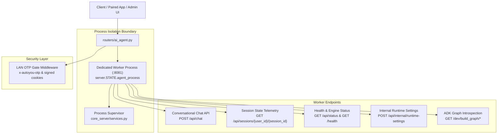
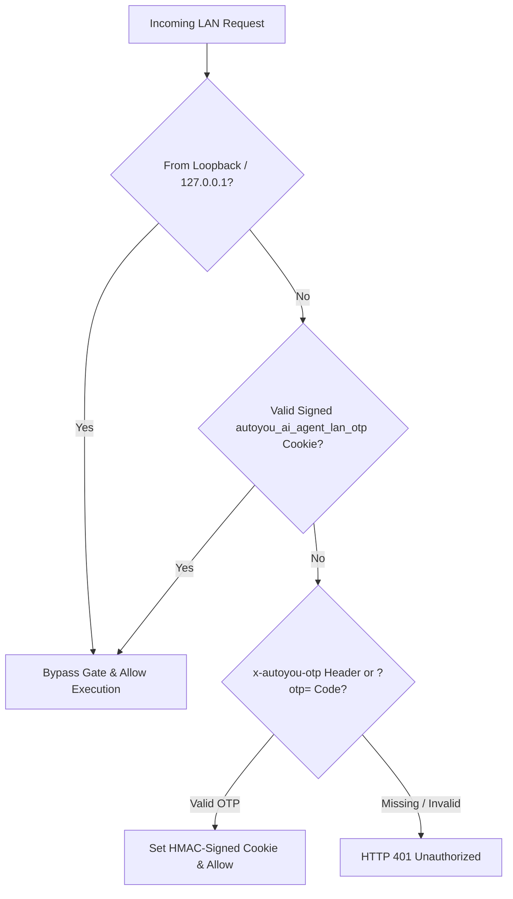

# AI Agent Worker & Process (`routers/ai_agent.py`)

The AI Agent engine runs as a dedicated worker process (or within an in-process thread pool) managed by `server.STATE.agent_process`. This architecture isolates heavy LLM generation, tool execution, and vector search from the core administrative and WebRTC media loops.



---

## 1. Port Allocation & Process Isolation

| Setting | Default Value | Environment Override | Purpose |
| :--- | :--- | :--- | :--- |
| **Worker Loopback Port** | `8081` | `AUTOYOU_AI_AGENT_PORT` | Direct internal communication between server and worker. |
| **LAN HTTPS Port** | `8444` | `AUTOYOU_AI_AGENT_LAN_HTTPS_PORT` | Optional direct LAN-accessible TLS endpoint. |
| **Internal Auth Token** | *(Generated at boot)* | `AUTOYOU_AI_AGENT_INTERNAL_TOKEN` | Secures administrative IPC calls to worker endpoints. |
| **Process Supervisor** | Managed in-process | `core_server/services.py` | Automatically restarts worker if an out-of-memory error occurs. |

---

## 2. Conversational Chat API: `POST /api/chat`

The primary conversational REST endpoint used by desktop clients, mobile apps, and headless integrations.

<CodeGroup>
```http Request
POST /api/chat HTTP/1.1
Host: 127.0.0.1:8081
Content-Type: application/json
Authorization: Bearer <session_token>

{
  "message": "Analyze the codebase for potential memory leaks.",
  "session_id": "sess_8f29ab01",
  "user_id": "operator",
  "context": [],
  "metadata": {
    "agent_name": "coding_agent",
    "model": "qwen2.5-coder:7b"
  }
}
```

```json 200 OK Response
{
  "response": "I have inspected the source files and identified two locations...",
  "session_id": "sess_8f29ab01",
  "message_id": "msg_01J8Z9X4K",
  "agent_name": "coding_agent",
  "tool_calls": [
    {
      "name": "inspect_path",
      "arguments": {
        "path": "src/engine.py"
      },
      "result": {
        "status": "ok"
      }
    }
  ]
}
```
</CodeGroup>

### Request Payload (`ChatRequest`)

| Field | Type | Required | Description |
| :--- | :--- | :--- | :--- |
| `message` | `string` | **Yes** | Natural language user message or instruction. |
| `session_id` | `string` | **Yes** | Conversation identifier for multi-turn history. |
| `user_id` | `string` | No | Partition key for user-isolated memory. |
| `context` | `array` | No | Optional turn history override or image attachments. |
| `metadata` | `object` | No | Specialist agent selection (`agent_name`) and model override. |

### Response Model (`ChatResponse`)

| Field | Type | Description |
| :--- | :--- | :--- |
| `response` | `string` | Final synthesized text response from the model. |
| `session_id` | `string` | Matched session identifier. |
| `message_id` | `string` | Unique identifier for message delivery tracking. |
| `agent_name` | `string` | Name of the specialist agent that completed the turn. |
| `tool_calls` | `array` | List of tool invocations performed during the turn. |

---

## 3. Session & Turn Inspection: `GET /api/sessions/{user_id}/{session_id}`

Retrieves active session state, turn counts, cumulative tokens consumed, and current context window utilization.

<CodeGroup>
```http Request
GET /api/sessions/operator/sess_8f29ab01 HTTP/1.1
Host: 127.0.0.1:8081
Authorization: Bearer <session_token>
```

```json 200 OK Response
{
  "user_id": "operator",
  "session_id": "sess_8f29ab01",
  "turns_count": 8,
  "tokens_consumed": 4120,
  "context_window_size": 32768,
  "active_agent": "coding_agent",
  "created_at": 1727998100,
  "last_active": 1727998902
}
```
</CodeGroup>

---

## 4. Agent Engine Status & Telemetry: `GET /api/status`

Returns live agent engine health, currently active Google ADK agents, and memory telemetry.

<CodeGroup>
```http Request
GET /api/status HTTP/1.1
Host: 127.0.0.1:8081
```

```json 200 OK Response
{
  "status": "online",
  "active_provider": "ollama",
  "active_model": "qwen2.5-coder:7b",
  "active_harness": "expanded",
  "loaded_agents_count": 41,
  "memory_backend": "sqlite+cognee",
  "vram_allocated_mb": 4200
}
```
</CodeGroup>

---

## 5. Internal Runtime Settings: `POST /api/internal/runtime-settings`

Allows the parent server process to update worker configurations dynamically (e.g. model switching, temperature adjustments, security filters) without restarting the Python worker process.

<Note>
  This endpoint requires the internal loopback token (`AUTOYOU_AI_AGENT_INTERNAL_TOKEN`) passed via the `X-Internal-Token` header.
</Note>

<CodeGroup>
```http Request
POST /api/internal/runtime-settings HTTP/1.1
Host: 127.0.0.1:8081
Content-Type: application/json
X-Internal-Token: <internal-token>

{
  "provider": "ollama",
  "model": "llama3.2:3b",
  "harness_profile": "compact",
  "temperature": 0.2,
  "reasoning_budget": 0,
  "two_stage_routing": true
}
```

```json 200 OK Response
{
  "status": "applied",
  "previous_model": "qwen2.5-coder:7b",
  "active_model": "llama3.2:3b",
  "harness_profile": "compact",
  "context_window": 8192
}
```
</CodeGroup>

### Configurable Settings

| Field | Type | Description |
| :--- | :--- | :--- |
| `provider` | `string` | Target provider (`ollama`, `openclaw`, `litellm`, `google`, `apple_intelligence`). |
| `model` | `string` | Model identifier or tag (e.g. `llama3.2:3b`, `qwen2.5:7b`). |
| `harness_profile`| `string` | Profile mode: `compact` (for small models) or `expanded` (for 14B+ models). |
| `temperature` | `float` | Sampling temperature between `0.0` and `1.0`. |
| `reasoning_budget`| `int` | Token budget for reasoning/thinking traces (`0` to disable). |
| `two_stage_routing`| `bool` | Enables intent-first specialist delegation. |

---

## 6. Graph & Routing Tree Introspection

```http
GET /dev/build_graph/{app_name}
GET /dev/build_graph_image/{app_name}
```

Introspects Google ADK agent routing trees, returning structured DOT graph representations and rendered SVG/PNG images of how subagents and tools connect to each other.

- **`GET /dev/build_graph/root_agent`**: Returns Graphviz DOT notation of the agent hierarchy.
- **`GET /dev/build_graph_image/root_agent`**: Generates and streams a rendered visual graph.

---

## 7. LAN OTP Gate Middleware

When exposed over local network HTTPS (on `AUTOYOU_AI_AGENT_LAN_HTTPS_PORT`), `routers/ai_agent.py` injects the **LAN OTP Gate**:



### Security Properties
1. **Header or Query Parameter**: Requests must present an OTP code via query parameter (`?otp=<code>`) or header (`x-autoyou-otp: <code>`).
2. **HMAC-Signed Session Cookie**: Once verified, the server sets a short-lived `autoyou_ai_agent_lan_otp` cookie HMAC-signed by the host TOTP secret (`_LAN_OTP_TOKEN_MAX_AGE_SECONDS = 3600`).
3. **Loopback Exemption**: Direct loopback connections (`127.0.0.1:8081`) bypass this gate automatically.
