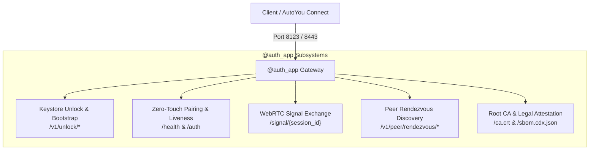

# `@auth_app` Route Catalog (Unseal & Pairing Gateway)

`@auth_app` is the isolated pre-authentication and pairing gateway FastAPI application initialized in `server.py`:

```python
# server.py line 7244
admin_app, auth_app = create_apps(LOGGER)
```

`@auth_app` is designed to be reachable when the server's encrypted keystore (`config.keystore.enc` / `config.encrypted`) is **sealed or locked**. It enables client devices (AutoYou Connect on Windows, macOS, iOS, or Android) to bootstrap trust, submit operator credentials, negotiate WebRTC peer connections, and establish encrypted sessions.



---

## 1. Bootstrap & Keystore Unlock

These endpoints manage the first-run cryptographic onboarding and runtime unsealing of the server's encrypted configuration.

### `GET /v1/unlock/status`

Returns the current cryptographic state of the server.

<CodeGroup>
```http Request
GET /v1/unlock/status HTTP/1.1
Host: 127.0.0.1:8123
Accept: application/json
```

```json 200 OK Response
{
  "status": "locked",
  "setup_required": false,
  "pin_required": true,
  "argon2_time_cost": 3,
  "memory_cost_kib": 65536
}
```
</CodeGroup>

#### Response Fields
- `status`: `"unlocked"` (keystore decrypted and running), `"locked"` (requires PIN or password to unseal), or `"requires_setup"` (initial first-run onboarding).
- `setup_required`: Boolean indicating whether the operator password must be created.
- `pin_required`: Boolean indicating whether a lockscreen PIN is configured.

---

### `POST /v1/unlock/setup`

Sets up the initial operator password, Argon2id derivation salt, and primary encryption key during first-run onboarding.

<CodeGroup>
```http Request
POST /v1/unlock/setup HTTP/1.1
Host: 127.0.0.1:8123
Content-Type: application/json

{
  "password": "CorrectHorseBatteryStaple123!",
  "confirm_password": "CorrectHorseBatteryStaple123!",
  "device_name": "Studio-Desktop"
}
```

```json 200 OK Response
{
  "status": "unlocked",
  "message": "Keystore initialized and unlocked successfully.",
  "recovery_key": "XXXX-XXXX-XXXX-XXXX"
}
```
</CodeGroup>

---

### `POST /v1/unlock/verify`

Submits the operator password or PIN to decrypt the keystore and transition the server into the `"unlocked"` state.

<CodeGroup>
```http Request
POST /v1/unlock/verify HTTP/1.1
Host: 127.0.0.1:8123
Content-Type: application/json

{
  "password": "CorrectHorseBatteryStaple123!"
}
```

```json 200 OK Response
{
  "status": "unlocked",
  "session_token": "tok_9f8a2b3c4d5e"
}
```
</CodeGroup>

---

## 2. Zero-Touch Pairing & Liveness

Zero-touch pairing routes allow clients on the local network to locate the server and negotiate cryptographic session keys.

### `GET /health`

Public liveness and capability probe used by mDNS/Bonjour discovery and client pairing handshakes.

<CodeGroup>
```http Request
GET /health HTTP/1.1
Host: 127.0.0.1:8123
```

```json 200 OK Response
{
  "status": "ok",
  "version": "1.4.0",
  "server_mode": "local",
  "capabilities": ["webrtc", "chat", "agents", "mcp"]
}
```
</CodeGroup>

---

### `POST /auth`

The primary pairing authentication handshake. Validates client cryptographic hello (PAKE / CPACE), verifies mutual certificate thumbprints, and issues an authenticated session token.

<CodeGroup>
```http Request
POST /auth HTTP/1.1
Host: 127.0.0.1:8123
Content-Type: application/json

{
  "client_id": "client_mac_a8f9",
  "client_name": "MacBook Air",
  "ephemeral_public_key": "a4b5c6d7e8f9...",
  "pairing_pin": "849201"
}
```

```json 200 OK Response
{
  "session_token": "sess_auth_01J8Z9X4K",
  "server_public_key": "d1e2f3a4b5c6...",
  "expires_in": 86400
}
```
</CodeGroup>

---

## 3. WebRTC Signal Exchange

Before direct peer-to-peer WebRTC DataChannels and media streams are open, SDP offers, answers, and ICE candidates are exchanged over HTTP polling or WebSockets.

### `POST /signal/{session_id}`

Submits an SDP offer, SDP answer, or ICE candidate for an active pairing session.

<CodeGroup>
```http Request
POST /signal/sess_auth_01J8Z9X4K HTTP/1.1
Host: 127.0.0.1:8123
Content-Type: application/json

{
  "type": "offer",
  "sdp": "v=0\r\no=- 482910 2 IN IP4 127.0.0.1\r\ns=-\r\nt=0 0\r\na=sendrecv..."
}
```

```json 200 OK Response
{
  "status": "queued",
  "message_id": "sig_98124"
}
```
</CodeGroup>

---

### `GET /signal/{session_id}`

Polls pending signaling messages (SDP answers, ICE candidates) queued for the client device.

<CodeGroup>
```http Request
GET /signal/sess_auth_01J8Z9X4K HTTP/1.1
Host: 127.0.0.1:8123
```

```json 200 OK Response
{
  "messages": [
    {
      "type": "answer",
      "sdp": "v=0\r\no=- 482911 2 IN IP4 127.0.0.1...",
      "timestamp": 1727998901234
    }
  ]
}
```
</CodeGroup>

---

## 4. Peer Rendezvous Discovery

Implements decentralized peer connection exchange without requiring third-party signaling infrastructure.

```http
POST /v1/peer/rendezvous/open
GET  /v1/peer/rendezvous/{invitation_id}/offer
POST /v1/peer/rendezvous/{invitation_id}/answer
GET  /v1/peer/rendezvous/{invitation_id}/answer
POST /v1/peer/rendezvous/{invitation_id}/close
GET  /peer/add
```

- **`POST /v1/peer/rendezvous/open`**: Creates an ephemeral pairing rendezvous invitation with a short-lived token and cryptographic fingerprint.
- **`GET /v1/peer/rendezvous/{invitation_id}/offer`**: Retrieves the host's SDP offer associated with the rendezvous token.
- **`POST /v1/peer/rendezvous/{invitation_id}/answer`**: Submits the connecting client's SDP answer.
- **`GET /v1/peer/rendezvous/{invitation_id}/answer`**: Retrieves the client's answer to finalize the direct connection.
- **`POST /v1/peer/rendezvous/{invitation_id}/close`**: Closes and invalidates the rendezvous channel.
- **`GET /peer/add`**: Serves a responsive HTML onboarding page for scanning pairing QR codes.

---

## 5. Trust, Root CA & Legal Attestation

```http
GET  /ca.crt
POST /v1/moderation/report
GET  /LICENSE
GET  /NOTICE.txt
GET  /THIRD-PARTY-NOTICES.md
GET  /sbom.cdx.json
```

- **`GET /ca.crt`**: Downloads the server's local self-signed root CA certificate, enabling connecting clients to establish trusted TLS sessions.
- **`POST /v1/moderation/report`**: Submits safety or abuse reports directly to the local audit store.
- **Legal Endpoints**: Serves tracked licenses, legal manifests, and CycloneDX SBOMs.
