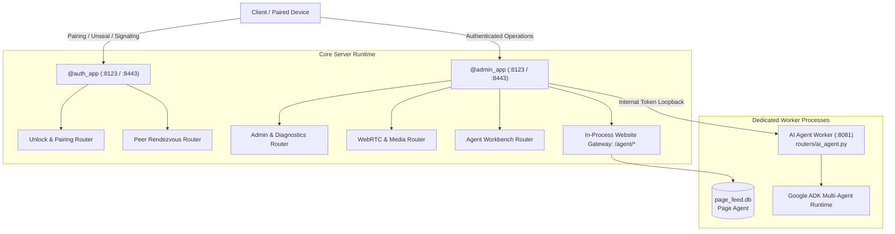

# API Reference Overview

AutoYou Server implements a secure, modular multi-application architecture designed for local-first privacy, zero-touch pairing, and multi-modal AI agent execution. Rather than running a single monolithic HTTP service, the server orchestrates distinct ASGI applications and worker processes:

1. **`@admin_app`**: The primary administrative, operator, and feature FastAPI application.
2. **`@auth_app`**: The isolated unseal, authentication, and pairing gateway FastAPI application.
3. **AI Agent Worker Process (`routers/ai_agent.py`)**: A dedicated worker running Google ADK agent pipelines and conversational chat endpoints on port `8081` (with optional LAN HTTPS).
4. **Page Service & Website Gateway (`routers/website_gateway.py`)**: An in-process ASGI gateway hosting agent frontends (`/agent/{name}/`), social feed operations (`page_feed.db`), and website directory discovery.



---

## 1. Dual ASGI Architecture: `@admin_app` vs `@auth_app`

Both applications are initialized together in `server.py`:

```python
# server.py line 7244
admin_app, auth_app = create_apps(LOGGER)
```

### Why the Apps Are Split

| Characteristic | `@auth_app` | `@admin_app` |
| :--- | :--- | :--- |
| **Operational Boundary** | **Pre-Authentication & Pairing Gateway** | **Authenticated Management & Control Plane** |
| **Keystore State** | Operates even when keystore is **locked** / sealed | Requires keystore to be **unlocked** and unsealed |
| **Authentication Requirement** | Public or PAKE / CPACE handshake tokens | Admin session cookie, Bearer token, and optional TOTP |
| **Primary Domain** | First-run setup, bootstrap PIN, WebRTC SDP signaling, peer rendezvous | Admin UI console, agent management, model library, messaging bridges |
| **Loopback Policy** | Bound to configured network interfaces for pairing | Locked to loopback unless explicitly unsealed or proxied |

---

## 2. `@auth_app` Route Catalog (Unseal & Pairing Gateway)

`@auth_app` hosts the critical bootstrap, zero-touch pairing, and WebRTC signal negotiation routes. It allows fresh client devices (AutoYou Connect on Windows, macOS, iOS, or Android) to discover the server, establish cryptographic trust, and negotiate secure peer-to-peer data channels.

### Bootstrap & Keystore Unlock

These routes govern the first-time setup and password unsealing of the server's encrypted keystore (`config.keystore.enc` / `config.encrypted`):

```http
GET  /v1/unlock/status
POST /v1/unlock/setup
POST /v1/unlock/verify
```

- **`GET /v1/unlock/status`**: Returns the current cryptographic seal status of the server:
  - `status`: `"unlocked"` (running normally), `"locked"` (requires password/PIN to unseal), or `"requires_setup"` (initial first run).
  - `setup_required`: Boolean indicating whether an operator password must be created.
  - `pin_required`: Boolean indicating whether a numeric lockscreen PIN is configured.
- **`POST /v1/unlock/setup`**: Sets up the initial operator password, Argon2id derivation salt, and primary encryption key during first-run onboarding.
- **`POST /v1/unlock/verify`**: Submits the operator password or PIN to decrypt the keystore and transition the server into the `"unlocked"` state.

### Pairing & WebRTC Signal Exchange

```http
GET  /health
POST /auth
POST /signal/{session_id}
GET  /signal/{session_id}
```

- **`GET /health`**: Public liveness and capability probe used by client pairing discovery.
- **`POST /auth`**: The primary pairing authentication handshake. Validates the client's cryptographic PAKE/CPACE hello, checks client certificates, and issues an authenticated session token.
- **`POST /signal/{session_id}`**: Submits an SDP offer, SDP answer, or ICE candidate for an active WebRTC session before data channels are open.
- **`GET /signal/{session_id}`**: Polls pending signaling messages (SDP answers, ICE candidates) queued for the client device.

### Peer Rendezvous Discovery

Implements decentralized peer connection exchange without third-party signaling servers:

```http
POST /v1/peer/rendezvous/open
GET  /v1/peer/rendezvous/{invitation_id}/offer
POST /v1/peer/rendezvous/{invitation_id}/answer
GET  /v1/peer/rendezvous/{invitation_id}/answer
POST /v1/peer/rendezvous/{invitation_id}/close
GET  /peer/add
```

- **`POST /v1/peer/rendezvous/open`**: Creates an ephemeral pairing rendezvous invitation with a short-lived token and cryptographic fingerprint.
- **`GET /v1/peer/rendezvous/{invitation_id}/offer`**: Retrieves the host's SDP offer associated with the rendezvous token.
- **`POST /v1/peer/rendezvous/{invitation_id}/answer`**: Submits the connecting client's SDP answer.
- **`GET /v1/peer/rendezvous/{invitation_id}/answer`**: Retrieves the client's answer to finalize the direct connection.
- **`POST /v1/peer/rendezvous/{invitation_id}/close`**: Closes and invalidates the rendezvous channel.
- **`GET /peer/add`**: Serves a clean, responsive HTML onboarding page for scanning pairing QR codes.

### Trust, Legal & Moderation

```http
GET  /ca.crt
POST /v1/moderation/report
GET  /LICENSE
GET  /NOTICE.txt
GET  /THIRD-PARTY-NOTICES.md
GET  /sbom.cdx.json
```

- **`GET /ca.crt`**: Downloads the server's local self-signed root CA certificate, enabling clients to establish trusted TLS connections.
- **`POST /v1/moderation/report`**: Submits client safety or abuse reports directly to the local audit store.
- **Legal Endpoints**: Serves tracked legal manifests, licenses, and CycloneDX SBOMs.

---

## 3. `@admin_app` Route Catalog (Control Plane & Feature APIs)

`@admin_app` serves the full Admin UI console (`assets/admin-ui.js`), handles elevated administrative commands, orchestrates the agent catalog, and coordinates background messaging integrations.

### Administrative Session & Authentication

```http
GET  /
GET  /admin
POST /api/admin/login
POST /api/admin/logout
GET  /api/admin/session
POST /api/admin/password/change
```

- **`GET /` & `GET /admin`**: Serves the single-page Admin Console application.
- **`POST /api/admin/login`**: Authenticates the operator password, establishing an `admin_session` cookie or issuing a Bearer token.
- **`GET /api/admin/session`**: Validates the current admin session, returning user identity, permissions, and active security tier.
- **`POST /api/admin/logout`**: Invalidates the active administrative session token immediately.

### Security Tier & TOTP Second-Factor

```http
GET  /api/totp/status
POST /api/totp/setup
POST /api/totp/verify
POST /api/security/mode
```

- **`GET /api/totp/status`**: Checks whether 2FA TOTP is configured and whether the current session is elevated.
- **`POST /api/totp/setup`**: Generates a new TOTP secret key and QR code URI for authenticator apps.
- **`POST /api/totp/verify`**: Submits a 6-digit TOTP code to elevate privileges for sensitive operations.
- **`POST /api/security/mode`**: Adjusts the active host security profile (`normal`, `secure`, or `secure_professional`).

### System Health, Logs & Diagnostics

```http
GET  /api/health
GET  /api/diagnostics
GET  /api/logs
POST /api/system/restart
```

- **`GET /api/health`**: Returns detailed health telemetry across all subsystems (memory, CPU, disk, keystore, subprocesses).
- **`GET /api/diagnostics`**: Generates an anonymized diagnostic bundle with active listener bindings and process trees.
- **`GET /api/logs`**: Retrieves recent server execution logs with automatic PII and secret redaction.
- **`POST /api/system/restart`**: Schedules a graceful server restart.

### Agent Workbench & Security Management

```http
GET  /api/agents/overview
POST /api/agents/install
POST /api/agents/uninstall
GET  /api/agents/workbench/{agent_name}
POST /api/agents/workbench/{agent_name}/test
POST /api/agents/workbench/{agent_name}/publish
POST /api/agent-security/agents/{agent_name}/wipe
POST /api/agents/ai/restart
```

- **`GET /api/agents/overview`**: Lists all 40+ built-in and dynamic agents, their install states, and active frontends.
- **`POST /api/agents/install` / `uninstall`**: Dynamically activates or disables agents in `agent_install_registry.json`.
- **`GET /api/agents/workbench/{agent_name}`**: Loads agent code, manifest parameters, and tool definitions into the visual editor.
- **`POST /api/agents/workbench/{agent_name}/test`**: Executes a single-turn test prompt against the selected agent in an isolated sandbox.
- **`POST /api/agents/workbench/{agent_name}/publish`**: Validates manifest compliance and deploys the agent to the live runtime.
- **`POST /api/agent-security/agents/{agent_name}/wipe`**: Purges all mutable storage, databases, and cached assets for an agent.
- **`POST /api/agents/ai/restart`**: Restarts the dedicated AI Agent worker subprocess or reloads the in-process agent runtime.

### Multi-Turn Chat & History

```http
POST   /api/chat
GET    /api/chat/history
DELETE /api/chat/sessions/{session_id}
```

- **`POST /api/chat`**: Routes chat prompts through the server intent router to the appropriate agent or LLM.
- **`GET /api/chat/history`**: Retrieves historical chat sessions and turns stored in `sessions.db`.
- **`DELETE /api/chat/sessions/{session_id}`**: Purges a specific conversation session and all its associated vector embeddings.

### Real-Time WebRTC Calls & DataChannels

```http
POST /api/webrtc/call/start
POST /api/webrtc/call/stop
GET  /api/webrtc/call/status
WS   /ws
```

- **`POST /api/webrtc/call/start`**: Initiates a bi-directional audio/video call session with connected clients.
- **`POST /api/webrtc/call/stop`**: Terminates the active media call.
- **`WS /ws`**: High-performance WebSocket stream for fragmented DataChannel messages, remote desktop input frames, and real-time event subscriptions.

### External Messaging Gateways

```http
GET  /api/telegram/status
POST /api/telegram/configure
GET  /api/signal/status
POST /api/signal/link
GET  /api/whatsapp/status
POST /api/whatsapp/qr
```

- Controls local background daemons for Telegram (`telegram_user_service.py`), Signal (`signal_service.py`), and WhatsApp (`whatsapp_service.py`).

### Model Library, Speech & LLMFit

```http
GET  /api/models
POST /api/models/select
GET  /api/speech/providers
POST /api/speech/synthesize
GET  /api/models/hardware
```

- **`GET /api/models`**: Lists installed local Ollama models and configured cloud LLM providers.
- **`POST /api/models/select`**: Activates a specific model for chat and agent execution.
- **`GET /api/models/hardware`**: Scans host VRAM and compute capabilities via **LLMFit** to recommend quantization levels.
- **`POST /api/speech/synthesize`**: Transcribes text to speech using Piper, Kokoro, or EmotiVoice.

### Cloud Relay & MCP Server

```http
POST /api/cloud/pair
GET  /api/cloud/status
DELETE /api/cloud/unbind
GET  /api/v1/mcp/sse
POST /api/v1/mcp/messages
```

- **Cloud Relay**: Manages encrypted relay connections to AutoYou Cloud for NAT traversal and remote mobile push alerts.
- **MCP Adapter**: Implements Model Context Protocol SSE transport, enabling external tools (such as Claude Desktop or ChatGPT) to interact with AutoYou agents.

---

## 4. AI Agent Worker Application & Process (`routers/ai_agent.py`)

The AI Agent engine runs as a dedicated worker process (or within an in-process thread pool) managed by `server.STATE.agent_process`. This worker isolates heavy LLM generation, tool execution, and vector search from the core administrative and WebRTC media loops.

### Port Allocation & Process Isolation

- **Default Port**: Bound to loopback port `8081` (`http://127.0.0.1:8081`).
- **LAN HTTPS Listener**: Can optionally bind to a separate LAN HTTPS port (`AUTOYOU_AI_AGENT_LAN_HTTPS_PORT`) for local network access.
- **Supervisor Check**: The main server monitors the worker using `server._is_agent_process_running(server.STATE.agent_process)`.
- **Worker Reload**: Triggered via `POST /api/agents/ai/restart`.

### AI Agent Endpoints

```http
POST /api/chat
GET  /api/sessions/{user_id}/{session_id}
GET  /api/status
GET  /api/docs
GET  /health
POST /api/internal/runtime-settings
GET  /dev/build_graph/{app_name}
GET  /dev/build_graph_image/{app_name}
```

#### `POST /api/chat`

The primary conversational REST endpoint used by desktop clients, mobile apps, and headless integrations:

- **Request Model (`ChatRequest`)**:
  ```json
  {
    "message": "Analyze the codebase for potential memory leaks.",
    "session_id": "sess_8f29ab01",
    "user_id": "operator",
    "context": [],
    "metadata": {
      "agent_name": "coding_agent",
      "model": "qwen2.5-coder:7b"
    }
  }
  ```
- **Response Model (`ChatResponse`)**:
  ```json
  {
    "response": "I have inspected the source files and identified two locations...",
    "session_id": "sess_8f29ab01",
    "message_id": "msg_01J8Z9X4K",
    "agent_name": "coding_agent",
    "tool_calls": [
      {
        "name": "inspect_path",
        "arguments": {"path": "src/engine.py"},
        "result": {"status": "ok"}
      }
    ]
  }
  ```

#### `GET /api/sessions/{user_id}/{session_id}`

Retrieves active session state, turn counts, cumulative tokens consumed, and current context window utilization (`SessionInfo`).

#### `GET /api/status`

Returns live agent engine health, currently active Google ADK agents, and memory telemetry (`APIStatus`).

#### `POST /api/internal/runtime-settings`

Allows the parent server process to update worker configurations (e.g. model switching, temperature adjustments, security filters) without restarting the Python process. Protected by `AUTOYOU_AI_AGENT_INTERNAL_TOKEN`.

#### `GET /dev/build_graph/{app_name}` & `/dev/build_graph_image/{app_name}`

Introspects Google ADK agent routing trees, returning structured DOT graph representations and rendered images of how subagents and tools connect to each other.

### LAN OTP Gate Middleware

When exposed over local network HTTPS, `routers/ai_agent.py` injects the **LAN OTP Gate**:

- Requests must present an OTP code via query parameter (`?otp=<code>`) or header (`x-autoyou-otp: <code>`).
- Once verified, the server sets a short-lived `autoyou_ai_agent_lan_otp` cookie HMAC-signed by the server's TOTP secret (`_LAN_OTP_TOKEN_MAX_AGE_SECONDS = 3600`).
- Direct loopback connections (`127.0.0.1:8081`) bypass this gate automatically.

---

## 5. Page Service & Website Gateway (`routers/website_gateway.py`)

The **Website Gateway** mounts agent web applications directly behind the admin origin, eliminating the need for multi-port reverse proxy configurations in home network setups.

### In-Process Architecture

```
Client Request -> [Admin Origin: 8123 / 8443] -> WebsiteGateway ASGI Endpoint -> In-Process Page Service -> Agent Frontend (:8067)
```

In `path_proxy` home-network mode, only the admin port listens beyond loopback. A remote browser signs in over HTTPS and reaches every website app under `/agent/{name}/` on that same origin. Each request is handed to the page service **in-process**: no second listener, no extra hop, and identical media streaming capabilities.

### Website Gateway Paths

The following paths are intercepted on the admin origin and forwarded to the page service:

```http
GET   /websites
GET   /agent-websites
GET   /agent-frontends
GET   /api/websites
GET   /api/agent-websites
QUERY /api/agent-websites
GET   /api/agent-frontends
GET   /api/agent-directory
ALL   /agent/{agent_name}
ALL   /agent/{agent_name}/{proxy_path:path}
```

### Agent Web App Mounting (`/agent/{agent_name}/*`)

Each agent with a `website/frontend/` directory (e.g. `audio_agent`, `notes_agent`, `agent_builder_agent`) is automatically served under `/agent/{agent_name}/`.

- **Static Assets**: Serves `index.html`, CSS stylesheets, and bundled JavaScript.
- **WebSocket Tunnels**: Full-duplex WebSocket connections are forwarded directly to the agent's internal backend logic.
- **Remote Client Identity**: The gateway automatically translates and preserves remote browser identity headers (`REMOTE_BROWSER_IDENTITY_HEADERS`) for paired mobile devices.

### Page Feed & Social Publisher (`page_feed.db`)

Powers `page_agent` for authoring, querying, and distributing rich media cards, social posts, and agent-generated documents:

- **Database**: Dedicated SQLite store at `page_feed.db`.
- **Feed Search**: Full-text search and tag aggregation across published items.
- **Media Streaming**: High-throughput media streaming supporting HTTP 206 Partial Content range requests.

### RFC 10008 HTTP QUERY Support

AutoYou Server natively implements **RFC 10008 HTTP QUERY** on directory and website search endpoints:

```http
QUERY /api/agent-websites HTTP/1.1
Host: 127.0.0.1:8123
Content-Type: application/json
Accept-Query: application/json

{
  "category": "coding-and-building",
  "has_frontend": true,
  "limit": 10
}
```

This permits complex JSON filtering without running into URL query parameter length restrictions or leaking sensitive search terms in proxy access logs.

---

## 6. Authentication & Header Conventions

| Header | Description | Usage Context |
| :--- | :--- | :--- |
| `Authorization: Bearer <token>` | Primary API session token | Admin REST endpoints, client chat, and model selection |
| `X-Session-ID: <session_id>` | Active conversation or WebRTC session identifier | Chat turns, WebRTC signaling, and session history |
| `X-AutoYou-TOTP: <code>` | 6-digit TOTP second-factor verification code | Sensitive admin mutations, keystore unlock, and file deletion |
| `x-autoyou-otp: <code>` | LAN OTP authentication code | Accessing AI Agent worker over LAN HTTPS |
| `Cookie: admin_session=<token>` | HTTP-only encrypted session cookie | Admin UI console and Website Gateway browser access |
| `Cookie: autoyou_ai_agent_lan_otp=<token>` | Short-lived signed LAN OTP session token | AI Agent worker browser chat sessions |

---

## 7. Standard Error Response Format (RFC 7807)

All endpoints return RFC 7807 compliant JSON error structures:

```json
{
  "error": "unauthorized",
  "message": "Invalid or expired session token provided.",
  "code": 401,
  "timestamp": 1727998900123,
  "details": {
    "required_mode": "secure_professional",
    "totp_missing": true
  }
}
```

### Common HTTP Status Codes

- **`200 OK`**: Synchronous operation succeeded.
- **`202 Accepted`**: Background task or download scheduled.
- **`302 Found`**: Redirect to `/login` when unauthenticated browser requests a protected web frontend.
- **`400 Bad Request`**: Malformed payload, invalid schema, or missing parameters.
- **`401 Unauthorized`**: Authentication missing, bad password, or invalid session token.
- **`403 Forbidden`**: Operation not permitted by current security tier or sandbox boundary.
- **`404 Not Found`**: Requested agent, session, model, or file does not exist.
- **`429 Too Many Requests`**: Rate limit exceeded (e.g. repeated failed unlock attempts).
- **`500 Internal Server Error`**: Unexpected exception in server worker.
