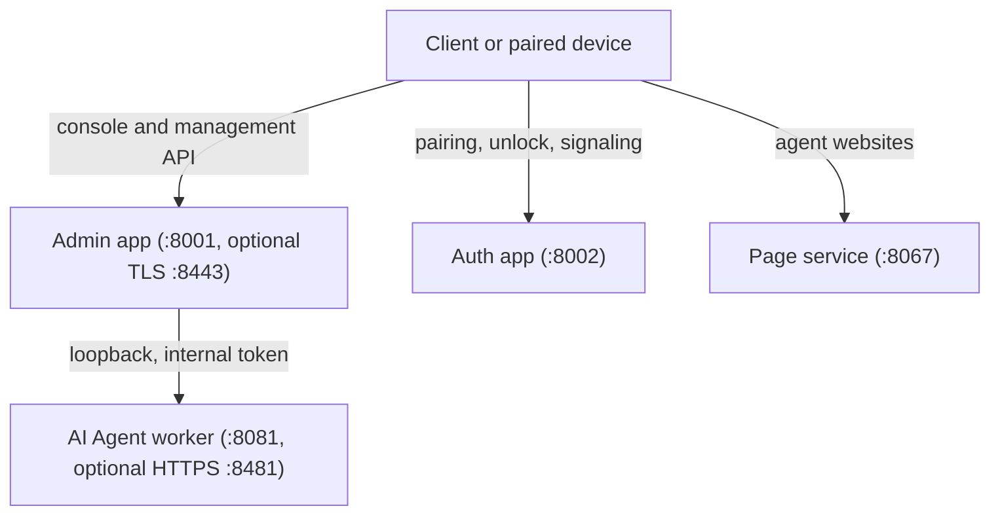

# API Reference Overview

AutoYou Server is not a single HTTP service. It runs several applications, each on its own port:



By default every listener binds to `127.0.0.1`. Set `AUTOYOU_BIND_HOST` to listen on your LAN.

---

## Applications

<CardGroup cols={2}>
  <Card title="Route catalog" icon="list" href="/api-reference/route-catalog">
    Every route declared in `routers/`, generated from the source.
  </Card>
  <Card title="Auth app" icon="key" href="/api-reference/auth-app">
    First-run setup, unlock, pairing authentication, WebRTC signaling, Peer Link rendezvous, and legal documents.
  </Card>
  <Card title="Admin app" icon="sliders" href="/api-reference/admin-app">
    The console, sign-in, configuration, agents, WebRTC, messaging, models, and cloud routes.
  </Card>
  <Card title="AI Agent worker" icon="microchip" href="/api-reference/ai-agent-worker">
    The separate worker process: chat, sessions, status, and the LAN one-time-code gate.
  </Card>
  <Card title="Website gateway" icon="browser" href="/api-reference/website-gateway">
    The page service that serves agent websites and the website directory.
  </Card>
</CardGroup>

---

## Admin app and auth app

Both are created together in `server.py` by `create_apps()`.

| | Auth app | Admin app |
| :--- | :--- | :--- |
| Default port | `8002` (`AUTOYOU_AUTH_PORT`) | `8001` (`AUTOYOU_ADMIN_PORT`), plus an optional TLS listener on `8443` |
| Purpose | Pairing surface: unlock, `POST /auth`, `/signal/{session_id}`, Peer Link rendezvous, legal documents | Console, configuration, agents, WebRTC, messaging, models, cloud, MCP |
| Credentials | Pairing credentials, or none for public routes | An `admin_session` cookie, or a short-lived bearer token |
| While the server is locked | Only the unlock routes, legal documents, and static assets answer | Only the unlock routes, `/login`, a few local helper routes, legal documents, and static assets answer |

Some routes, such as the unlock routes, are registered on both apps.

---

## Authentication

| Credential | Where | Used for |
| :--- | :--- | :--- |
| `admin_session` cookie | Admin app | The admin console and its API. Set by signing in; `HttpOnly`, `SameSite=Strict`, and `Secure` over HTTPS. Idle expiry is 12 hours by default. |
| `Authorization: Bearer <token>` | Admin app | A token issued for one hour by `POST /api/admin/session/verify` after a valid authenticator code. |
| `Authorization: Bearer <internal token>` | Loopback only | Calls between the server and the AI Agent worker, such as `POST /api/internal/runtime-settings`. |
| `x-autoyou-otp` header or `otp` query parameter | AI Agent worker on the LAN HTTPS port | The current authenticator code. A successful check sets the `autoyou_ai_agent_lan_otp` cookie. |

Requests that change state on the admin app must carry an `Origin` or `Referer` header that matches the server, or they are rejected with `403`. Some routes that change credentials or security settings are refused for remote browsers entirely; see [Security & Authentication](/architecture/security-and-auth).

---

## Errors

Most routes report errors as JSON with a `success` flag:

```json
{
  "success": false,
  "error": "Authentication required"
}
```

A few routes use their own shape, such as `{"error": "..."}` or `{"valid": false, "error": "..."}`. The API does not use the RFC 7807 problem format.

| Code | Where you see it |
| :--- | :--- |
| `400` | Malformed JSON, a missing field, or an unsupported value. |
| `401` | Not signed in, the server is `Locked`, a wrong password, or a missing one-time code. |
| `403` | Cross-site request guard, an internal route called without the internal token, or a remote browser attempting a protected change. |
| `409` | The action does not apply in the current state, such as rotating Maximus storage when it is not active. |
| `428` | The license agreement must be accepted before unlocking. |
| `429` | A rate limit was exceeded, for example repeated pairing attempts. |
| `451` | Setup is pending, so the server is not yet available. |
| `500`, `503` | A server error, or a dependency such as secure storage or a saved configuration is unavailable. |
