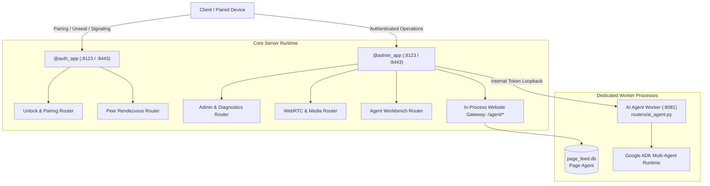

# API Reference Overview

AutoYou Server implements a modular multi-application architecture designed for local-first privacy, zero-touch pairing, and multi-modal AI agent execution. Rather than running a single monolithic HTTP service, the server orchestrates distinct ASGI applications and worker processes:



---

## Architecture Components

<CardGroup cols={2}>
  <Card title="@auth_app Route Catalog" icon="key" href="/api-reference/auth-app">
    Pre-authentication unseal, keystore unlock, PAKE/CPACE zero-touch pairing, WebRTC signaling, and peer rendezvous.
  </Card>
  <Card title="@admin_app Route Catalog" icon="sliders" href="/api-reference/admin-app">
    Administrative session auth, TOTP second-factor elevation, system diagnostics, and agent management.
  </Card>
  <Card title="AI Agent Worker & Process" icon="microchip" href="/api-reference/ai-agent-worker">
    Dedicated worker process on port 8081, conversational chat (`/api/chat`), runtime settings, and LAN OTP security.
  </Card>
  <Card title="Website Gateway & Page Service" icon="browser" href="/api-reference/website-gateway">
    In-process web proxy, `/agent/{name}/` web app mounting, RFC 10008 HTTP QUERY, and `page_feed.db`.
  </Card>
</CardGroup>

---

## Dual ASGI Comparison: `@admin_app` vs `@auth_app`

Both applications are initialized together in `server.py`:

```python
# server.py line 7244
admin_app, auth_app = create_apps(LOGGER)
```

| Characteristic | `@auth_app` | `@admin_app` |
| :--- | :--- | :--- |
| **Operational Boundary** | **Pre-Authentication & Pairing Gateway** | **Authenticated Management & Control Plane** |
| **Keystore State** | Operates even when keystore is **locked** / sealed | Requires keystore to be **unlocked** and unsealed |
| **Authentication Requirement** | Public or PAKE / CPACE handshake tokens | Admin session cookie, Bearer token, and optional TOTP |
| **Primary Domain** | First-run setup, bootstrap PIN, WebRTC SDP signaling, peer rendezvous | Admin UI console, agent management, model library, messaging bridges |
| **Loopback Policy** | Bound to configured network interfaces for pairing | Locked to loopback unless explicitly unsealed or proxied |

---

## Authentication & Header Conventions

| Header | Description | Usage Context |
| :--- | :--- | :--- |
| `Authorization: Bearer <token>` | Primary API session token | Admin REST endpoints, client chat, and model selection |
| `X-Session-ID: <session_id>` | Active conversation or WebRTC session identifier | Chat turns, WebRTC signaling, and session history |
| `X-AutoYou-TOTP: <code>` | 6-digit TOTP second-factor verification code | Sensitive admin mutations, keystore unlock, and file deletion |
| `X-Internal-Token: <token>` | Internal supervisor authentication token | Internal worker IPC (`/api/internal/runtime-settings`) |
| `x-autoyou-otp: <code>` | LAN OTP authentication code | Accessing AI Agent worker over LAN HTTPS |
| `Cookie: admin_session=<token>` | HTTP-only encrypted session cookie | Admin UI console and Website Gateway browser access |
| `Cookie: autoyou_ai_agent_lan_otp=<token>` | Short-lived signed LAN OTP session token | AI Agent worker browser chat sessions |

---

## Standard Error Response Format (RFC 7807)

All endpoints return RFC 7807 compliant JSON error structures:

```json
{
  "error": "unauthorized",
  "message": "Invalid or expired session token provided.",
  "code": 401,
  "timestamp": 1727998900123,
  "details": {
    "required_mode": "secure_professional",
    "totp_missing": true
  }
}
```

### Common HTTP Status Codes

| Code | Status | Meaning |
| :--- | :--- | :--- |
| **`200`** | `OK` | Synchronous operation completed successfully. |
| **`202`** | `Accepted` | Background task, model download, or backup scheduled. |
| **`302`** | `Found` | Unauthenticated browser redirected to `/login`. |
| **`400`** | `Bad Request` | Malformed JSON, schema violation, or missing parameters. |
| **`401`** | `Unauthorized` | Missing authentication token or invalid credentials. |
| **`403`** | `Forbidden` | Disallowed by active security tier or sandbox boundary. |
| **`404`** | `Not Found` | Requested agent, session, model, or file does not exist. |
| **`429`** | `Too Many Requests` | Rate limit exceeded (e.g. repeated unlock attempts). |
| **`500`** | `Internal Error` | Unexpected exception in server worker. |
