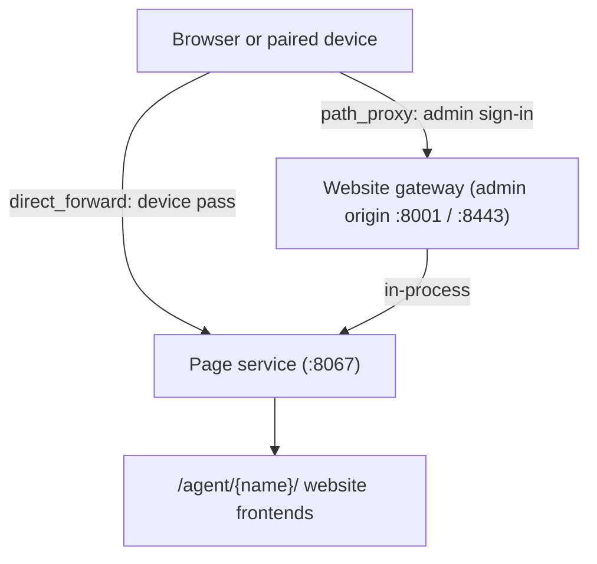

# Website Gateway & Page Service

Agent websites are served by the **page service** (`autoyou_page_service.py`). It listens on port `8067` by default (`AUTOYOU_PAGE_PORT`) and is the shared host for every agent website and for the website directory. The **website gateway** (`routers/website_gateway.py`) serves the same page service on the admin origin, behind the admin sign-in.



---

## How browsers reach agent websites

The server setting `server.home_network_websites` decides how a browser on your home network reaches website apps:

| Mode | Behavior |
| :--- | :--- |
| `direct_forward` (default) | The page service listens on the home network as well as on this computer. Every request from another device needs a device pass: a Local Pair device gets one over its data channel, and a browser gets one by signing in to the admin page. |
| `path_proxy` | The page service stays on this computer. Browsers on other devices sign in on the admin port, over HTTPS, and reach every website app under `/agent/<name>/` on that same origin. |

The page service listens beyond loopback only when the server itself is bound beyond loopback (`AUTOYOU_BIND_HOST`) **and** the mode is `direct_forward`. This setting is protected from remote browsers. Each agent website also has its own route mode, `path_proxy` or `direct_forward`; a few, such as `admin_agent`, require `direct_forward`.

---

## Page service routes

| Route | Purpose |
| :--- | :--- |
| `GET /`, `GET /websites`, `GET /agent-websites` | The website directory page. `GET /` redirects to the default agent website. `q` filters the directory. |
| `GET /agent-frontends` | Redirects to `/websites` |
| `GET /api/websites`, `GET /api/agent-websites` | The registered agent frontends as JSON |
| `QUERY /api/websites`, `QUERY /api/agent-websites` | Search the registered agent frontends with a JSON body (below) |
| `OPTIONS /api/websites`, `OPTIONS /api/agent-websites` | Advertises `Allow: GET, HEAD, OPTIONS, QUERY` and `Accept-Query: "application/json"` |
| `GET /api/agent-frontends` | The registered agent frontends as JSON |
| `GET /api/agent-directory` | The directory of installed agents |
| `GET /api/ui/theme`, `POST /api/ui/theme` | Read or set the shared theme (`dark` or `light`) |
| `GET /agent/{agent_name}` | Redirects to `/agent/{agent_name}/` if an installed frontend is registered; otherwise the request is refused |
| `ANY /agent/{agent_name}/{proxy_path}` | Proxies to the agent website (GET, POST, PUT, PATCH, DELETE, OPTIONS, HEAD, QUERY) |
| `WEBSOCKET /agent/{agent_name}/{proxy_path}` | WebSocket proxy to the agent website |
| `GET /api/status`, `GET /api/info`, `GET /health` | Status and liveness |

Each agent with a website serves it from `autoyou_agents/{agent_name}/website/` and is reached at `/agent/{agent_name}/`.

### Gateway routes on the admin origin

The gateway registers these paths on the admin app. The page service answers them unchanged, but only for a signed-in admin session:

`/websites`, `/agent-websites`, `/agent-frontends`, `/api/websites`, `/api/agent-websites`, `/api/agent-frontends`, `/api/agent-directory`, `/agent/{agent_name}`, and `/agent/{agent_name}/{proxy_path}` (with WebSocket support under `/agent/`).

Without a sign-in, a page request is redirected to `/login` and an API request gets `401`. If the page service is not running, the gateway answers `503`. The gateway also decides who the browser is: an operator signed in with the admin password is presented to the website as this computer, any identity the browser claimed is dropped, and a paired device's browser keeps the identity AutoYou stamped on it.

---

## HTTP QUERY search

The directory search uses the HTTP `QUERY` method ([RFC 10008](https://www.rfc-editor.org/rfc/rfc10008.html)), which carries the search in a JSON body instead of the URL.

```bash
curl --request QUERY http://127.0.0.1:8067/api/agent-websites \
  --header 'Content-Type: application/json' \
  --data '{"query":"calendar scheduling","limit":24}'
```

| Field | Rules |
| :--- | :--- |
| `query` | A string of at most 200 characters. An empty string returns everything. |
| `limit` | An integer from 1 through 50. The default is 24. |

The body must be a JSON object of at most 4,096 bytes with `Content-Type: application/json`. Other values return `415` or `400` (wrong content type), `413` (too large), `422` (wrong types or ranges), or `400` (invalid JSON).

The response is the frontend registry payload with the matches in `frontends`, ordered by relevance, plus `query`, `count` (matches returned), and `total` (all registered). Each frontend includes fields such as `agent_name`, `route_mode`, and the launch path.

---

## Page feed

The Page agent keeps feed items in `page_feed.db` (tables `feed_items`, `item_tags`, and `blobs`). Its web interface is served as an ordinary agent website at `/agent/page_agent/`.
