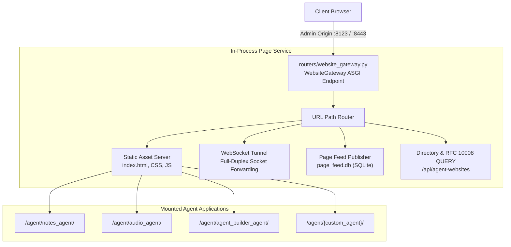

# Website Gateway & Page Service (`routers/website_gateway.py`)

The **Website Gateway** mounts agent web applications directly behind the main admin origin, eliminating the need for complex multi-port reverse proxy configurations in home network setups.



---

## 1. In-Process Gateway Architecture

In `path_proxy` home-network mode, only the admin port listens beyond loopback. A remote browser signs in over HTTPS and reaches every website app under `/agent/{name}/` on that same origin. 

Each request is handed to the page service **in-process**: no second listener, no extra hop, and identical media streaming capabilities.

```
Client Request -> [Admin Origin: 8123 / 8443] -> WebsiteGateway ASGI Endpoint -> In-Process Page Service -> Agent Frontend (:8067)
```

---

## 2. Website Gateway Route Catalog

The following paths are intercepted on the admin origin and forwarded to the page service:

```http
GET   /websites
GET   /agent-websites
GET   /agent-frontends
GET   /api/websites
GET   /api/agent-websites
QUERY /api/agent-websites
GET   /api/agent-frontends
GET   /api/agent-directory
ALL   /agent/{agent_name}
ALL   /agent/{agent_name}/{proxy_path:path}
```

---

## 3. Agent Web App Mounting (`/agent/{agent_name}/*`)

Each agent with a `website/frontend/` directory (e.g. `audio_agent`, `notes_agent`, `agent_builder_agent`) is automatically served under `/agent/{agent_name}/`.

### Features
- **Static Assets**: Serves `index.html`, CSS stylesheets, and bundled JavaScript.
- **WebSocket Tunnels**: Full-duplex WebSocket connections are forwarded directly to the agent's internal backend logic.
- **Remote Client Identity**: The gateway automatically translates and preserves remote browser identity headers (`REMOTE_BROWSER_IDENTITY_HEADERS`) for paired mobile devices.

---

## 4. RFC 10008 HTTP QUERY Support

AutoYou Server natively implements **RFC 10008 HTTP QUERY** on directory and website search endpoints:

<CodeGroup>
```http Request
QUERY /api/agent-websites HTTP/1.1
Host: 127.0.0.1:8123
Content-Type: application/json
Accept-Query: application/json

{
  "category": "coding-and-building",
  "has_frontend": true,
  "limit": 10
}
```

```json 200 OK Response
{
  "results": [
    {
      "name": "agent_builder_agent",
      "title": "Agent Builder",
      "category": "coding-and-building",
      "route": "/agent/agent_builder_agent/",
      "proxy_port": 8067,
      "status": "active"
    }
  ]
}
```
</CodeGroup>

This permits complex JSON filtering without running into URL query parameter length restrictions or leaking sensitive search terms in proxy access logs.

---

## 5. Page Feed & Social Publisher (`page_feed.db`)

Powers `page_agent` for authoring, querying, and distributing rich media cards, social posts, and agent-generated documents:

- **Database**: Dedicated SQLite store at `page_feed.db`.
- **Feed Search**: Full-text search and tag aggregation across published items.
- **Media Streaming**: High-throughput media streaming supporting HTTP 206 Partial Content range requests.
