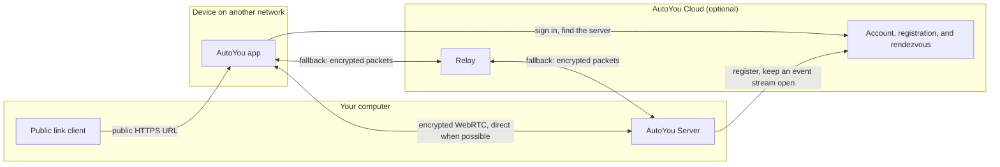

# Cloud Pair & Remote Access

AutoYou Server is designed to run on a local network without an AutoYou Cloud connection. Local Pair, Bluetooth Pair, and a loopback-only server need no outside service for pairing. When a device is on another network, the server offers optional helpers. Each helper has its own trust boundary, described below.

---

## Remote access paths

Pairing tries a direct encrypted WebRTC link first. If the networks block that, the connection can use a relay that forwards the same encrypted packets. The [connection-helper documentation](../technical/webrtc.md) states that AutoYou Cloud does not decrypt message content, voice audio, files, or browsing content. Peers and connection services can still see network addresses and timing.

---

## Cloud Pair

Cloud Pair lets an app find a computer that is not on its network. It is optional and requires an AutoYou account.

### Registration

The server links to an account through a browser sign-in at AutoYou Cloud (`AUTOYOU_CLOUD_BASE_URL`, default `https://app.autoyou.me`) and then holds a server token. Tokens are rotated: by default the server renews a token after 24 hours and treats one as expired after 3 days. While registered, the server keeps a server-sent-events stream open to AutoYou Cloud, and it backs off when that stream keeps dropping.

### Connection helpers

When the account is entitled to them, the server merges relay and STUN helpers from AutoYou Cloud with the `iceServers` you configured and advertises the combined list during pairing. If AutoYou Cloud cannot be reached, it falls back to the local list and never blocks pairing on a cloud round trip. `GET /api/cloud/ice-preview` shows what would be advertised.

### Owner approval of devices

Cloud Pair is checked at your computer, not only in the cloud. The computer saves the key each device presents, and you can require your approval for new devices. The setup QR also carries the computer's own Cloud Pair key (`sk`) and server ID (`sid`), so a phone that scans it can check that AutoYou Cloud did not substitute a key.

### Routes

All of these are admin-app routes (`routers/cloud.py`) and require an admin sign-in:

| Route | Purpose |
| :--- | :--- |
| `GET /api/cloud/status` | Registration and connection status |
| `GET /api/cloud/link-start`, `GET /api/cloud/callback` | Browser sign-in and the redirect back |
| `POST /api/cloud/activate` | Make this server the active AutoYou Cloud server for the account |
| `POST /api/cloud/reregister` | Register again after the token was rejected |
| `POST /api/cloud/unregister` | Remove the registration and stop the event stream |
| `GET /api/cloud/devices`, `POST /api/cloud/devices/approval`, `POST /api/cloud/devices/{device_id}/approve`, `POST /api/cloud/devices/{device_id}/forget` | Saved device keys and owner approval |
| `POST /api/cloud/push-client` | Ask paired clients to reconnect through AutoYou Cloud |
| `POST /api/cloud/notify-client` | Send a notification to your opted-in client devices |
| `GET /api/cloud/guest-access`, `POST /api/cloud/guest-access` | x402 guest-access settings |
| `GET /api/v1/x402/connect`, `POST /api/v1/x402/connect`, `POST /api/v1/pair` | x402 payment-gated guest connection |

Changes to who may pair through AutoYou Cloud can be made only from the computer itself or an HTTPS admin session on the admin port. See [Security & Authentication](/architecture/security-and-auth).

---

## Connections that arrive through a proxy

A public link or reverse proxy delivers requests from `127.0.0.1`. The server treats a request that carries a forwarding header (`X-AutoYou-Tunnel-Client-IP`, `X-Forwarded-For`, `Forwarded`, or `CF-Connecting-IP`) as coming from somewhere else. That device is a **shared** device, not this computer, and the computer's own microphone and sound are not looped back to it. Such a browser can read the console but cannot change credentials or security settings.

---

## Public link (Tunnelmole)

For Website Apps, demos, and webhooks, the server can start a [Tunnelmole](https://tunnelmole.com) client that publishes a public HTTPS URL. It is optional and off by default. In its default timed mode the link closes after a timeout (5 minutes by default).

- The Tunnelmole client is a separate program. The server downloads it for your platform when it is first needed. Set `AUTOYOU_NO_DOWNLOAD_TUNNELMOLE=1` to disable that download; Docker builds also accept the `AUTOYOU_SKIP_TUNNELMOLE_DOWNLOAD` build argument.
- The public URL is served by the tunnel service, so traffic to that URL is handled by the service and is not a peer-to-peer link. Persistent addresses on `tm.autoyou.me` are used for accounts that have them.
- The public link is also what carries the one-time-code and Auto Pair methods when a device is not on your network.

---

## Peer Link rendezvous

Peer Link connects one AutoYou app to another app. The rendezvous routes are on the auth app and are deliberately unauthenticated, because the person accepting an invite is a stranger to the server until pairing completes. They are safe to expose for these reasons:

- Every payload is ciphertext that the server cannot read.
- A slot is addressed by a 256-bit invitation id known only to the invite holder, and unknown ids are answered exactly like unanswered ones, so slots cannot be enumerated.
- An answer can be stored once and collected once, so neither leg can be replayed or substituted.
- Every route is rate limited per client and globally, and slots expire on their own.

| Route | Purpose |
| :--- | :--- |
| `POST /v1/peer/rendezvous/open` | Publish an encrypted offer under a new invitation id |
| `GET /v1/peer/rendezvous/{invitation_id}/offer` | Hand the invitee the inviter's encrypted offer |
| `POST /v1/peer/rendezvous/{invitation_id}/answer` | Store the invitee's encrypted answer, or its decline |
| `GET /v1/peer/rendezvous/{invitation_id}/answer` | Collect the answer once |
| `POST /v1/peer/rendezvous/{invitation_id}/close` | Withdraw an invitation. It always reports success and never confirms that a slot existed. |
| `GET /peer/add` | The page someone lands on after tapping an invite link |

The receiving app approves each link. If the host app is connected to its own computer and allows it, the guest's chat and browsing are passed on to that computer; that is one step and never a chain of apps.
