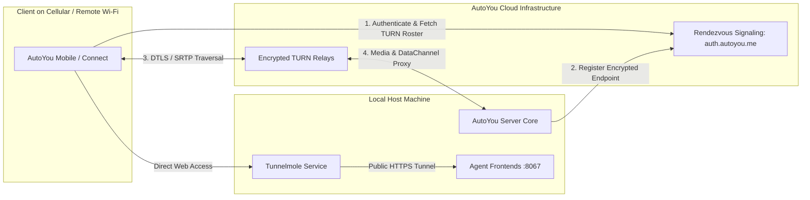

# Cloud Relay & Remote Access

While AutoYou Server is built to run entirely on local networks without mandatory cloud dependencies, it includes built-in capabilities for secure remote access over the internet without requiring manual router port forwarding.

---

## Remote Access Architecture



---

## Encrypted Cloud Relay (`routers/cloud.py`)

Cloud Relay allows an operator to access their home computer securely from an iPhone, Android device, or laptop while traveling.

### Lifecycle & Management Endpoints

- **`GET /api/cloud/status`**: Returns registration status, active link identifiers, and TURN relay health.
- **`POST /api/cloud/activate`**: Activates Cloud Relay for the current server instance using operator account tokens.
- **`POST /api/cloud/reregister`**: Refreshes dynamic DNS and rendezvous routing keys.
- **`POST /api/cloud/unregister`**: Instantly revokes remote access and severs active cloud tunnels.
- **`POST /api/cloud/notify-client`**: Sends a high-priority push notification (via Apple APNs or Google FCM) to awaken a sleeping mobile client.
- **`POST /api/cloud/push-client`**: Dispatches immediate data sync requests to paired devices.

### Remote Access Header Policy

When requests arrive via public reverse proxies or cloud tunnels, AutoYou Server analyzes proxy headers (`X-AutoYou-Tunnel-Client-IP`, `CF-Connecting-IP`, `X-Forwarded-For`).
- Remote connections are marked as **Shared** rather than **Own**.
- Microphones on the server machine are **never opened** for inbound remote sessions unless explicitly granted.
- The Admin UI restricts sensitive keystore operations when accessed over remote links unless `secure_professional` TOTP authentication is verified.

---

## Tunnelmole Public Website Hosting

For sharing agent websites, demos, or webhooks without complex DNS configurations, AutoYou Server embeds the open-source **Tunnelmole** tunneling service.

### Capabilities
- Generates a public HTTPS URL (e.g. `https://demo-agent.tm.autoyou.me`) routing directly to local port `8067`.
- Automatically obtains and terminates Let's Encrypt TLS certificates.
- Can be started, stopped, or refreshed on demand.

### Control Endpoints

```http
POST /tunnelmole/start HTTP/1.1
Host: 127.0.0.1:8001
Authorization: Bearer <ADMIN_SESSION_TOKEN>
```

```http
GET /api/tunnelmole/website-hosting HTTP/1.1
Host: 127.0.0.1:8001

{
  "active": true,
  "public_url": "https://a1b2c3d4.tm.autoyou.me",
  "target_port": 8067,
  "connected_clients": 2
}
```

---

## Peer Rendezvous Protocol (`routers/peer_rendezvous.py`)

AutoYou Server supports decentralized peer link sharing, allowing clients to establish direct connections between one another and relay guest traffic upstream through a host machine (`C3 -> C2 -> C1 -> Server`):

1. **`POST /v1/peer/rendezvous/open`**: Creates an invitation slot with a unique `invitation_id`.
2. **`GET /v1/peer/rendezvous/{invitation_id}/offer`**: Guest retrieves the host's WebRTC SDP offer.
3. **`POST /v1/peer/rendezvous/{invitation_id}/answer`**: Guest submits its SDP answer.
4. **`POST /v1/peer/rendezvous/{invitation_id}/close`**: Closes the rendezvous session upon successful datachannel negotiation.
