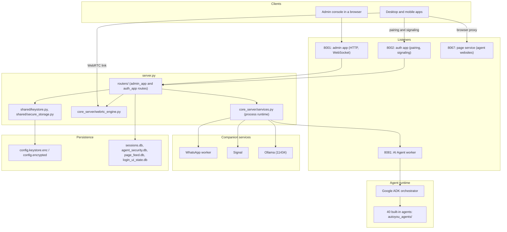

# Architecture Overview

AutoYou Server combines an asynchronous API server, a real-time WebRTC engine, a multi-agent runtime, and a web proxy for agent websites. It is built with Python, FastAPI, and asyncio, and it runs on hardware you control. Cloud model providers, Cloud Pair, and messaging bridges are optional integrations.

---

## System architecture



---

## Entry points

### `server.py`

`server.py` is the composition root. It creates two FastAPI applications with `create_apps()` from `core_server/app.py`, then registers each router module on them:

```python
admin_app, auth_app = create_apps(LOGGER)

globals().update(register_admin_routes(admin_app, auth_app, sys.modules[__name__]))
globals().update(register_pairing_routes(admin_app, auth_app, sys.modules[__name__]))
globals().update(register_webrtc_routes(admin_app, auth_app, sys.modules[__name__]))
# ...agents, messaging, models, services, cloud, mcp, peer_rendezvous, moderation
```

The **admin app** serves the console, configuration, agents, WebRTC, messaging, and the other management routes. The **auth app** serves the public pairing surface: unlock, `POST /auth`, `/signal/{session_id}`, Peer Link rendezvous, and legal documents. Both are listed in the [route catalog](/api-reference/route-catalog), and the [API overview](/api-reference/overview) explains how they differ.

### `autoyou_app.py`

`autoyou_app.py` is the launcher for compiled builds (Windows and macOS builds are packaged with Nuitka). Its command-line modes include:

- `--run-server`: start the server.
- `--run-ai-agent-server`: start the AI Agent worker process.
- `--run-fine-tuning-runner`: run background fine-tuning jobs.
- `--run-autoyou-lite`: start the lightweight server.
- `--desktop-stdio`: private JSON-lines IPC with the native host (a WinUI app on Windows, a Swift app on macOS).

---

## Ports

By default every listener binds to `127.0.0.1`. Set `AUTOYOU_BIND_HOST` (or pass `--host`) to listen on your LAN. See the [security architecture](/architecture/security-and-auth) before exposing any port.

| Port | Default | Environment override | Purpose |
| :--- | :--- | :--- | :--- |
| `8001` | Always started | `AUTOYOU_ADMIN_PORT` | Admin app: console, REST API, WebSocket. |
| `8443` | Opt-in | `server.https_port` in the configuration | TLS listener for the admin app. It is offered automatically when the server is bound to a non-loopback address outside a container. |
| `8002` | Always started | `AUTOYOU_AUTH_PORT` | Auth app: unlock, pairing, WebRTC signaling, Peer Link rendezvous. |
| `8067` | When the page service is enabled | `AUTOYOU_PAGE_PORT` | Page service: agent websites at `/agent/{name}/`, the website directory, and HTTP `QUERY` search. |
| `8081` | Started with the worker | `AUTOYOU_AI_PORT` | AI Agent worker, plain HTTP on loopback. |
| `8481` | Opt-in | `AUTOYOU_AI_AGENT_LAN_HTTPS_PORT` | AI Agent worker over HTTPS with a one-time code, for LAN access. |
| `11434` | Ollama default | Ollama's own settings | Local model runner monitored by `ollama_service.py`. |

---

## Concurrency and process model

1. **Asyncio event loop.** Handles HTTP and WebSocket requests, WebRTC signaling, and DataChannel framing with non-blocking I/O.
2. **Separate processes and threads.** The AI Agent worker runs as its own process, and the auth app runs in its own server thread. `core_server/services.py` starts and monitors them. Companion services (WhatsApp, Signal, Ollama) are managed by `whatsapp_service.py`, `signal_service.py`, and `ollama_service.py`.
3. **Worker threads.** Blocking work such as disk I/O, key derivation (PBKDF2), audio processing, and database transactions runs off the event loop.

`service_manager.py` is separate from process supervision. It initializes the ADK session and memory services that agents share.

---

## Storage

Operational data is stored locally in the server's configuration directory:

```
config.keystore.enc           # Encrypted configuration; key held in the OS credential store
config.encrypted              # Password-based fallback for the same configuration
sessions.db                   # SQLite: ADK sessions, events, conversation threads and titles, conversation media
agent_security.db             # SQLite: per-agent 2FA security profiles and their agent assignments
page_feed.db                  # SQLite: Page feed items, tags, and blobs
login_ui_state.db             # SQLite: login mini-game scores and runs
agent_install_registry.json   # Registry of installed agent packages
agent_frontends_registry.json # Registry of agent website route modes
uploads/                      # Uploaded media and voice recordings
```

The configuration files are described in [Security & Authentication](/architecture/security-and-auth). In Secure Professional Maximus mode the SQLite databases and JSON files are also encrypted at rest.
