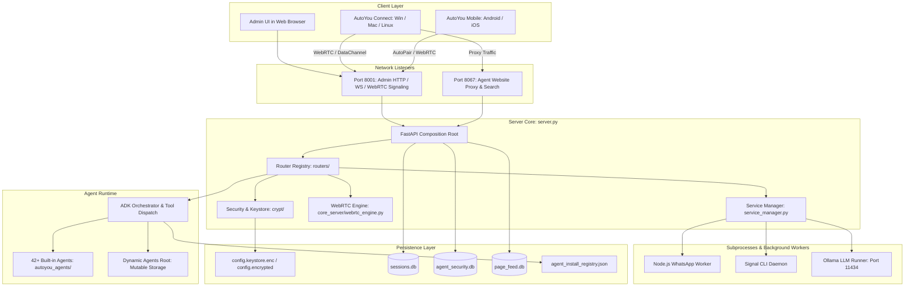

# Architecture Overview

AutoYou Server is an integrated platform combining an asynchronous API server, real-time WebRTC communications engine, multi-agent orchestrator, and web frontend proxy. It is built using Python, FastAPI, and asyncio, designed to run natively on user hardware without external cloud dependencies.

---

## High-Level System Architecture



---

## Entry Points & Composition Root

AutoYou Server provides two primary execution modalities:

### 1. `server.py` (Development & Source Composition Root)
In source checkouts, `server.py` instantiates the main FastAPI application, configures CORS and security middleware, registers all domain routers from `routers/`, mounts static assets, and launches the Uvicorn ASGI server.

```python
# Simplified server.py composition flow
from fastapi import FastAPI
from routers import (
    admin, agents, ai_opt_out, cloud, mcp,
    messaging, models, moderation, pairing,
    peer_rendezvous, services, webrtc, website_gateway
)

app = FastAPI(title="AutoYou Server", docs_url=None, redoc_url=None)
admin.register_routes(app, ...)
agents.register_routes(app, ...)
webrtc.register_routes(app, ...)
# ... remaining routers mounted
```

<Note>
**Formatting Constraint**: In accordance with project governance, `server.py` enforces a 4-line blank space separator between top-level functional blocks.
</Note>

### 2. `autoyou_app.py` (Compiled Standalone Launcher)
In native desktop production builds (Windows `.exe`, macOS `.app`), `autoyou_app.py` serves as the compiled entrypoint produced by Nuitka. It handles CLI dispatch:
- `--run-server`: Initializes the compiled backend server.
- `--run-ai-agent-server`: Launches the isolated Agent Development Kit worker subprocess.
- `--run-fine-tuning-runner`: Executes background model fine-tuning jobs.
- `--desktop-stdio`: Establishes private JSON-lines IPC with the native host wrapper (WinUI 3 on Windows, Swift/AppKit on macOS).

---

## Network Ports & Responsibilities

AutoYou Server binds distinct local network ports for isolation and security:

| Port | Protocol | Default Bind | Purpose |
| :--- | :--- | :--- | :--- |
| **`8001`** | HTTP / WebSocket | `127.0.0.1` | **Primary Admin & Core API**. Serves the Admin Console UI (`/admin`), REST APIs (`/api/*`), WebRTC signaling (`/signal/*`), and pairing handshakes. |
| **`8067`** | HTTP | `127.0.0.1` | **Agent Website Proxy & Directory**. Routes traffic to embedded agent frontends (`/agent/{name}/`), serves public agent assets, and processes RFC 10008 `QUERY` discovery requests. |
| **`8101`** | HTTP | `127.0.0.1` | **macOS Security Agent Backend**. Dedicated internal loopback backend for the private macOS Security Agent, keeping port 8067 free for standard browser proxies. |
| **`11434`** | HTTP | `127.0.0.1` | **Ollama Local LLM Runner**. Default port for local LLM inference engines monitored by `ollama_service.py`. |

---

## Concurrency & Process Isolation Model

To maintain responsive UI and low-latency audio/video streaming while running intensive LLM inferences, AutoYou Server employs a hybrid concurrency model:

1. **Asyncio Event Loop (Main Server)**:
   - Handles all HTTP requests, WebSocket connections, WebRTC signaling, and DataChannel frame chunking asynchronously using non-blocking I/O.
2. **Subprocess Process Supervisors (`service_manager.py`)**:
   - Long-running companion services (WhatsApp Puppeteer node service, Signal CLI daemon, Ollama runners) run as supervised external child processes with automated restart and health checks.
3. **Thread Pool Executor**:
   - Blocking operations such as disk I/O, cryptographic key derivation (Argon2id), audio resampling, and database transactions run in dedicated worker threads via `asyncio.to_thread` or thread executors.

---

## Storage & Persistence Layer

AutoYou Server stores all operational data locally on the host machine. It distinguishes between immutable application assets and mutable user data:

```
Runtime Storage
├── config.keystore.enc       # Encrypted master credentials & settings
├── sessions.db               # SQLite: Chat conversations & turn histories
├── agent_security.db         # SQLite: Agent permission profiles & security tokens
├── page_feed.db              # SQLite: Social feed posts & media items
├── login_ui_state.db         # SQLite: Rate-limiting & UI session state
├── agent_install_registry.json # Dynamic registry of installed agent packages
├── agent_frontends_registry.json # Dynamic registry of website route modes
└── uploads/                  # User media uploads & audio voice recordings
```

### Database Responsibilities

- **`sessions.db`**: Stores all conversation threads (`conversations`, `messages`, `media_metadata`). Supports fast retrieval by `session_id` and tracks delivery status (`delivered: true/false`).
- **`agent_security.db`**: Manages granular permission grants for agents (e.g. filesystem read/write, shell execution, network outbound) across security profiles.
- **`page_feed.db`**: Backs the internal AutoYou Page community feed, storing published articles, image links, and post reactions.
- **`config.keystore.enc`**: Master encrypted vault protecting operator passwords, TOTP secret keys, cloud tokens, and third-party API credentials using hardware-assisted or passphrase-derived encryption keys.
