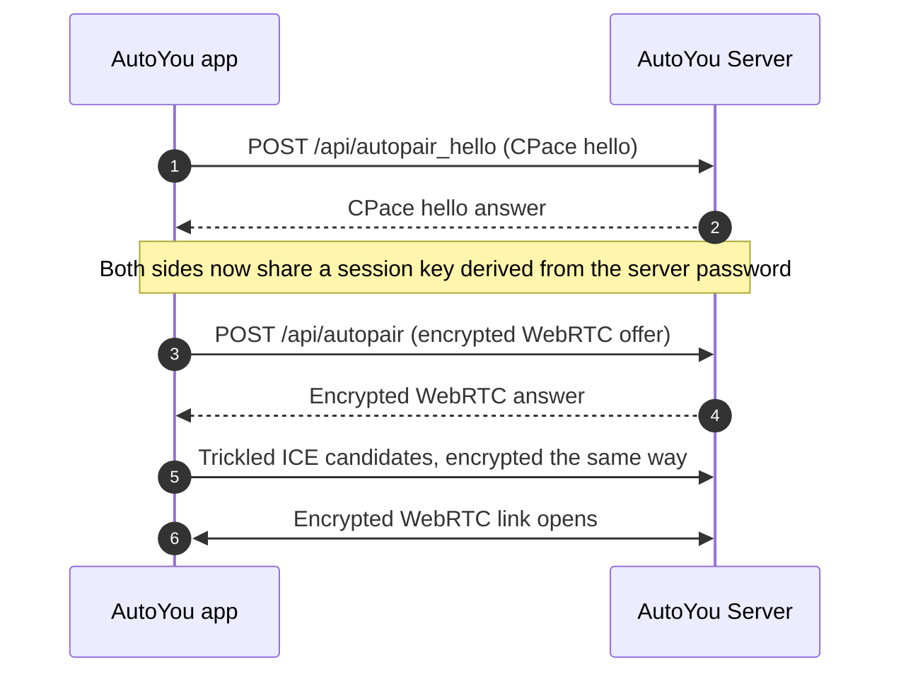

# Pairing & Device Discovery

Pairing connects an AutoYou app to your computer. Which methods are available depends on your configuration, and every method ends in the same kind of encrypted WebRTC link. Pairing connects an app to a **server**; Peer Link, which connects one app to another app, is described in [Pairing](../technical/pairing-protocols.md).

---

## Pairing methods

The setup QR code advertises the methods that are currently available as transport profiles. Each profile has a security tier (see [Security Modes](../security/security-modes.md)).

| Method | Profile | Available when | Tier |
| :--- | :--- | :--- | :--- |
| **Local Pair** | `local_pair` | The server listens on a LAN address (it is not bound to loopback only) and a private LAN address was found. | Enhanced |
| **Bluetooth Pair** | `bluetooth_pair` | Bluetooth pairing is enabled. The phone looks for `<server name> Bluetooth Pair`. | Enhanced |
| **Auto Pair** | `auto_pair` | The public link (Tunnelmole) is on and at least one messaging partner is configured. Pairing messages travel through a Telegram, Signal, or WhatsApp chat. | Your configured tier |
| **One-time code** | `otp` | The public link is on. The `/pair` chat command returns a one-time code and the link. | Your configured tier |
| **Cloud Pair** | `cloud_pair` | AutoYou Cloud is enabled for this server. An optional rendezvous helps a device find the computer across NAT. | Enhanced |

In a messaging chat, `/pair` (alias `/otp_pair`) issues a one-time code. In Secure Professional mode the current authenticator code can be sent on the same line, as in `/otp_pair 482913`; it is verified, with rate limiting, before anything is issued.

---

## Local discovery

### mDNS advertisement

When the server is reachable from other devices on the network, it advertises itself with Multicast DNS:

- **Service type:** `_autoyou._tcp.local.`
- **Instance and host name:** `AutoYou-<id>` and `autoyou-<id>.local.`, where `<id>` is the first 12 hex characters of a SHA-256 hash of the saved installation ID. The raw installation ID and hardware identifiers are not published.
- **Port:** the admin app port.
- **TXT records:** `v=1` and `name=<server name>`.
- **Addresses:** only private IPv4 addresses (`10.0.0.0/8`, `172.16.0.0/12`, `192.168.0.0/16`).

The server advertises only while discovery is enabled in its settings and it listens beyond loopback. Nothing is advertised in the default loopback-only configuration.

### Finding the LAN address

To learn which address it uses on the local network, the server asks the operating system to select a route with a UDP `connect()` to a reserved documentation address (`198.51.100.1`). `connect()` on a UDP socket chooses the route locally and sends no packet. The result is served by `GET /api/local-pair-info`, which requires an admin sign-in:

```json
{
  "addresses": ["192.168.1.145"],
  "primary_address": "192.168.1.145",
  "port": 8001,
  "bind_host": "0.0.0.0",
  "loopback_only": false,
  "lan_reachable": true,
  "server_name": "Studio-Desktop",
  "success": true
}
```

`lan_reachable` is true only when an address was found and the server is not bound to loopback only.

---

## The secure handshake

In Secure and Secure Professional modes, Local Pair and Auto Pair use the same two-step handshake. Plaintext offers are rejected.



The session key comes from a password-authenticated key exchange: a CPace-family construction over ristretto255, implemented in `shared/pairing_cpace.py` with libsodium. It proves knowledge of the server password without sending it, and it protects the pairing offer, answer, and ICE candidates. The endpoints are rate limited per client and globally.

The WebRTC signaling itself is served by the auth app at `/signal/{session_id}`; see the [auth app reference](../api-reference/auth-app.mdx).

---

## Setup QR code (Automatic Configuration)

`GET /api/settings/export-qr` returns a QR code, as a data URL in `qr_url`, that configures a supported Android or iOS app in one scan. It requires an admin sign-in and is sent with `Cache-Control: no-store`.

<Warning>
The QR payload is not encrypted and **contains your server password and the shared authenticator secret**. Anyone who scans it can pair with your server. Show it only on a screen you control, never post it or share a screenshot, and regenerate your credentials if it is exposed.
</Warning>

The payload is a compact JSON object. Its main keys are:

| Key | Meaning |
| :--- | :--- |
| `v` | Payload version (currently `3`) |
| `pw` | Server password |
| `mode` | Security mode (`normal`, `secure`, or `secure_professional`; Maximus is sent as `secure_professional`) |
| `totp` | Shared authenticator secret (empty string clears an old one) |
| `name` | Server display name |
| `profiles`, `preferred` | Available pairing transports (see above) and the default one |
| `tg`, `wa`, `sg` | Telegram username, WhatsApp number, and Signal number when configured |
| `ice` | The configured `iceServers` list |
| `tm`, `autopair`, `proxy`, `voice`, `cloud`, `vc`, `bg`, `rec`, `cam`, `caud`, `defmsg` | Feature flags and defaults for the client |
| `sk`, `sid` | When Cloud Pair is on: the computer's Cloud Pair key and server ID, so the phone can check that AutoYou Cloud did not substitute a key |

Keys that would be empty or false are omitted to keep the code scannable.

---

## Live Pair

Live Pair carries the Auto Pair exchange as animated QR codes, so a phone and the computer can pair by showing each other QR frames without a network path between them. A long pairing message is split into numbered frames of at most 600 bytes, each carrying a SHA-256 digest of the whole message, and the receiver reassembles and verifies them. Grants live only in memory.

It is driven from the admin console, and every route requires an admin sign-in:

- `GET /api/live-pair/status`: the current live-pairing state, with QR frames to display.
- `POST /api/live-pair/scan`: reads a QR code from a JPEG camera frame captured by the console (`data:image/jpeg;base64,...`). It needs OpenCV; without it the console falls back to pasting the text.
- `POST /api/live-pair`: submits a pairing message and returns the result, the response text, and QR frames to show to the phone.
