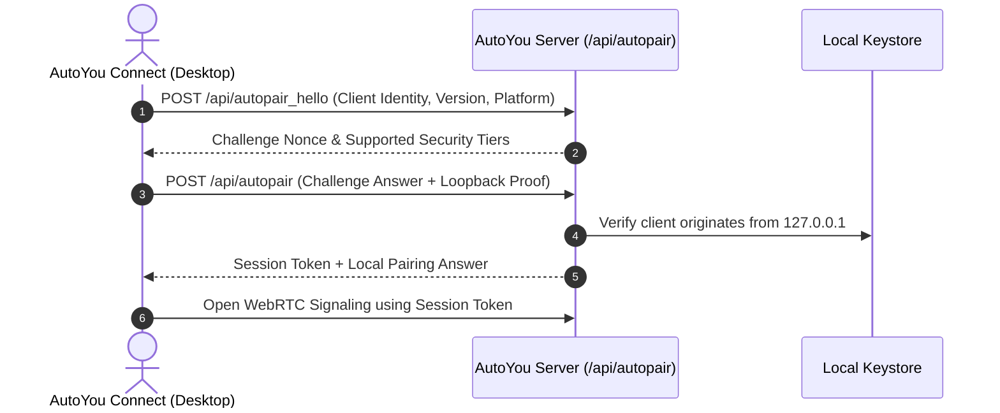

# Pairing & Device Discovery

AutoYou Server implements a multi-tier device pairing and discovery architecture designed to connect desktop, mobile, and browser clients securely without manual network configuration.

---

## The 5 Pairing Modes

AutoYou supports five distinct pairing modalities tailored to different environments and security requirements:

| Mode | Identifier | Typical Use Case | Security Characteristics |
| :--- | :--- | :--- | :--- |
| **AutoPair** | `AP` | Same-machine / Native desktop clients | Zero-touch authentication over loopback; auto-negotiates temporary local password. |
| **Local Pair** | `LP` | Home / Office LAN Wi-Fi | Connects directly via private IP (`192.168.x.x`); authenticated with server admin password. |
| **Pair with OTP** | `OP` | Guest devices / Untrusted networks | Uses an ephemeral 6-digit one-time PIN generated in the Admin Console. |
| **Bluetooth Pair** | `BP` | Out-of-band mobile bootstrapping | Advertises connection payload over Bluetooth Low Energy (BLE). |
| **Cloud Pair** | `CP` | Remote access across NAT / Firewalls | Relayed connection through encrypted rendezvous signaling. |

---

## Local Discovery (mDNS & Zero-Traffic LAN)

### 1. mDNS Service Advertising
When enabled, the server advertises its presence on the local subnet via Multicast DNS (mDNS / Bonjour):

- **Service Type**: `_autoyou._tcp.local.`
- **Service Port**: Port `8001` (or dynamic admin port)
- **Hostname**: Derived from a cryptographic SHA-256 hash of `server.installation_id`. This guarantees the hostname remains stable across DHCP reboots without exposing raw hardware MAC addresses or operator identity.

### 2. Zero-Traffic LAN IPv4 Discovery
To determine its local network address without spamming the network with broadcast ARP/UPnP packets, `shared/local_network_info.py` utilizes the UDP route-selection technique:

```python
import socket

def get_lan_ip() -> str:
    with socket.socket(socket.AF_INET, socket.SOCK_DGRAM) as s:
        # Connect to a non-routable public IP without sending packets
        s.connect(("8.8.8.8", 80))
        return s.getsockname()[0]
```

Clients query `GET /api/local-pair-info` to fetch the resolved local address, port, and security parameters:

```json
{
  "lan_ip": "192.168.1.145",
  "port": 8001,
  "browser_proxy_port": 8067,
  "server_name": "Studio-Desktop",
  "security_mode": "normal",
  "auth_required": true
}
```

---

## AutoPair Handshake Protocol

Used by **AutoYou Connect** and native desktop runtimes (Windows / macOS), the AutoPair protocol eliminates the need to manually enter passwords on the local computer:



---

## QR Code Export & Setup Recipes

For mobile clients (iOS and Android), AutoYou Server generates an encrypted bootstrap QR code containing connection metadata:

```http
GET /api/settings/export-qr HTTP/1.1
Host: 127.0.0.1:8001
Authorization: Bearer <ADMIN_SESSION_TOKEN>
```

**Response Payload**:
```json
{
  "qr_png_base64": "data:image/png;base64,iVBORw0KGgoAAAANSUhEUgAA...",
  "connection_string": "autoyou://pair?host=192.168.1.145&port=8001&token=sec_abc123"
}
```

Scanning this QR code in the AutoYou Mobile app immediately configures the server address, network security tier, and credentials in a single tap.

---

## Live Pair Interactive Scanning

AutoYou Server provides live scanning endpoints for operator control in the Admin UI:
- `GET /api/live-pair/status`: Returns current status of active pairing sessions.
- `POST /api/live-pair/scan`: Triggers scanning for nearby devices broadcasting pair requests.
- `POST /api/live-pair`: Confirms and finalizes an incoming pairing request from an approved client.
