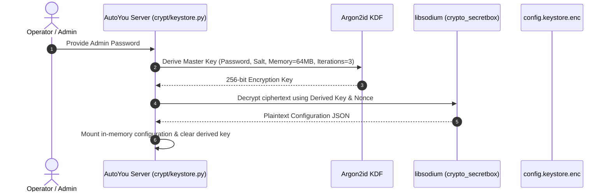
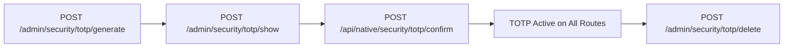

# Security & Encryption Architecture

AutoYou Server is engineered around a zero-trust, local-first security philosophy. Operator credentials, communication secrets, private agent states, and database keys never leave the host machine unencrypted.

---

## Cryptographic Keystore Architecture

The server stores all sensitive configuration in an encrypted vault file (`config.keystore.enc` or `config.encrypted`).



### 1. Key Derivation Function (KDF)
- **Algorithm**: **Argon2id** (configured in accordance with RFC 9106 standards).
- **Parameters**: High memory cost (64MB) and multi-pass iterations to resist GPU-based brute-force attacks.
- **Salt**: 16-byte cryptographically secure random salt stored alongside the ciphertext header.

### 2. Authenticated Encryption
- **Cipher**: `libsodium` authenticated symmetric encryption (`crypto_secretbox_easy` using **XSalsa20-Poly1305** or **XChaCha20-Poly1305-IETF**).
- **Nonce**: 24-byte unique random nonce generated per write operation.
- **Integrity**: Any bit flip in the ciphertext or header triggers an immediate verification failure, preventing tamper attacks.

---

## Security Tiers (Modes)

AutoYou Server operates in one of three configurable security tiers:

| Tier | Policy Name | Intended Deployment | Authentication Requirements |
| :--- | :--- | :--- | :--- |
| **Tier 1** | `normal` | Single-user local desktop | Single admin password. TOTP is optional. Local network auto-pairing enabled. |
| **Tier 2** | `secure` | Home LAN / Small team | Enforces session timeouts. Disables unauthenticated network discovery. Pairing requires explicit one-time PIN (OTP). |
| **Tier 3** | `secure_professional` | Enterprise / Public exposure | **Mandatory TOTP 2FA** for all admin API routes. Immediate session revocation on idle. Strict IP rate limiting and audit logging. |

You can switch the server's security mode dynamically through the Admin UI or via API:

```http
POST /api/admin/security/mode HTTP/1.1
Host: 127.0.0.1:8001
Content-Type: application/json
Authorization: Bearer <ADMIN_SESSION_TOKEN>

{
  "mode": "secure_professional"
}
```

---

## Two-Factor Authentication (TOTP 2FA)

AutoYou Server implements RFC 6238 Time-Based One-Time Password (TOTP) verification:

- **Algorithm**: HMAC-SHA1 / HMAC-SHA256.
- **Interval**: 30-second window with $\pm 1$ step drift allowance for clock skew.
- **Digits**: 6-digit verification codes.
- **Secret Storage**: Base32-encoded secret stored within the encrypted keystore.

### TOTP Lifecycle Endpoints



1. **Generate**: `POST /admin/security/totp/generate` generates a 32-character random Base32 secret.
2. **Display**: `POST /admin/security/totp/show` returns the `otpauth://` URI and QR code image for Google Authenticator / 1Password / Apple Keychain.
3. **Verify**: The operator submits the 6-digit code to confirm activation.
4. **Current Code Inspection**: `GET /admin/security/totp/current-code` allows local inspection if authorized by physical terminal access.

---

## Zero-Knowledge Unlock Protocol

When running in headless or locked server environments, the server boots in a restricted **LOCKED** state where all agent execution and persistent data access is paused until unlocked:

```http
POST /v1/unlock/verify HTTP/1.1
Host: 127.0.0.1:8001
Content-Type: application/json

{
  "passphrase": "operator-master-passphrase"
}
```

- When verified, the master encryption key is loaded into RAM and protected by memory-pinning APIs where available.
- Upon receiving a shutdown signal (`SIGINT`, `SIGTERM`, or `POST /shutdown`), the server securely zeroes out all decrypted keys in memory before terminating.

---

## Atomic Keystore Rotation

AutoYou Server supports online, zero-downtime password and encryption key rotation through `POST /api/admin/security/storage/rotate`:

1. Generates a fresh random salt and nonce.
2. Re-derives a new master encryption key using the new password.
3. Re-encrypts the in-memory configuration dictionary with the new key.
4. Atomically writes the new ciphertext to a temporary file (`config.keystore.enc.tmp`) and renames it over the original file (`atomic replace`), ensuring corruption cannot occur if power is interrupted.
