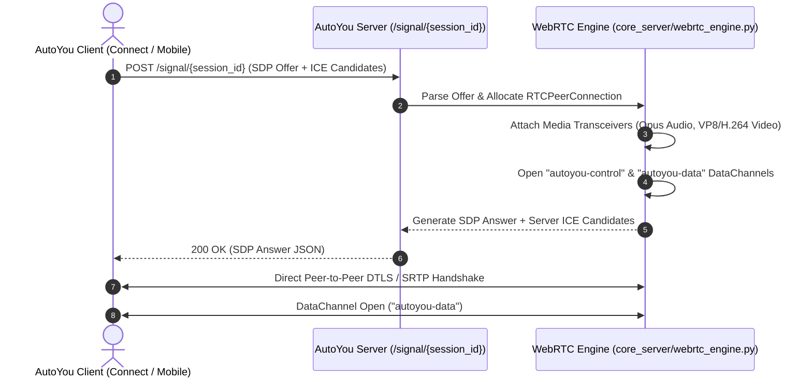

# WebRTC & DataChannels Architecture

Real-time audio, video, and bidirectional messaging between AutoYou Server and connected clients (AutoYou Connect, Android, iOS, and Web) are powered by an asynchronous **WebRTC engine** built upon `aiortc` and optimized for low latency and high reliability over unreliable networks.

---

## WebRTC Signaling & Connection Flow

WebRTC requires an out-of-band signaling mechanism to exchange SDP (Session Description Protocol) offers, answers, and ICE (Interactive Connectivity Establishment) candidates before the direct peer-to-peer transport is established.



---

## DataChannel Framing & Chunking Protocol

WebRTC DataChannels have strict MTU and buffer limits across browsers and operating systems (typically 16KB to 64KB per message). To send large messages—such as full LLM completions, agent workspace diffs, audio clips, and images—AutoYou Server implements an automatic **Framing and Chunk Acknowledgement Protocol**.

### Chunk Segmentation & Ack Window
- **Chunk Size**: Payloads exceeding 16KB are automatically split into 16,384-byte chunks.
- **Window Size**: 64 chunks in flight before mandatory pause.
- **Timeout**: 7.0 seconds chunk ack timeout with automatic retransmission.

### Envelope Structure

All DataChannel messages are encoded as JSON objects containing standard header envelopes:

```json
{
  "header": {
    "session_id": "sess_89f1a23c4d5e",
    "user_id": "usr_main_desktop",
    "message_id": "msg_01J8YXZ0QW4T9P",
    "timestamp": 1727998800123
  },
  "type": "chat",
  "payload": {
    "text": "Hello, how can I assist you today?",
    "author": "AutoYou AI",
    "streaming": false
  }
}
```

### Handled DataChannel Message Types

The `DataChannelManager` registers dedicated handlers for the following message types:

| Message Type | Direction | Description |
| :--- | :--- | :--- |
| **`chat`** | Bidirectional | Text messages, conversational turns, and structured responses. |
| **`chunk`** | Bidirectional | Segmented payload block for large payloads. |
| **`chunk_ack`** | Bidirectional | Acknowledgement receipt confirming chunk arrival. |
| **`voice_call_control`** | Bidirectional | Call signaling: `call_start`, `call_ringing`, `call_accept`, `call_end`. |
| **`http_response`** | Server $\rightarrow$ Client | Proxied HTTP response over WebRTC data transport. |
| **`http_sse_start`** | Server $\rightarrow$ Client | Initiates a streamed Server-Sent Events stream. |
| **`http_sse_event`** | Server $\rightarrow$ Client | Individual event payload within an active SSE stream. |
| **`http_sse_end`** | Server $\rightarrow$ Client | Signals the end of an SSE stream. |
| **`http_ws_upgrade`** | Bidirectional | Establishes a tunnelled WebSocket connection over the DataChannel. |
| **`http_ws_data`** | Bidirectional | WebSocket text or binary frame data. |
| **`http_stream_open`** | Server $\rightarrow$ Client | Opens an arbitrary binary download stream. |
| **`http_stream_data`** | Server $\rightarrow$ Client | Segment of streamed binary data. |
| **`pairing_control`** | Bidirectional | In-session security re-authentication and capability renegotiation. |
| **`ping` / `pong`** | Bidirectional | Heartbeat keepalive measuring round-trip latency. |

---

## Media Streaming Pipelines

In addition to DataChannels, AutoYou Server provides hardware-accelerated media streaming capabilities:

### 1. Low-Latency Voice Engine
- **Audio Codec**: Opus (48 kHz sample rate, 20ms packet duration, dynamic bitrate 24–64 kbps).
- **Echo Cancellation & DTX**: Discontinuous Transmission (DTX) reduces bandwidth during silence.
- **Audio Routing**: Microphones can be toggled via `PUT /api/webrtc/microphone-sharing`.

### 2. Desktop Screen Sharing
- **Capture Backends**: `mss` (multi-monitor fast desktop capture) or native OS APIs.
- **Frame Encoding**: VP8 or H.264 video track pushed to client video players.
- **Monitors Discovery**: `GET /api/webrtc/monitors` lists all attached displays with resolutions and coordinates.

### 3. Virtual Video File Playback
- Developers can upload and stream MP4/WebM video files directly into an active WebRTC session via `POST /api/webrtc/video-file/upload` and `POST /api/webrtc/video-file/play`.
- Controlled via `POST /api/webrtc/video-file/pause` and status checks on `/api/webrtc/video-file/status`.

### 4. Interactive Low-Latency Game Input
For remote desktop control or game streaming, AutoYou Server provides high-frequency low-latency WebSocket input channels:
- `WEBSOCKET /api/webrtc/hosted-game/api/game/native-input`
- `WEBSOCKET /api/webrtc/game-input/stream`

These channels receive normalized mouse delta coordinates, keypress codes, and gamepad analog states, injecting them directly into the host OS input queue with sub-5ms processing delay.
