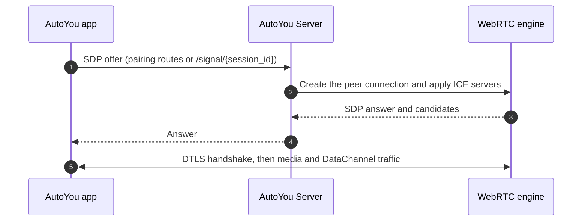

# WebRTC & DataChannels Architecture

Real-time audio, video, and messaging between AutoYou Server and its clients run on a WebRTC engine built on `aiortc` (`core_server/webrtc_engine.py`). Media is protected by DTLS-SRTP and DataChannels by DTLS, between the two endpoints. See the [security architecture](/architecture/security-and-auth) for how the pairing messages that set the link up are protected.

---

## Signaling and connection flow

WebRTC needs an out-of-band channel to exchange SDP offers, answers, and ICE candidates before the link opens. Pairing routes (`/api/autopair_hello`, `/api/autopair`) and the signaling routes `POST /signal/{session_id}` and `GET /signal/{session_id}` carry that exchange. The signaling routes are served by the **auth app**, which listens on port `8002` by default; see the [auth app reference](/api-reference/auth-app).

In Secure and Secure Professional modes the offer, answer, and trickled ICE candidates are encrypted under the session key from the pairing handshake. See [Pairing & Device Discovery](/architecture/pairing-and-discovery).



The server builds the ICE configuration from the `iceServers` in its configuration. If none is saved, it advertises Google's public STUN servers by default. Set `AUTOYOU_DISABLE_PUBLIC_STUN=1` or `AUTOYOU_LOCAL_STUNTURN_HOST` to change that. A client may also supply its own `iceServers` in its offer. Cloud-provided relay helpers are merged in when your account is entitled to them.

The server accepts the data channel that the client opens; it does not require a particular channel label.

---

## DataChannel messages

`shared/datachannel_manager.py` defines the message envelope. Every message is a JSON object:

```json
{
  "header": {
    "message_id": "string",
    "message_type": "chat",
    "timestamp": 1727998800.123,
    "session_id": "string or null",
    "user_id": "string or null"
  },
  "payload": {},
  "chunk_info": null
}
```

`chunk_info` is present only on chunk messages. It carries `chunk_id`, `total_chunks`, `chunk_index`, `chunk_size`, `total_size`, and a `checksum`.

### Message types

| Family | `message_type` values |
| :--- | :--- |
| Conversation | `chat`, `error` |
| HTTP proxy | `http_request`, `http_request_cancel`, `http_response` |
| Server-sent events | `http_sse_start`, `http_sse_event`, `http_sse_end` |
| Generic streams | `http_stream_open`, `http_stream_data`, `http_stream_end`, `http_stream_abort` |
| WebSocket proxy | `http_ws_upgrade`, `http_ws_data`, `http_ws_close` |
| Chunking | `chunk`, `chunk_ack` |
| Keepalive | `ping`, `pong` |
| Calls and pairing | `voice_call_control`, `pairing_control` |
| Peer Link and rooms | `peer_control`, `room_bridge_control`, `room_control`, `room_chat`, `room_federation_control`, `room_federation_chat` |

The HTTP, SSE, stream, and WebSocket types let a client reach the server's web content, including agent websites, through the encrypted link without any open port on the client side.

### Chunking and acknowledgement

Large messages are split into chunks, and each chunk is acknowledged. The defaults, from `shared/datachannel_manager.py`:

| Setting | Default |
| :--- | :--- |
| Chunk size | 1,024 bytes. The adaptive frame size steps through 8,192, 4,096, 2,048, and 1,024 bytes. |
| Acknowledgement window | 64 chunks in flight |
| Acknowledgement timeout | 7.0 seconds per chunk (`AUTOYOU_CHUNK_ACK_TIMEOUT_SECONDS`) |
| Retries | 5 per chunk |
| Reassembly timeout | 60 seconds |
| Buffered-amount high-water mark | 256 KiB |

The receiver enforces limits so that a peer cannot exhaust its memory: at most 6,500,000 chunks and about 1.5 GiB for a single message, and 2 GiB across all partial reassemblies. The conservative 1 KiB chunk size exists because larger single frames were observed to disappear silently on some Windows, WSL, iOS, and Android sessions, while the chunk and acknowledgement path stayed reliable.

---

## Media pipelines

- **Voice and calls.** Call setup and control use `voice_call_control` messages. Whether the computer's microphone and sound are shared with a caller depends on the connection; see the note on shared devices in [Cloud Pair & Remote Access](/architecture/cloud-and-remote). Microphone sharing is controlled with `PUT /api/webrtc/microphone-sharing`.
- **Desktop screen sharing.** The server captures displays with `mss` and prefers H.264 for remote desktop video when the peer supports it. `GET /api/webrtc/monitors` lists the attached displays.
- **Virtual video file playback.** Upload with `POST /api/webrtc/video-file/upload`, then control playback with `POST /api/webrtc/video-file/play` and `POST /api/webrtc/video-file/pause`. `POST /api/webrtc/video-file/status` reports state, and `GET /api/webrtc/video-files` lists uploaded files.
- **Remote input.** For remote desktop control, the server accepts input over `WEBSOCKET /api/webrtc/game-input/stream` and `WEBSOCKET /api/webrtc/hosted-game/api/game/native-input`.

The complete list of WebRTC routes is in the [route catalog](/api-reference/route-catalog).
