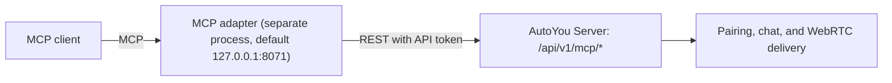

# Model Context Protocol (MCP) Integration

AutoYou Server exposes a narrow, authenticated REST bridge under `/api/v1/mcp/` on the admin app (port `8001`). An **MCP adapter** is a separate process that speaks the Model Context Protocol to MCP clients such as Claude, Cursor, Codex, and Antigravity, and calls this bridge to reach your server. The adapter is not part of this repository.



The bridge does not duplicate pairing, chat, or WebRTC logic; it hands requests to the same runtime that the apps use.

---

## Enabling and authenticating the bridge

- **Enabled by default.** Turn it off in the server's MCP settings, or set `AUTOYOU_ENABLE_MCP_PARTNER=0` before starting the server. A disabled bridge answers `403`.
- **API token.** Requests authenticate with a token configured as `mcp.api_token` or in the `AUTOYOU_MCP_API_TOKEN` environment variable. Send it as `Authorization: Bearer <token>` or in the `x-autoyou-mcp-token` header. If both are sent they must match. A wrong or missing token answers `401`.
- **No token configured.** Requests are allowed only when the server is bound to loopback **and** the caller is on loopback, which is meant for local development. Any other deployment needs a token, and the bridge answers `503` without one.

Keep the bridge on loopback. `mcp` is one of the configuration sections a remote browser cannot change.

---

## Setting up the private adapter

The admin console has an MCP setup panel that prepares the adapter's settings:

1. Generate a server token. The console generates 32 random bytes in your browser and only does so on `localhost` or over HTTPS.
2. Save the token as the server's MCP API token.
3. Download the adapter settings file, `autoyou-mcp.env`.

The file looks like this, with your token filled in. Keep it private:

```
AUTOYOU_MCP_AUTH_MODE=none
AUTOYOU_MCP_ENV=private
AUTOYOU_MCP_HOST=127.0.0.1
AUTOYOU_MCP_PORT=8071
AUTOYOU_MCP_BACKEND_MODE=full
AUTOYOU_MCP_FULL_BASE_URL=http://127.0.0.1:8001
AUTOYOU_MCP_FULL_API_TOKEN=<your token>
```

The console refuses to produce the file unless both the server and the adapter use loopback addresses. Start the adapter with these settings, then point your MCP client at the adapter by following the adapter's own instructions.

---

## Bridge routes

| Route | Purpose |
| :--- | :--- |
| `GET /api/v1/mcp/status` | Bridge and server status: connected sessions, AI provider and model, security mode and tier, and whether MCP is enabled |
| `GET /api/v1/mcp/sessions` | Connected WebRTC sessions |
| `POST /api/v1/mcp/send/{session_id}` | Send a text message (up to 16,000 characters) to a connected device. The sender identity is the server's, not caller-supplied. |
| `POST /api/v1/mcp/pair` | Submit a pairing command (`/pair`, `/otp_pair`, `/autopair_hello`, `/autopair`, and related messages) to the pairing router |
| `POST /api/v1/mcp/chat` | Send a chat turn. It accepts either `message` or OpenAI-style `messages`, plus `session_id`, `context`, and `metadata`. |

These routes are also in the [route catalog](/api-reference/route-catalog).

---

## Other integrations

The browser agent is backed by a separately running `auto-browser` controller, which defaults to `http://127.0.0.1:8000`. That is unrelated to the MCP bridge above. See [Web and automation agents](../agents/web-and-automation.mdx).
