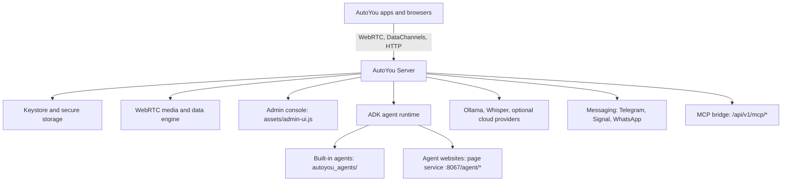

# AutoYou Server

Welcome to the **AutoYou Server** developer documentation. AutoYou Server is a self-hosted AI server that runs on your own computer. It coordinates AI agents, supervises local model and speech runtimes, provides WebRTC audio, video, and DataChannel transport, manages device pairing, and hosts an admin console. The source is available under the [server license](https://github.com/autoyou-ai/AutoYou-Server/blob/main/LICENSE); it is not an OSI-approved open-source license.

<CardGroup cols={2}>
  <Card title="Quickstart" icon="bolt" href="/quickstart">
    Run AutoYou Server from source on your computer.
  </Card>
  <Card title="Architecture" icon="sitemap" href="/architecture/overview">
    The composition root, the two FastAPI apps, ports, and local storage.
  </Card>
  <Card title="Admin UI Console" icon="browser" href="/admin-ui/architecture">
    The single-page admin console implemented in `assets/admin-ui.js`.
  </Card>
  <Card title="API Reference" icon="code" href="/api-reference/overview">
    The admin app, auth app, AI Agent worker, and page service, with a generated route catalog.
  </Card>
  <Card title="Agent Framework" icon="microchip" href="/agent-framework/architecture">
    How the Agent Development Kit (ADK) runtime, tools, and agent websites fit together.
  </Card>
  <Card title="Agent Catalog" icon="cubes" href="/agents/system-and-admin">
    Reference for the built-in agents across system, developer, creative, and web domains.
  </Card>
</CardGroup>

---

## Core capabilities

### 1. Local AI agents

The server bundles specialized agents under `autoyou_agents/`. Each agent can declare Python tools, background workers, session state, and a web frontend served by the page service at `http://127.0.0.1:8067/agent/{agent_name}/`.

### 2. WebRTC media and DataChannels

An asynchronous WebRTC engine provides voice calls, desktop screen sharing, camera capture, virtual video file playback, and reliable fragmented DataChannel messaging with per-chunk acknowledgement (`chunk` and `chunk_ack`).

### 3. Encrypted configuration and four security modes

Configuration and credentials are stored in an encrypted file: `config.keystore.enc` (a Fernet token whose key is held in the operating system's credential store) or `config.encrypted` (a password-derived fallback). The server has four security modes, `normal`, `secure`, `secure_professional`, and `secure_professional_maximus`. Secure Professional adds an authenticator (TOTP) code to pairing, and Maximus also encrypts the server's saved data on disk. See [Security & Authentication](/architecture/security-and-auth).

### 4. Pairing and discovery

Apps pair by Local Pair, Bluetooth Pair, Auto Pair (through a messaging chat), a one-time code, or Cloud Pair. When the server listens beyond loopback and discovery is enabled, it advertises itself on the local network with mDNS (`_autoyou._tcp.local.`). See [Pairing & Device Discovery](/architecture/pairing-and-discovery).

### 5. Messaging bridges

Optional bridges connect your agents to WhatsApp (through a managed Node.js worker), Signal, and Telegram (a bot and a Telegram user client).

---

## Repository structure

| Path | Purpose |
| :--- | :--- |
| `server.py` | Composition root: creates the FastAPI apps, registers routers, and starts the services. |
| `autoyou_app.py` | Launcher for compiled builds. |
| `assets/admin-ui.js` | The single-page admin console. |
| `assets/admin-ui.css` | The console stylesheet. |
| `core_server/` | WebRTC engine, process and service runtime, HTTP helpers, and security helpers. |
| `routers/` | Route modules registered on the admin and auth apps. |
| `autoyou_agents/` | The built-in agents with their tools, manifests, and website assets. |
| `crypt/` | A standalone AES-GCM envelope helper. The keystore and secure storage live in `shared/keystore.py` and `shared/secure_storage.py`. |
| `shared/` | Cross-module helpers: keystore, secure storage, pairing, discovery, DataChannel framing, and media. |
| `node/` | Node.js companion code, such as the WhatsApp bridge and Tunnelmole support. |
| `tests/` | The test suite. |

---

## Next steps

<CardGroup cols={3}>
  <Card title="Run the server" icon="play" href="/quickstart">
    Set up and start the server locally.
  </Card>
  <Card title="Explore the API" icon="terminal" href="/api-reference/overview">
    Browse the apps and the generated route catalog.
  </Card>
  <Card title="Build a custom agent" icon="hammer" href="/guides/custom-agent-tutorial">
    Create and publish your own agent with the ADK.
  </Card>
</CardGroup>
