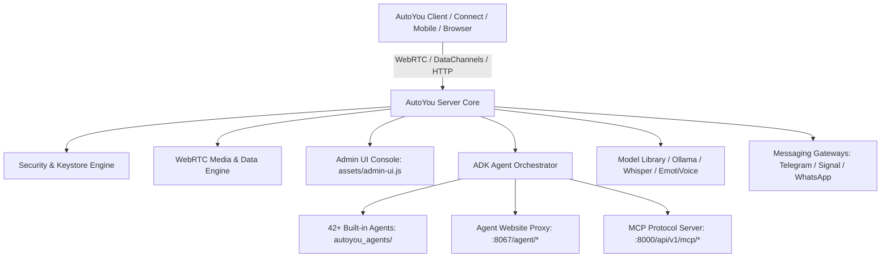

# AutoYou Server

Welcome to the **AutoYou Server** developer documentation. AutoYou Server is an open, self-hosted AI operating environment that runs locally on your computer. It coordinates multi-modal AI agents, supervises local LLM and speech inference, exposes rich WebRTC audio/video/datachannel transports, manages secure client pairing, and hosts an integrated administrative console.

<CardGroup cols={2}>
  <Card title="Quickstart" icon="bolt" href="/quickstart">
    Get AutoYou Server up and running locally from source or Docker in minutes.
  </Card>
  <Card title="Architecture" icon="sitemap" href="/architecture/overview">
    Explore the FastAPI composition root, service orchestrator, and security architecture.
  </Card>
  <Card title="Admin UI Console" icon="browser" href="/admin-ui/architecture">
    Understand the single-page admin console, reactive controls, and state lifecycles in `admin-ui.js`.
  </Card>
  <Card title="REST & WebSocket APIs" icon="code" href="/api-reference/overview">
    Exhaustive documentation for over 150 administrative, pairing, streaming, and messaging endpoints.
  </Card>
  <Card title="Agent Framework" icon="microchip" href="/agent-framework/architecture">
    Learn how the Agent Development Kit (ADK) powers dynamic agent lifecycle, tools, and execution.
  </Card>
  <Card title="Agent Catalog" icon="cubes" href="/agents/system-and-admin">
    Deep-dive reference for all 42 built-in agents across system, developer, creative, and web domains.
  </Card>
</CardGroup>

---

## Core Capabilities

### 1. Multi-Modal Local AI Agents
AutoYou Server bundles over 40 specialized agents under `autoyou_agents/`. Each agent can declare Python tools, background workers, session state, and dedicated HTML/JS web frontends accessible via the internal browser proxy at `http://127.0.0.1:8067/agent/{agent_name}/`.

### 2. High-Performance WebRTC Media & DataChannels
Real-time communication is powered by an asynchronous WebRTC engine supporting low-latency bi-directional voice calls, desktop screen sharing, camera capture, virtual video file injection, and reliable, fragmented datachannel messaging with end-to-end chunk acknowledgement (`chunk` / `chunk_ack`).

### 3. Hardened Security & Keystore
All persistent configuration, credentials, and pairing secrets are guarded by an encrypted keystore (`config.keystore.enc` / `config.encrypted`) utilizing Argon2id key derivation and libsodium authenticated cryptography. The server supports three security tiers: `normal`, `secure`, and `secure_professional` with mandatory TOTP 2FA.

### 4. Zero-Touch Pairing & Discovery
Clients (AutoYou Connect for Windows, macOS, Linux, Android, and iOS) connect seamlessly using local mDNS service discovery (`_autoyou._tcp.local.`), QR code export, or encrypted Cloud Relay link exchange without compromising operator privacy.

### 5. Multi-Channel Messaging Bridge
Bi-directional messaging bridges connect your local agents directly to WhatsApp (via managed Puppeteer/Node service), Signal (via Signal daemon), and Telegram (via Telegram Bot and TDLib user client).

---

## Repository Structure

The AutoYou Server repository is organized into distinct, modular subsystems:

| Path | Purpose |
| :--- | :--- |
| `server.py` | FastAPI application composition root, middleware, lifecycle handlers, and HTTP server startup. |
| `autoyou_app.py` | Standalone native launcher and Nuitka binary entrypoint. |
| `assets/admin-ui.js` | Complete frontend implementation of the single-page Admin Console (10,000+ lines). |
| `assets/admin-ui.css` | Modern, responsive dark-mode stylesheet for the administrative interface. |
| `core_server/` | WebRTC engine, runtime state management, HTTP helpers, and core lifecycle coordination. |
| `routers/` | Domain-specific FastAPI routers (`admin.py`, `agents.py`, `webrtc.py`, `messaging.py`, `models.py`, `cloud.py`, `mcp.py`, `pairing.py`, etc.). |
| `autoyou_agents/` | Complete catalog of 42 built-in agents, their tool definitions, manifests, and frontend assets. |
| `crypt/` | Keystore encryption, Argon2id hashing, and cryptographic key rotation utilities. |
| `shared/` | Cross-process models, IPC helpers, platform runtime resolution, and audio processing libraries. |
| `node/` | Node.js companion services (WhatsApp Puppeteer bridge, browser automation helpers). |
| `tests/` | Comprehensive test suite covering units, contracts, agents, and end-to-end flows. |

---

## Next Steps

<CardGroup cols={3}>
  <Card title="Run the Server" icon="play" href="/quickstart">
    Follow the step-by-step setup guide to run the server locally.
  </Card>
  <Card title="Explore APIs" icon="terminal" href="/api-reference/overview">
    Browse API specifications with complete request/response payloads.
  </Card>
  <Card title="Build Custom Agents" icon="hammer" href="/guides/custom-agent-tutorial">
    Create, scaffold, and publish your own agent using the ADK.
  </Card>
</CardGroup>
